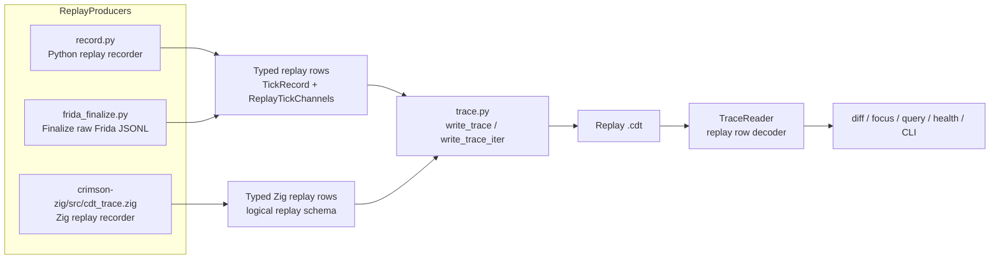
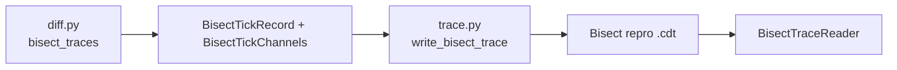
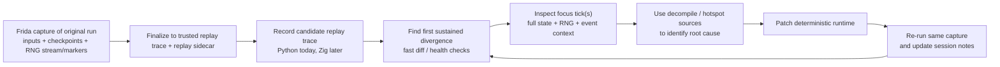
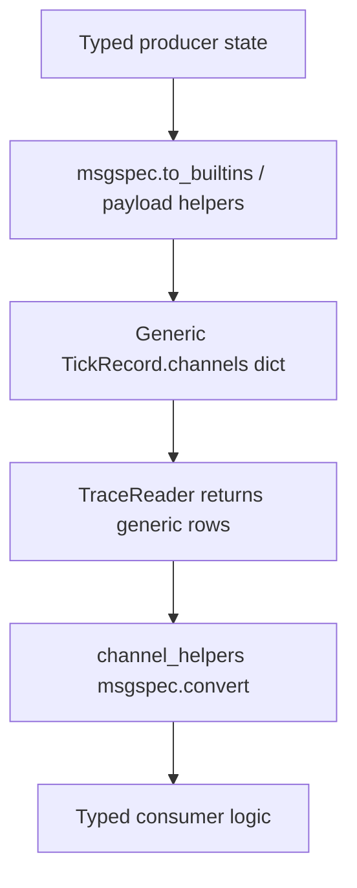
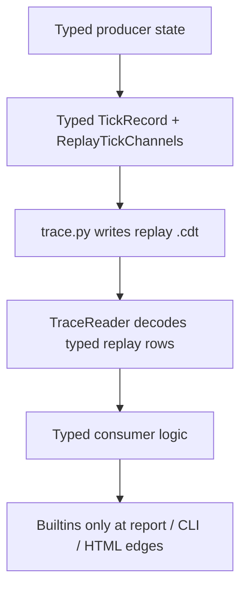
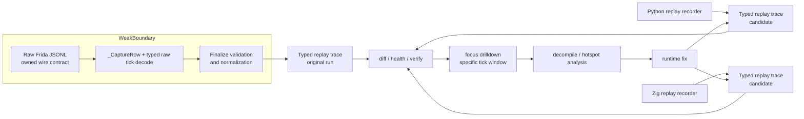
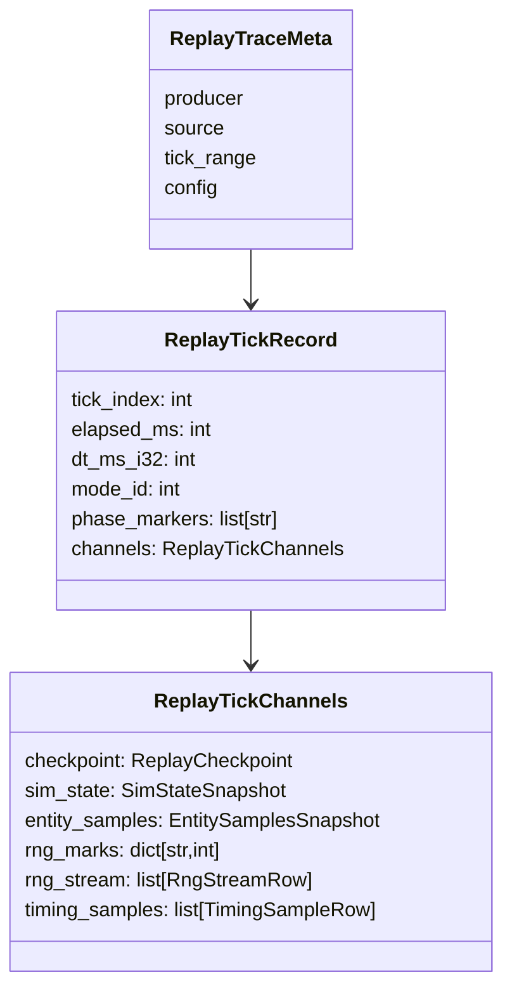

# Debug Trace Architecture Memo

## Purpose

This memo captures:

1. The current `dbg` trace architecture at `HEAD`.
2. The recent changelog that got us here.
3. The real trust boundaries and what is now typed vs still generic.
4. What historical differential sessions actually needed from `dbg`.
5. The remaining split-brain contracts between writers and consumers.
6. The proposed follow-up architecture to finish the cleanup without overengineering.

The concrete execution sequence for that cleanup lives in `plan.md`.

## Executive Summary

The root-cause fix is now partially landed.

- Raw Frida JSONL is the only remaining capture-ingress boundary, but it is
  still ours and should be treated as a strict owned wire contract, not as
  untrusted data.
- Finalized replay `.cdt` traces are now typed end-to-end on the Python side.
- `frida_finalize.py` and `record.py` both write typed replay rows.
- `trace.py` decodes replay `.cdt` blocks directly into typed replay rows.
- Replay consumers no longer re-decode per-channel payload dicts just to get back to typed objects.

The more important conclusion after reviewing historical differential sessions is
that the real `dbg` need is narrower than the current abstraction surface:

- capture original gameplay with full deterministic evidence
- replay the same inputs in the candidate runtime
- locate the first sustained divergence quickly
- inspect one or a few focus ticks with full state + RNG context
- jump into the decompile/hotspot sources and fix the runtime
- repeat the same loop fast, with caching and session bookkeeping

The sessions show high leverage from:

- accurate typed boundaries
- reliable divergence/focus reports
- fast repeated probes on the same capture
- targeted recapture when telemetry is insufficient

The sessions show much weaker evidence for:

- multiple long-lived `.cdt` dialects
- stored bisect repro bundles as a first-class artifact family
- broad generic query surfaces driving the trace schema

What is still split-brain in the current implementation:

- replay `.cdt` and bisect repro `.cdt` share one top-level container and schema version, but actually carry different tick row dialects
- `TraceMeta` is still a generic map shell hiding several producer-specific contracts
- Zig replay trace shape still diverges from Python canonical replay channels
- metadata and footer fields still duplicate some facts instead of having one authority

## Recent Changelog

### `56266c74 chore: snapshot dbg trace typing exploration`

This was the checkpoint commit taken before the architecture was corrected. It preserved the first round of exploration and the initial memo baseline.

### `4cf54fdd refactor: keep dbg replay traces typed end-to-end`

This commit landed the actual replay-path root-cause fix:

- added typed replay channels to `src/crimson/dbg/schema.py`
- changed replay `TickRecord` to carry typed `ReplayTickChannels`
- changed `src/crimson/dbg/trace.py` to decode replay traces directly into typed rows
- changed `src/crimson/dbg/frida_finalize.py` to keep validated Frida tick channels typed through `.cdt` write
- changed `src/crimson/dbg/record.py` to write typed replay rows directly
- simplified `src/crimson/dbg/channel_helpers.py` into typed accessors
- removed `src/crimson/dbg/checkpoint_codec.py`
- removed dead builtin-validation helpers from `src/crimson/dbg/canonical_channels.py`
- introduced a separate typed bisect repro row shape and writer path

## Current Architecture

### Artifact Families

There are now four relevant debug artifact families:

1. Raw Frida JSONL capture
2. Replay `.cdt` traces
3. Bisect repro `.cdt` traces
4. Replay `.crd` files

The `.cdt` container is still shared:

- file header + trailer
- `META` chunk
- `TICK` chunks
- `FOTR` footer chunk
- msgpack payloads
- zstd compression

`src/crimson/dbg/trace.py` is the shared container layer.

### Current Replay Data Flow

### Current Bisect Data Flow

### Current Schema Shape

The replay row path is now typed:

- `TickRecord.channels: ReplayTickChannels`
- `ReplayTickChannels.checkpoint: ReplayCheckpoint`
- `ReplayTickChannels.sim_state: SimStateSnapshot`
- `ReplayTickChannels.entity_samples: EntitySamplesSnapshot`
- `ReplayTickChannels.rng_marks: dict[str, int]`
- `ReplayTickChannels.rng_stream: list[RngStreamRow]`
- `ReplayTickChannels.timing_samples: list[TimingSampleRow]`

The bisect repro path is also typed, but separate:

- `BisectTickRecord.channels: BisectTickChannels`
- `BisectTickChannels.golden: ReplayTickChannels | None`
- `BisectTickChannels.candidate: ReplayTickChannels | None`
- `BisectTickChannels.focus_tick: bool`

What is still generic:

- `TraceMeta.producer: dict[str, Any]`
- `TraceMeta.source: dict[str, Any]`
- `TraceMeta.config: dict[str, Any]`

## What Differential Sessions Actually Needed

Historical session logs show a very consistent workflow. The `dbg` suite exists
to support deterministic parity triage, not to be a general-purpose data
exploration platform.

### Evidence From Historical Sessions

- Session 10 was entirely about making repeated `divergence-report` and
  `focus-trace` runs fast enough to be usable. Caching turned repeated probes on
  the same capture from tens of seconds into sub-second feedback.
- Session 12 found that the blocker was not gameplay code but incorrect
  divergence accounting around RNG attribution. Tooling correctness mattered as
  much as runtime correctness.
- Session 17 repeatedly hit cases where the next step was more faithful
  quest-mode focus tracing or richer recapture telemetry, not more generic
  trace/container abstractions.
- Session 19 closed a real frontier by using exactly the core loop:
  baseline divergence report, bisect to first bad tick, focus trace on that
  tick, native caller mapping, runtime fix, and replay verification.

### Core Capabilities The Workflow Actually Depends On

- One trusted replay trace format carrying:
  - replay inputs
  - full or strategically anchored state snapshots
  - RNG stream samples and stable RNG markers
  - enough timing/event context to attribute first divergence
- Fast candidate trace recording from `.crd` sidecars for Python today and Zig
  later.
- Cheap identification of the first sustained divergence.
- High-detail focus reports for a specific tick window.
- Strong cache/index support so repeated probes on one capture are cheap.
- Session bookkeeping keyed by capture SHA and JSON report artifacts.
- A recapture path when telemetry is insufficient to explain the frontier.

### Secondary Capabilities

These are useful, but the historical record does not show them as the main
drivers of parity progress:

- ad hoc query-by-path tooling
- entity/tick inspection commands as standalone primary workflows
- long-lived visualizer or HTML payload architecture
- stored bisect repro `.cdt` bundles

## What Looks Overengineered

Relative to the historical workflow, the following areas look suspiciously
overbuilt or at least under-justified:

### 1) Treating Finalized Replay Traces As Weakly Typed

This was the core mistake already corrected in `4cf54fdd`. We were validating
the boundary and then immediately discarding the typed model.

### 2) Promoting Bisect Repro Bundles Into A Peer Artifact Family

The docs mention repro bundles, but the session history does not show them as a
central working artifact. Most sessions persisted:

- the capture SHA
- JSON reports
- focused commands
- the resulting code changes

That makes bisect repro `.cdt` files look optional rather than architectural.

### 3) Letting Peripheral Consumers Shape The Core Schema

The schema should primarily serve:

- trace recording
- divergence detection
- focus drilldown
- replay verification

Commands like `query`, `entity`, and `tick` should be thin consumers on
top of that core, not reasons to make the core format more dynamic or more
abstract.

### 4) Multi-Dialect `.cdt` Support Without Strong Evidence

If replay traces are the main long-lived artifact, then adding more `.cdt`
dialects increases reader/writer complexity and metadata split-brain. That
complexity needs stronger evidence than “it might be nice for tooling.”

### 5) Solving Metadata Generality Before Replay-Loop Fit

Typed metadata is still worth doing, but the historical sessions suggest the
highest-value next work is:

- better typed capture/finalize boundaries
- one shared replay schema across producers
- faster and more accurate diff/focus workflows

before investing in broader artifact taxonomy work.

## Real Boundaries

The important distinction is not “all debug data is weakly trusted.”

### Owned Capture Contract

Raw Frida JSONL is the only real ingress boundary, but it is produced by code
we own on both sides. So this is not an adversarial or duck-typing boundary. It
is an owned wire contract with some operational failure modes:

- emitted by a long-running script
- vulnerable to abrupt shutdown
- vulnerable to partial/incomplete rows
- versioned independently from the finalized replay trace shape
- currently mixed with auxiliary rows that are not part of finalized replay output

This boundary is handled in `src/crimson/dbg/frida_finalize.py` by:

- `_CaptureRow` tagged decode
- `_TickChannels` typed decode
- semantic finalize checks
- canonical RNG mark validation
- replay input width validation
- bootstrap/seed validation

The right target is stricter than “validate a weak boundary.” It is:

- `gameplay_diff_capture.js` emits one narrow canonical row contract for replay
  rows
- `frida_finalize.py` decodes that contract directly
- any schema mismatch fails loudly instead of being normalized away

### Strong Boundary

After finalize validation, replay trace rows are ours.

That means:

- finalized replay `.cdt` rows should stay typed
- replay consumers should not treat replay row payloads as duck-typed JSON blobs
- builtin conversion belongs only at presentation edges

This is now mostly true for replay rows.

## What Changed vs The Old Design

The old loop was:

The current replay loop is:

That is the right direction and matches the repo principle:

> validate at edges, trust inside

## Current Findings

### 1) Replay vs Bisect Is Still One Container With Two Dialects

This is the biggest remaining architectural mismatch.

Replay traces and bisect repro traces both use:

- the same trace magic
- the same top-level `TraceMeta`
- the same `trace_schema_version`
- the same file extension

But they do not contain the same tick row type.

Replay uses:

- `TickRecord`
- `ReplayTickChannels`

Bisect repro uses:

- `BisectTickRecord`
- `BisectTickChannels`

We now have two readers:

- `TraceReader`
- `BisectTraceReader`

But we do not have a typed discriminant such as `trace_kind` in metadata. So replay-only consumers cannot reject bisect traces early and cleanly.

### 2) `TraceMeta` Still Hides Producer-Specific Contracts Behind Generic Maps

`TraceMeta` is still acting as a bag of dicts rather than a real typed schema.

Current producers write different `source` / `config` contracts:

- Frida finalize writes raw-capture provenance and run metadata
- Python replay record writes replay file provenance
- Zig replay record writes its own typed source/config shape in Zig
- bisect repro writes expected/candidate path metadata

That means consumers cannot safely rely on metadata fields without knowing producer folklore.

### 3) Zig Replay Schema Still Diverges From Python Canonical Replay Schema

The Zig writer is still not the same contract as Python canonical replay channels.

Examples:

- Zig hardcodes single-player arrays where Python uses lists
- Zig projectile ownership uses scalar `owner_id` fields where Python uses `OwnerRef`
- Zig record currently rejects non-single-player replays before writing

So “typed on both sides” is true, but “one shared replay schema” is still not true.

### 4) Channel Presence Has Multiple Authorities

There are still several different ways the system describes channels:

- `meta.channels`
- `footer.channel_counts`
- the row type itself
- the hardcoded `TRACE_REQUIRED_CHANNELS`

These are close, but they are not one authority.

Examples:

- `diff.py` trusts `meta.channels`
- `health.py` derives coverage by iterating rows
- `trace.py` increments footer channel counts from the required channel list, not from discovered row contents

### 5) Tick Bounds Also Have Multiple Authorities

Tick range appears in:

- `meta.tick_range`
- `footer.first_tick`
- `footer.last_tick`
- `footer.tick_count`

The writer currently keeps these aligned, but they are still duplicated facts rather than one canonical source plus derived views.

### 6) Frida Session Metadata Is Still Generic

The hot path is fixed, but the Frida `session_start` metadata remains generic:

- `config: dict[str, Any]`
- `session_fingerprint: dict[str, Any]`

In practice the capture script emits stable object literals here too. So this is likely typeable, but it is not the main remaining root cause.

## Current Split-Brain Table

| Area | Writer View | Consumer View | Problem |
| --- | --- | --- | --- |
| Replay vs bisect `.cdt` | two different row dialects | replay commands still assume replay unless the user knows otherwise | missing explicit artifact discriminant |
| Trace metadata | producer-specific dict payloads | consumers must inspect ad hoc fields | no typed meta union |
| Zig replay rows | typed Zig structs | Python `TraceReader` expects Python canonical replay schema | schemas not fully aligned |
| Channel presence | row schema, meta, footer, constants | different commands trust different authorities | metadata drift can exist conceptually |
| Tick bounds | meta and footer both store them | CLI/reporting reads meta while reader validates footer | duplicated source of truth |
| Core vs secondary workflows | parity loop is diff/focus/verify driven | some APIs assume broad exploratory use | architecture may be serving rare workflows first |

## Proposed Architecture Direction

The next cleanup should optimize for the real parity loop first.

### 1) Keep One Main Typed Replay Trace Contract

The strongest simplification is to treat replay `.cdt` as the primary durable
artifact and make every producer target that exact schema:

- Frida finalize
- Python replay record
- Zig replay record

That keeps the core loop closed-world and removes the need for consumers to
reason about multiple replay dialects.

### 2) Make The Owned Capture Contract Strict

The remaining boundary work is in raw Frida capture/finalize metadata and row
shapes, because that is where transport failures or producer bugs can still
show up.

This follows the repo rule directly:

> validate at edges, trust inside

But here “edge” should not be read as “untrusted.” We control both sides, so we
should tighten the producer and consumer together until the JSONL wire shape is
also effectively a strict typed contract.

### 3) Unify Zig Replay Schema With Python Canonical Replay Schema

This is the next big parity cleanup after the Python replay refactor.

Goals:

- identical replay tick channel shape across Python and Zig
- no single-player-only special case in Python for Zig traces
- shared ownership representation
- shared player/perk/count container shapes

Once that lands, `TraceReader(out_path)` validating Zig output becomes a real cross-implementation contract instead of a narrow happy path.

### 4) Make Diff / Focus / Verify The Center Of The Design

The historical loop suggests these should remain the design center:

- record
- health
- diff
- focus
- verify-style checks

Everything else should be treated as a secondary consumer layered on top of the
same typed replay rows.

### 5) Reduce Duplicate Authorities

- row schema defines required channels
- footer derives block/tick/channel counts from actual written rows
- metadata carries descriptive provenance, not redundant integrity facts when avoidable

In other words:

- derive counts from rows
- derive replay/bisect kind from typed meta
- minimize manually maintained duplicated facts

### 6) Demote Repro Bundles To Optional Outputs

`dbg bisect --out` can remain useful as a convenience, but the historical record
does not justify building the architecture around stored bisect repro traces.

If we keep them:

- they should be clearly marked as optional convenience artifacts
- they should not complicate the main replay schema
- they should not force generic readers/consumers to carry extra dialect logic

### 7) Type Frida Session Metadata

- type `session_start.config`
- type `session_start.session_fingerprint`

That would make the Frida finalize path typed from raw JSONL ingress all the way through finalized replay trace output.

## Target Architecture

## Recommended Next Steps

1. Type the remaining Frida finalize boundary objects, especially stable
   `session_start` metadata and any still-generic capture row payloads.
2. Keep replay `.cdt` as the main durable trace contract and stop letting
   secondary artifact kinds drive the core schema.
3. Align Zig replay row structs with Python canonical replay row structs.
4. Revisit whether `dbg bisect --out` should stay a stored `.cdt` artifact or
   become a lighter report-only convenience.
5. Reduce duplicate authorities in metadata/footer bookkeeping.
6. Keep `query`, `entity`, and `tick` as thin consumers; do not let them
   reintroduce weak typing into the replay path.
7. Update stale docs such as `docs/rewrite/cdt-trace-format.md` so the
   documentation matches the typed replay-trace reality.

## Bottom Line

The architecture is in a much better place than before:

- the remaining capture-ingress contract is now correctly localized at raw
  Frida JSONL
- replay trace rows are typed end-to-end on the Python side
- builtin coercion is no longer the internal replay data model

After reviewing historical sessions, the bigger correction is also conceptual:

- `dbg` is primarily a deterministic parity workbench
- the core loop is capture -> replay -> diff -> focus -> fix -> re-run
- the architecture should serve that loop first, not speculative artifact
  generality

The remaining work is:

- make the Frida JSONL capture contract strict on both producer and consumer
  sides
- make Zig and Python share one actual replay schema
- keep repeated diff/focus probes fast and accurate
- avoid building more artifact machinery unless session history proves it pays for itself
