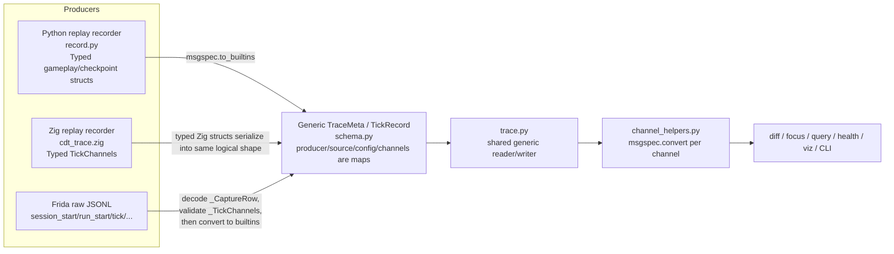
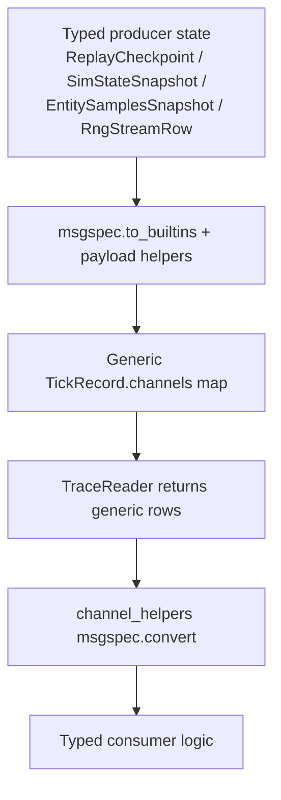
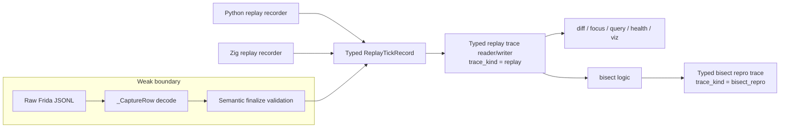
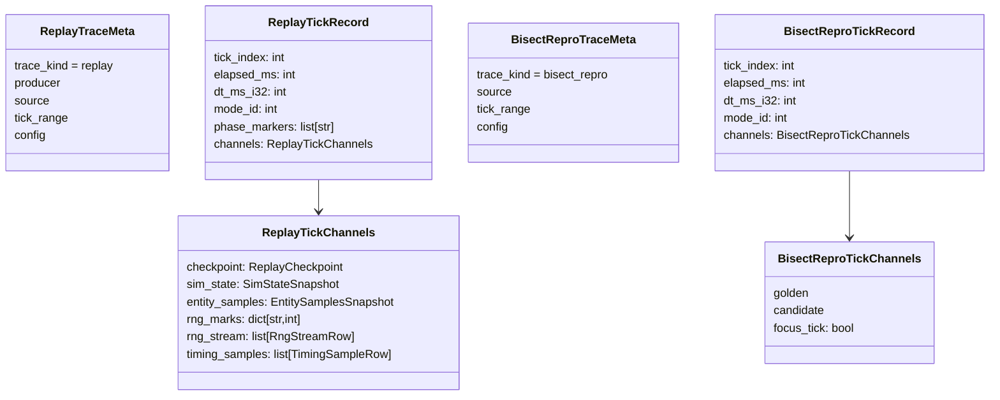

# Debug Trace Architecture Memo

## Purpose

This memo captures:

1. The current `dbg` trace architecture in this repo.
2. Where the real trust boundaries are.
3. Why the current design still falls back to generic maps and payload coercion.
4. A proposed architecture that keeps weak typing only at the raw Frida capture boundary and makes finalized replay traces fully typed.

The key conclusion is simple: our finalized replay traces are already conceptually closed-world and produced by us. The generic `dict[str, Any]` / builtin payload loop is mostly self-inflicted and comes from trying to use one generic trace row shape for too many artifact kinds.

## Current Architecture

### 1) Artifact families

There are currently three relevant debug artifact paths:

- Python replay trace writer in `src/crimson/dbg/record.py`
- Zig replay trace writer in `crimson-zig/src/cdt_trace.zig`
- Raw Frida JSONL capture + finalize path in `src/crimson/dbg/frida_finalize.py` and `scripts/frida/gameplay_diff_capture.js`

The `.cdt` container format is shared by all of them:

- file header + trailer
- `META` chunk
- `TICK` chunks
- `FOTR` footer chunk
- msgpack payloads
- zstd compression

`src/crimson/dbg/trace.py` is the shared read/write layer for this container.

### 2) Current data flow

### 3) Current schema shape

Today the shared Python schema is generic:

- `TraceMeta.producer: dict[str, Any]`
- `TraceMeta.source: dict[str, Any]`
- `TraceMeta.config: dict[str, Any]`
- `TickRecord.channels: dict[str, Any]`

That generic shape lives in `src/crimson/dbg/schema.py`.

The reader in `src/crimson/dbg/trace.py` decodes directly into those generic containers. Consumers then re-decode per channel through `channel_helpers.py`:

- `checkpoint_channel_required(...)`
- `sim_state_channel_required(...)`
- `entity_samples_channel_required(...)`
- `rng_stream_channel_required(...)`
- `timing_samples_channel_required(...)`

### 4) Current trust boundaries

The important distinction is not “all debug data is untrusted.”

The actual boundaries are:

- Raw Frida JSONL is weakly trusted.
- Finalized `.cdt` replay traces are strongly trusted in practice, because we produce them ourselves.

Raw Frida JSONL is weaker because:

- it is emitted by a long-running script in `scripts/frida/gameplay_diff_capture.js`
- it can contain partial/incomplete runs
- it can contain non-finalizable rows such as `error`
- it evolves over time with capture script changes
- shutdown can be abrupt, and finalize intentionally tolerates that for in-flight runs

By contrast, the finalized replay trace subset is already narrow and typed:

- `frida_finalize.py` decodes raw rows into `_CaptureRow`
- tick rows decode into `_TickChannels`
- finalize enforces semantic invariants before writing `.cdt`

So the replay trace has already crossed the hard validation boundary before it is written.

### 5) The current type erosion loop

This is the main design smell.

We take typed data, erase it to builtins, store it in generic maps, then reconstruct typed data again in consumers.

### 6) Why the current design ended up generic

There are two real reasons:

#### A. Shared generic schema for different artifact kinds

Normal replay traces and bisect repro traces currently reuse the same `TraceMeta` / `TickRecord` shape.

Replay traces want channels like:

- `checkpoint`
- `sim_state`
- `entity_samples`
- `rng_marks`
- `rng_stream`
- `timing_samples`

Bisect repro traces want channels like:

- `golden`
- `candidate`
- `focus_tick`

That pushes the schema toward a generic `channels: dict[str, Any]` even though the replay trace itself has a fixed channel set.

#### B. Overgeneralized meta/config payloads

The Python side currently models trace metadata as generic maps, even though the producers are fairly stable:

- Python replay recorder fills a known replay source/config shape.
- Zig recorder fills a known replay source/config shape.
- Frida finalize fills a known finalized-trace source/config shape.

The generic meta/config typing is broader than the actual closed-world producer set.

### 7) What is already typed today

This is important because it shows the proposed direction is not speculative.

#### Zig replay producer is already strongly typed

`crimson-zig/src/cdt_trace.zig` defines:

- `TraceMeta`
- `TickChannels`
- `TickRecord`

with concrete fields, not generic maps.

#### Frida finalize already validates a typed tick channel subset

`src/crimson/dbg/frida_finalize.py` defines:

- `_TickChannels`
- `_SessionStartRow`
- `_RunStartRow`
- `_TickRow`
- `_RunEndRow`
- `_SessionEndRow`

So finalize already knows the raw JSONL tick shape and validates it before writing trace output.

#### Replay consumers already want typed data

`diff.py`, `focus.py`, `health.py`, and `query.py` all immediately convert generic channel data back into typed objects before doing any real work.

That is a strong signal that the generic stored representation is not the right internal architecture.

## Current Pain Points

### Finalized replay traces are weaker than their producers

Both Python and Zig replay producers naturally construct fixed replay trace rows, but the shared Python schema flattens them into generic maps.

### Defensive payload code is in the wrong place

The current `payloads.py` layer protects builtin payload shapes after decode, but that is downstream of the real trust boundary. It is compensating for a schema choice, not validating a real external interface.

### One schema is doing too many jobs

The same trace row type is trying to represent:

- normal replay traces
- finalized Frida replay traces
- bisect repro traces

That is the main architectural pressure creating weak typing.

### Consumers pay repeated decode costs and complexity

Every consumer must remember to:

- pull a generic channel out of `row.channels`
- re-decode it
- handle missing/generic payloads

This is unnecessary for normal replay traces.

## Proposed Architecture

### 1) Split the true boundaries

The intended boundary model should be:

- raw Frida JSONL remains the only weak/dynamic boundary
- finalized `.cdt` replay traces become strongly typed
- bisect repro traces become a separate typed artifact kind

### 2) Typed replay trace schema

Introduce a replay-specific schema with concrete types:

- replay trace meta
- replay tick channels
- replay tick rows

The replay row should have concrete fields for:

- `checkpoint`
- `sim_state`
- `entity_samples`
- `rng_marks`
- `rng_stream`
- `timing_samples`

Consumers should access them directly:

- `row.channels.checkpoint`
- `row.channels.sim_state`
- `row.channels.entity_samples`

No generic map lookup, no per-channel `msgspec.convert`, no builtin coercion.

### 3) Separate bisect repro trace kind

Bisect repro output should stop pretending to be a normal replay trace.

It should still use the `.cdt` container, but it should carry a distinct typed schema:

- replay trace kind: fixed replay channels
- repro trace kind: `golden`, `candidate`, `focus_tick` bundle

### 4) Raw Frida finalize stays strict, but narrow

The raw Frida path should remain strict because it is a real edge:

- decode JSONL rows into a typed row union
- accept only the supported finalize subset
- validate semantic invariants once
- construct typed replay trace rows directly

No builtin conversion is needed after finalize validation.

The design rule should be:

> validate at raw capture ingress, then trust typed trace rows from that point onward

### 5) Metadata should also be typed by artifact kind

Meta/config/source should stop being generic `dict[str, Any]` in the replay trace path.

The replay meta shape is small and known:

- Python replay recorder meta
- Zig replay recorder meta
- Frida-finalized replay meta

Those can be modeled explicitly, even if the exact structs differ slightly by producer or by trace kind.

## Proposed Consumer Architecture

### Replay consumers

These should operate on typed replay trace rows only:

- `dbg diff`
- `dbg focus`
- `dbg tick`
- `dbg entity`
- `dbg query`
- `dbg health`
- `dbg viz`

### Repro consumers

If we keep repro traces readable at all, they should have separate reader/command support or be explicitly rejected by replay-only commands.

That is clearer than pretending replay and repro rows share one channel schema.

## Recommended Design Rules

1. Raw Frida JSONL is the only weak boundary.
2. Finalized replay `.cdt` traces are trusted typed data.
3. Do not convert typed replay channels to builtins just to store them in the trace model.
4. Do not use one generic trace row type for replay traces and bisect repro artifacts.
5. Convert to builtins only for presentation edges:
   - CLI JSON output
   - HTML payloads
   - snapshots meant specifically as JSON-like reports

## Recommended Migration Shape

1. Introduce `trace_kind` and bump the trace schema version.
2. Add a replay-specific typed row/meta schema.
3. Add a bisect repro-specific typed row/meta schema.
4. Update Python replay writer and Frida finalize to build replay rows directly.
5. Update the shared reader to dispatch by `trace_kind`.
6. Remove `payloads.py` and the generic channel coercion loop from normal replay trace consumers.
7. Keep only the raw JSONL finalize path as the strict validation boundary.

## Bottom Line

The repo already tells us the right architecture:

- Zig replay trace writing is typed.
- Frida finalize already validates a typed tick subset.
- Replay consumers already want typed channels.

So the root-cause fix is not “better payload coercion.”

The root-cause fix is:

- typed replay trace schema
- separate bisect repro schema
- weak typing only at raw capture ingress

