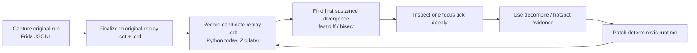
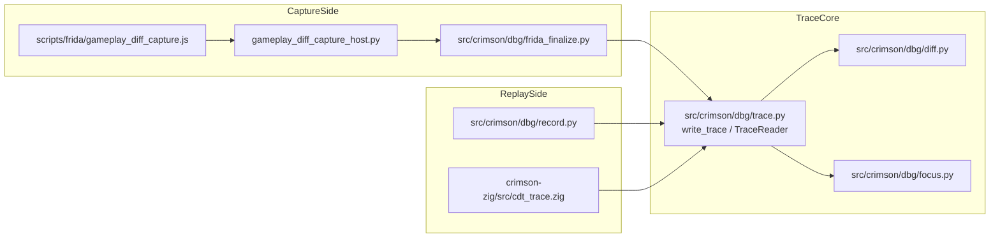

# Debug Trace Architecture Memo

## Purpose

This memo is the branch-state architecture document for `refactor/smells1`.

It captures:

1. What has already landed on this branch.
2. What the `dbg` stack is actually for.
3. What the current replay-trace architecture looks like at `HEAD`.
4. Which contracts are now clean versus which ones are still split-brain.
5. The open questions that still need an explicit branch-level decision.
6. A recommended next-step sequence for the remaining cleanup work.

`plan.md` remains the execution ladder. This memo is the explanatory companion.

## Branch Status

As of this branch state, the early simplification cuts are already landed.

### Landed Stages

- `286d7e4b refactor(dbg): remove trace viz`
  - removed `dbg viz`
  - removed the HTML visualizer module
  - removed docs/tests that treated `viz` as part of the standard parity loop
- `53a9bc9d refactor(dbg): tighten frida capture contract`
  - narrowed the raw Frida JSONL contract
  - treated capture JSONL as an owned wire protocol rather than a loose bag of rows
  - kept finalize validation strict
- `0d217e17 refactor(dbg): drop bisect repro traces`
  - removed the separate bisect-repro `.cdt` artifact path
  - kept `dbg bisect` as a report command rather than a second trace dialect

### Still Open

These are the next meaningful cleanup areas:

- Stage 4: type replay trace metadata
- Stage 5: align Zig with the replay schema
- Stage 6: thin secondary consumers
- Stage 7: remove duplicate authorities and stale docs

### Important Correction To Older Notes

Earlier versions of this memo discussed `dbg viz` and bisect-repro `.cdt`
artifacts as current architectural problems. That is now stale.

At `HEAD` on this branch:

- there is no `dbg viz`
- there is no stored bisect-repro `.cdt` dialect
- replay `.cdt` is the only durable trace kind left

That simplification matters because it changes what the real remaining work is.
We are no longer deciding between multiple trace artifact families. We are now
mainly deciding how sharp to make the one replay-trace contract.

## Executive Summary

The central conclusion did not change during the cleanup:

`crimson.dbg` is not supposed to become a general debug platform. It is a
deterministic parity workbench.

The workflow it needs to serve is much narrower and much more concrete:

The historical differential sessions repeatedly show that progress comes from:

- trustworthy original capture finalization
- replay-grade candidate recording
- fast first-bad-tick detection
- strong single-tick drilldown with RNG/state/entity context
- targeted recapture when the frontier is still ambiguous

The sessions do not show strong evidence for:

- a broad exploratory trace platform
- multiple durable `.cdt` dialects
- a visualizer-heavy workflow
- schema growth driven by peripheral commands

That means the design center should stay:

- `frida_finalize`
- `record`
- `diff`
- `bisect`
- `focus`
- one replay `.cdt` format

Everything else should clearly sit on top of that.

## What The Current Architecture Actually Is

### Durable Artifact Families

At `HEAD`, the relevant artifact families are:

1. Raw Frida JSONL capture
2. Replay `.crd` sidecars
3. Replay `.cdt` traces

That is the important simplification. There is only one durable trace kind now.

### Current Data Flow

### Replay Trace Schema At A Glance

The replay row path is typed:

- `TickRecord`
- `ReplayTickChannels`
- `ReplayCheckpoint`
- `SimStateSnapshot`
- `EntitySamplesSnapshot`
- `list[RngStreamRow]`
- `list[TimingSampleRow]`

The required channel list today is:

- `checkpoint`
- `sim_state`
- `entity_samples`
- `rng_stream`
- `timing_samples`

This is already much better than the old generic `channels: dict[str, object]`
flow. Replay consumers now operate on typed rows instead of round-tripping
through builtin payloads.

### What Each Core Piece Is Responsible For

#### `gameplay_diff_capture.js`

This is the owned producer for the raw Frida JSONL capture wire format.

Its real job is:

- capture replay-grade inputs
- capture original-side checkpoint/state/entity/RNG/timing evidence
- emit explicit lifecycle rows:
  - `session_start`
  - `run_start`
  - `tick`
  - `run_end`
  - `session_end`

It is not just a logging script anymore. It is the producer side of a strict
capture contract.

#### `frida_finalize.py`

This is the trust boundary between raw capture transport and durable replay
artifacts.

Its real job is:

- decode the owned JSONL wire shape strictly
- validate lifecycle ordering
- validate bootstrap/seed assumptions
- recompute canonical RNG marks
- preserve replay-grade inputs into `.crd`
- write original-side replay `.cdt`

This is one of the most important files in the whole parity loop because it
defines what "original trace" means.

#### `record.py`

This is the candidate-side recorder.

Its real job is:

- consume the `.crd` replay sidecar
- run Python or Zig deterministically from the same input timeline
- record candidate-side state/entity/RNG evidence into the same `.cdt` format

Conceptually this is the mirror of `frida_finalize.py` for the candidate
runtime.

#### `trace.py`

This is the container layer:

- typed `META`
- typed `TICK` blocks
- typed `FOTR`
- compressed random-access storage
- small block cache in the reader

It should stay boring. Its value is not cleverness; its value is that it makes
repeated diff/focus work cheap.

#### `diff.py` and `bisect`

These are the frontier-finding tools.

Their job is:

- compare two replay traces tick-by-tick
- stop on the first sustained mismatch
- report which channels disagreed at that tick
- produce a compact first-bad window

This is the command path the session history uses over and over again.

#### `focus.py`

This is the surgical drilldown tool.

Its job is:

- inspect one tick in detail across both traces
- show checkpoint drift
- show RNG mark and RNG stream drift
- show entity presence drift
- show structural `sim_state` / `entity_samples` differences

This command is where the loop goes once `diff` or `bisect` has found the
frontier.

#### `tick`, `entity`, and `query`

These are projections.

They can be useful, but they are not the reason the trace schema exists. They
should be layered consumers, not schema drivers.

## Why This Shape Matches The Session History

The historical session trail is unusually consistent.

### The Sessions Keep Asking The Same Questions

Again and again the workflow is:

1. What is the first bad tick?
2. Is the lead an RNG shortfall, value drift, or state drift?
3. Which state/entity detail changed at that exact tick?
4. If the current snapshots are not enough, what targeted recapture should we
   run next?

That validates keeping these as first-class:

- replay-grade inputs
- full checkpoint/state snapshots
- entity samples
- RNG stream
- RNG marks
- single-tick focused comparison

### What The Sessions Do Not Really Need

The sessions do not provide strong evidence for investing heavily in:

- long-lived visualizer infrastructure
- a broad trace query platform
- extra durable trace artifact kinds
- schema inflation for every one-off probe channel

Targeted probe telemetry is still valuable. The important point is that targeted
probe telemetry should stay clearly optional, not silently expand the base diff
contract without justification.

## What Is Already In A Good State

These parts of the architecture are materially better now than they were before
the cleanup:

### 1) There Is Only One Durable Trace Kind

This is a major simplification.

We no longer need:

- a replay-vs-bisect artifact split
- multiple readers for long-lived trace families
- metadata that exists mostly to discriminate between dialects

### 2) Replay Rows Stay Typed End-To-End On The Python Side

That means:

- producers emit typed rows
- the container stores typed rows
- the reader decodes typed rows
- consumers operate on typed rows

This matches the repo principle:

> validate at edges, trust inside

### 3) Capture JSONL Is Treated As An Owned Contract

This matters conceptually as much as technically.

The raw JSONL format still needs validation because transport can fail, but it
is not an adversarial boundary. We own both sides. That means strictness and
consistency should win over permissive cleanup behavior.

### 4) Diffing Is Decoupled From Playback

This is one of the biggest practical wins from the whole refactor.

Playback is expensive. Focused comparison should not require replaying the same
capture over and over. The trace container plus diff/focus split fixes that.

## The Remaining Architectural Seams

These are the real open seams now. They are narrower than the old architecture
problems, but they still matter.

### 1) `TraceMeta` Is Still Too Generic

`TraceMeta` still uses generic maps for:

- `producer`
- `source`
- `config`
- `tick_range`

That has a few costs:

- readers and CLIs need producer folklore to know which keys matter
- metadata remains weaker and less self-documenting than the row schema
- we still have avoidable `Any` and dict-shaped contracts in the replay path

This is the natural Stage 4 target.

### 2) Zig Still Does Not Fully Share The Python Replay Schema

The architecture goal is not "typed on both sides." The goal is "one replay
schema across original, Python, and Zig."

This is still not fully true. The remaining differences include:

- producer-specific metadata shape
- ownership / container representation mismatches
- Zig-specific recording limitations that leak into the contract story

This is the Stage 5 target.

### 3) `timing_samples` Is The Least-Settled Part Of The Contract

This is the most important unresolved contract question on the branch.

Today:

- `timing_samples` is listed as required in the schema
- `diff` compares it strictly
- Frida captures can emit meaningful timing rows
- Python recording currently writes `timing_samples=[]` for every tick
- `health` counts timing rows but does not treat "all empty" as an issue
- `focus` does not surface timing mismatch detail at all

So the current system is sending mixed signals:

- timing is important enough to be a required canonical channel
- but the main candidate recorder does not yet produce meaningful rows
- and the main drilldown tool does not explain timing divergence

That does not mean timing evidence is unimportant. In fact, parity docs and
session history say timing evidence can be valuable. It means the branch still
needs to decide what the minimum timing contract actually is.

### 4) `focus` Does Not Yet Match The Full Diff Contract

`diff` can currently diverge on:

- checkpoint
- RNG stream
- sim state
- entity samples
- timing samples

But `focus` only explains:

- checkpoint
- RNG marks
- RNG stream
- entity presence / entity samples
- sim state

If timing is part of the parity-significant contract, the main single-tick
drilldown tool should expose it. Otherwise the user is forced to infer timing
problems from `diff` output without a matching focused explanation.

### 5) Candidate-Side RNG Provenance Is Still Missing

Original-side Frida traces can carry:

- `caller_static`
- `branch_id`

Python recording currently leaves those fields as `None`.

This is not a correctness blocker for basic equality checking because the
current RNG comparison intentionally keys on value/state progression, not
caller metadata. But it is a root-cause speed problem:

- original-side provenance helps explain why original consumed RNG
- candidate-side provenance would make Python-vs-Zig and Python-vs-original
  frontier work much faster

This feels like a better future investment than adding more general query
surface.

### 6) Channel And Tick Facts Still Have Multiple Authorities

Today there are still several ways to describe the same facts.

For channel presence:

- the row type
- `TRACE_REQUIRED_CHANNELS`
- `meta.channels`
- `footer.channel_counts`

For tick bounds:

- `meta.tick_range`
- `footer.first_tick`
- `footer.last_tick`
- `footer.tick_count`

These are usually kept aligned, but the architecture is still more redundant
than it needs to be.

### 7) Some CLI Surface Still Carries Legacy Wording

Two examples stand out:

- `dbg verify` is still mostly a wiring assertion rather than a workflow
  command
- `dbg health` still prints `movement_root_cause_ready`, which is narrower and
  more historical than the current deterministic-alignment use case

This is not the highest-risk problem, but it is good Stage 6/7 cleanup work.

### 8) Docs Still Drift In Ways That Obscure The Architecture

The biggest stale doc at the moment is `docs/rewrite/cdt-trace-format.md`.

It still refers to:

- `dbg viz`
- schema version `3`
- the older required-channel set
- an outdated diff contract description

This matters because doc drift makes the system look more complicated and less
intentional than it actually is.

## One Important Non-Conclusion

The right simplification is not "strip the traces down to only hashes and a few
summary counters."

The branch should keep treating these as core, not optional luxuries:

- full checkpoint/state evidence
- entity samples
- RNG stream
- RNG marks

The session history is clear that these are the tools that actually let us move
frontiers. The goal is not to make the traces smaller at any cost. The goal is
to make the contracts sharper and more honest.

## Open Questions

These are the questions that still need a deliberate answer.

### 1) What Is The Minimum `timing_samples` Contract?

There are three plausible directions:

1. Keep `timing_samples` parity-significant and require Python/Zig to emit
   meaningful rows.
2. Keep the channel in the replay schema, but make diff/focus treat it as
   optional until candidate emitters catch up.
3. Move timing to a clearly optional probe-grade contract rather than the
   minimum deterministic-alignment contract.

The important thing is not which choice we make. The important thing is that
the branch should make the choice explicitly.

### 2) If Timing Stays Core, What Should The Candidate Emitters Produce?

If the answer is "timing stays core," then Python and Zig need a concrete
minimum row contract. For example:

- one or two canonical phase snapshots per tick
- the exact phase names we compare
- whether we require write-kind detail or only phase snapshots

Without that, the current contract is only strict on paper.

### 3) Should Candidate RNG Provenance Live In `rng_stream` Or In An Optional Diagnostic Channel?

There are two reasonable approaches:

- keep provenance as optional fields on `RngStreamRow`
- move richer provenance into a separate diagnostic/probe channel later

My preference is to keep the lightweight symbolic provenance in `RngStreamRow`
if we can generate it cheaply, because that keeps the most useful clue near the
frontier data people already inspect.

### 4) What Should Typed Replay Metadata Look Like?

The design question is not whether to type it. It is how much producer-specific
structure belongs in the typed metadata.

The likely answer is:

- one typed replay meta envelope
- one small typed producer/source section per producer kind
- no revival of a broader artifact union

### 5) Does `dbg verify` Need To Stay User-Facing?

Possible answers:

- keep it as a small user-facing sanity command
- fold it into tests and internal assertions
- replace it with a more meaningful contract-report command

This is not urgent, but it should be decided rather than left as residue.

### 6) How Strict Should `health` Be About Timing Coverage?

If `timing_samples` stays core, then `health` probably needs to distinguish:

- channel present
- channel non-empty
- channel meaningfully populated across the trace window

Right now it mainly answers the first question.

### 7) What Should Remain Stored Versus Derived?

The row schema already gives us a lot. The remaining decision is how much meta
and footer data we want to store redundantly for convenience versus derive from
rows for consistency.

This is mainly a Stage 7 design cleanup question.

## Recommendations For Next Steps On This Branch

This is the sequence I would recommend now that Stages 1-3 are already landed.

### Recommendation 1: Make An Explicit `timing_samples` Decision Before More Schema Polish

This is the highest-value branch decision because it affects:

- the required-channel list
- `diff`
- `focus`
- `health`
- candidate recorder expectations
- doc wording

My recommendation:

- keep `timing_samples` in the replay schema
- do not pretend the current Python behavior is a finished core contract
- make one explicit branch call:
  - either candidate traces must start emitting meaningful timing rows soon
  - or timing should be treated as optional in diff/focus until that work lands

I would not leave the current "required, but usually empty on Python, and not
explained by focus" state in place for long.

### Recommendation 2: Do Stage 4 As "Typed Metadata Plus Honest Timing Story"

Typing metadata is the natural next architecture step, but it will be easier to
do cleanly if the timing decision is made at the same time.

This pass should aim to:

- type `TraceMeta`
- keep one replay meta contract
- avoid reopening artifact unions
- make the stored metadata describe the actual shipped replay contract

### Recommendation 3: If Timing Stays Core, Upgrade `focus` And `health` In The Same Wave

If timing remains parity-significant, then:

- `focus` should expose timing comparison detail
- `health` should report meaningful timing coverage, not just channel presence
- tests should lock this behavior in

This keeps the tools coherent.

### Recommendation 4: Do Stage 5 Next, Not Later

Once metadata is typed, the next highest-value branch step is Zig alignment.

That work pays off directly because it makes:

- Python-vs-Zig diffs more trustworthy
- shared tooling less conditional
- the "one replay schema" story actually true instead of aspirational

### Recommendation 5: Treat Candidate RNG Provenance As A Focused Follow-Up

After Stage 5, candidate-side RNG provenance would be a high-leverage targeted
improvement.

Recommended guardrails:

- do not make provenance part of the equality key for `compare_rng_stream`
- keep equality based on value/state progression
- expose provenance as explanatory detail for frontier work

### Recommendation 6: Use Stage 6 To Clean Residual Surface Area, Not To Re-Architect

Stage 6 should be about making the layering obvious:

- `query`, `entity`, and `tick` remain thin projections
- `verify` is either justified or removed
- legacy naming such as `movement_root_cause_ready` is updated

This should be cleanup, not another large architecture turn.

### Recommendation 7: Finish With A Docs-Reality Pass

Once the metadata, timing, and Zig decisions are settled, Stage 7 should bring
the docs fully in line with shipped behavior:

- update `docs/rewrite/cdt-trace-format.md`
- update any remaining playbook wording as needed
- mark completed stages in `plan.md` and this memo

That matters because the branch is now close enough to the target shape that
stale docs create more confusion than the code does.

## Suggested Branch Execution Order

If we want a concrete order rather than just themes, this is the one I would
use:

1. Decide `timing_samples` policy.
2. Type replay metadata around that policy.
3. If timing is core, extend `focus` and `health` to match.
4. Align Zig with the replay schema.
5. Add candidate RNG provenance if it is cheap enough to be practical.
6. Thin secondary consumers and clean CLI wording.
7. Update stale docs and remove duplicate authorities where practical.

## Acceptance Gates For The Remaining Work

The remaining stages should continue to be judged against real artifact flows,
not just local type tidiness.

The branch should preserve these acceptance gates:

- raw Frida JSONL -> finalized original replay `.cdt` + `.crd`
- `.crd` -> Python replay `.cdt`
- `.crd` -> Zig replay `.cdt`
- replay trace diff happy path
- replay trace focus happy path

And any timing-policy change should also be covered by explicit tests for:

- diff behavior
- focus behavior
- health behavior

## Bottom Line

This branch already removed the biggest sources of unnecessary complexity:

- no visualizer-heavy workflow
- no bisect-repro trace dialect
- no generic replay-row decode path

What remains is more specific:

- type metadata
- settle the timing contract
- align Zig with the replay schema
- add a few high-value diagnostic improvements
- clean residual surface area and stale docs

That is a much better place to be.

The branch does not need another broad rethink. It needs a few explicit
decisions, then disciplined follow-through.
