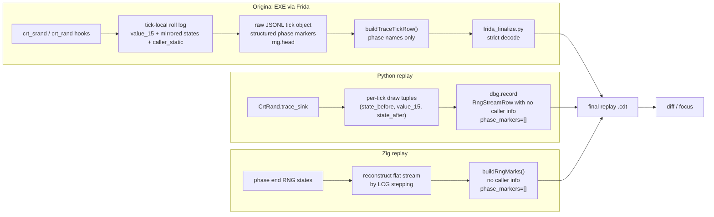
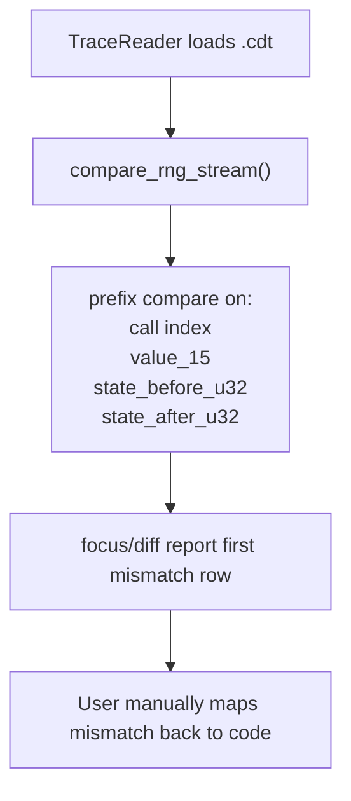
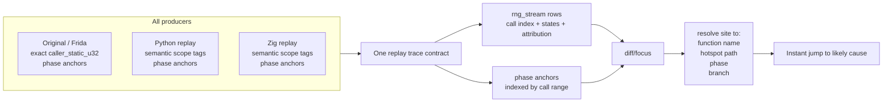
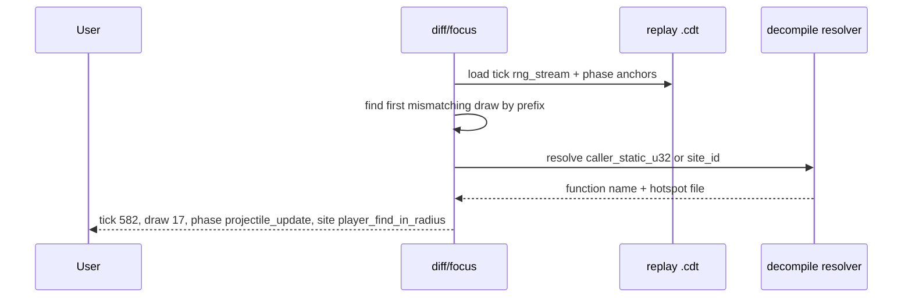

# RNG Trace Memo

## Purpose

`dbg` exists to find deterministic simulation drift quickly.

For RNG, the question we really want the tooling to answer is:

> Which exact RNG draw diverged first, and where in the original code did that draw come from?

Today we already capture enough evidence to detect many RNG mismatches precisely. What we do not yet do consistently is preserve and report the attribution needed to jump straight into the decompile.

This memo describes:

- how RNG capture works today in Frida, Python replay, and Zig replay
- what information is preserved or lost on each path
- what the target shape should be if we want "instant decompile jump" diagnostics

## Glossary

- `value_15`: the 15-bit `rand()` return value actually consumed by game code
- `state_before_u32`: the full 32-bit CRT RNG state before a draw
- `state_after_u32`: the full 32-bit CRT RNG state after a draw
- `tick_call_index`: the 1-based draw index within a tick
- `seed_epoch`: a counter bumped on each observed `srand`
- `caller_static`: a normalized static return address from Frida, suitable for lookup in the decompile maps
- `branch_id`: intended to distinguish subpaths within one caller, but currently not meaningful for RNG
- `rng_marks`: legacy summary field now removed from durable replay artifacts

## Current Architecture

## Current Frida Path

### 1. Hooking

`scripts/frida/gameplay_diff_capture.js` hooks both `crt_srand` and `crt_rand`.

For each `crt_rand` call it records:

- `tick_call_index`
- `value_15`
- `state_before_u32`
- `state_after_u32`
- `caller_static`
- `branch_id`
- `seed_epoch`

It also keeps a mirror of the CRT RNG state, so the capture script can reconstruct `state_before_u32`, `state_after_u32`, and the expected 15-bit return value while observing the native call stream.

### 2. Raw per-tick aggregation

Frida accumulates per-tick RNG rows in `tick.rng.head`.

Important nuance:

- today `maxRngHeadPerTick` defaults to `-1`, so the stream is effectively unlimited by default
- but the artifact is still conceptually sourced from a "head" buffer, so the path can be truncated by config

Frida also records structured phase markers in memory during the tick. Those raw markers can carry payload, not just names.

### 3. Raw JSONL tick write

When the capture script writes a raw tick object, it includes:

- checkpoint snapshot
- `rng.head`
- structured `phase_markers`
- other diagnostics

### 4. Trace-row normalization inside the capture script

`buildTraceTickRow()` converts the raw tick object into the stricter trace-row shape:

- `rng_stream` is built from `tick.rng.head`
- `phase_markers` are flattened to `list[str]`

That last point is an important loss of information. The raw capture has structured markers, but the finalized replay trace only keeps the marker names.

### 5. Finalization

`src/crimson/dbg/frida_finalize.py` decodes the JSONL with strict typed rows.

This is good. It means:

- the per-draw stream is treated as the source of truth

But finalize still writes:

- `phase_markers: list[str]`
- `rng_stream` rows whose `branch_id` is currently just the same value as `caller_static`

## Current Python Replay Path

Python replay traces RNG through `CrtRand.trace_sink`.

For each draw, the runtime records:

- `state_before_u32`
- `value_15`
- `state_after_u32`

`dbg.record` turns those tuples into `RngStreamRow` entries.

What Python does not currently preserve:

- no `caller_static`
- no meaningful `branch_id`
- no phase anchors
- `phase_markers` are written as `[]`

So Python gives us an exact flat stream, but not attribution.

## Current Zig Replay Path

Zig currently reconstructs the per-tick RNG stream from lifecycle checkpoint states instead of recording each draw directly.

It steps the LCG across the phase endpoints:

- after perk effects
- after creatures
- after projectiles
- after secondary projectiles
- after particles
- after player update
- after stage spawns
- after wave spawns
- after spawns
- after bonus update
- final tick RNG state

This gives Zig:

- a correct flat stream when the phase-state chain is reconstructable

But it still does not provide:

- per-draw caller attribution
- meaningful `branch_id`
- structured phase anchors in the durable trace

## Current Consumer Behavior

Today `compare_rng_stream()` only compares:

- `tick_call_index`
- `value_15`
- `state_before_u32`
- `state_after_u32`

It does **not** use:

- `caller_static`
- `branch_id`
- phase markers

So even when the original Frida trace already captured useful provenance, the comparison layer ignores it.

## What Works Well Today

- We already store the full per-draw stream in replay traces.
- Diffing by prefix length is the right base primitive for locating the first missing or extra draw.
- Frida already captures the strongest native attribution we can hope for: a static caller address.

## What We Still Lose Today

### 1. Phase attribution is flattened away

Raw Frida phase markers are structured, but replay traces keep only `list[str]`.

That means we can say:

- "mismatch starts at draw 17"

but not:

- "mismatch starts at draw 17 inside `projectile_update`, after creature damage, before bonus update"

### 2. RNG caller attribution is only available on the original side

Frida has `caller_static`.

Python and Zig do not currently write an equivalent stable attribution field, so cross-port comparisons can detect the first draw mismatch but cannot align that mismatch to a semantic scope in the port.

### 3. `branch_id` is not doing real work yet

For RNG rows today, `branch_id` is effectively just a copy of `caller_static`.

That means one hot caller with multiple RNG subpaths cannot be disambiguated by the stored row.

### 4. Consumers do not resolve addresses

The repo already has decompile maps and hotspot files:

- `analysis/ghidra/raw/crimsonland.exe_functions.json`
- `analysis/ghidra/maps/name_map.json`
- `analysis/ghidra/derived/hotspots/*/functions/*.c`

But `focus` and `diff` do not currently use them to turn `caller_static` into:

- function name
- symbolic hotspot name
- decompile file path

## Goal Architecture

The target is not "more RNG summaries".

The target is:

1. flat per-draw stream remains the source of truth
2. each draw carries the best attribution available
3. phase boundaries stay tied to draw indices
4. focus/diff report the first mismatch with enough context to jump straight into the decompile

## Target Trace Shape

The minimal useful target is:

### `rng_stream`

Keep:

- `tick_call_index`
- `value_15`
- `state_before_u32`
- `state_after_u32`

Add or tighten:

- `caller_static_u32: int | None`
- `site_id: str | None`
- `branch_id: str | None`

Notes:

- On Frida, `caller_static_u32` should be exact when available.
- `site_id` should be a stable symbolic name when we can assign one.
- `branch_id` should stop being a duplicate of `caller_static` and instead distinguish multiple RNG sites under one caller.

### `phase_anchors`

Replace lossy `phase_markers: list[str]` with something like:

- `{phase: "projectile_update", start_call_index: 11, end_call_index: 19}`

or a start-only form if we want the lighter representation:

- `{phase: "projectile_update", tick_call_index: 11}`

This is the key to turning "draw 17 diverged" into "draw 17 diverged during projectile update".

## How To Attribute A Draw To The Decompile

For the original executable, the cleanest path is:

1. capture `caller_static_u32`
2. resolve it against `name_map.json` and `crimsonland.exe_functions.json`
3. optionally map it to a hotspot function file when one exists

That gives us a direct path from a mismatching draw to a decompile location such as:

- `0x00420730 -> player_find_in_radius`
- hotspot file: `analysis/ghidra/derived/hotspots/projectile_update/functions/00420730_player_find_in_radius.c`

For Python and Zig, we will not have native return addresses. The practical answer there is not stack unwinding. It is stable semantic tagging:

- `site_id="projectile_update.player_find_in_radius"`
- `branch_id="owner_collision_filter"`

That is enough for cross-implementation comparison if we keep the naming stable.

## Minimal Target Workflow

## Recommended Cutover

### Stage 1: Preserve attribution we already have

- Keep Frida `caller_static` in a more explicit durable form such as `caller_static_u32`.
- Stop flattening raw phase markers to `list[str]`.
- Keep phase anchors tied to draw indices.
- Make `focus` and `diff` resolve original-side `caller_static` through the Ghidra maps.

This alone would materially improve original-vs-port debugging.

### Stage 2: Make `branch_id` real

- Stop setting RNG `branch_id` equal to `caller_static`.
- Use it only when one caller contains multiple distinct RNG sites or loops.

### Stage 3: Add semantic scope tags to Python

- Add lightweight scoped tagging around the major RNG-heavy gameplay regions.
- Write `site_id` and optional `branch_id` into Python replay traces.
- Do not try to reproduce native return addresses in Python.

### Stage 4: Add the same semantic scope tags to Zig

- Emit the same `site_id` values from Zig as Python.
- Keep the same replay trace contract.

## Non-goals

To keep this tractable, the target should **not** require:

- symbolic execution
- full backtrace capture in replay traces
- per-draw heavyweight metadata blobs
- multiple competing RNG trace dialects

The valuable thing is not more data volume. It is stable attribution.

## Bottom Line

We already have the right core primitive: the per-tick per-draw RNG stream.

The next step is not to reintroduce summary fields like `rng_marks`. The next step is to preserve and normalize attribution:

- exact original caller address
- meaningful branch or site identity
- phase anchors tied to call indices

Once that is in place, `focus` and `diff` can tell us:

> first RNG mismatch: tick 582, draw 17, phase `projectile_update`, site `player_find_in_radius`

That is the level of answer that makes deterministic parity work fast.
