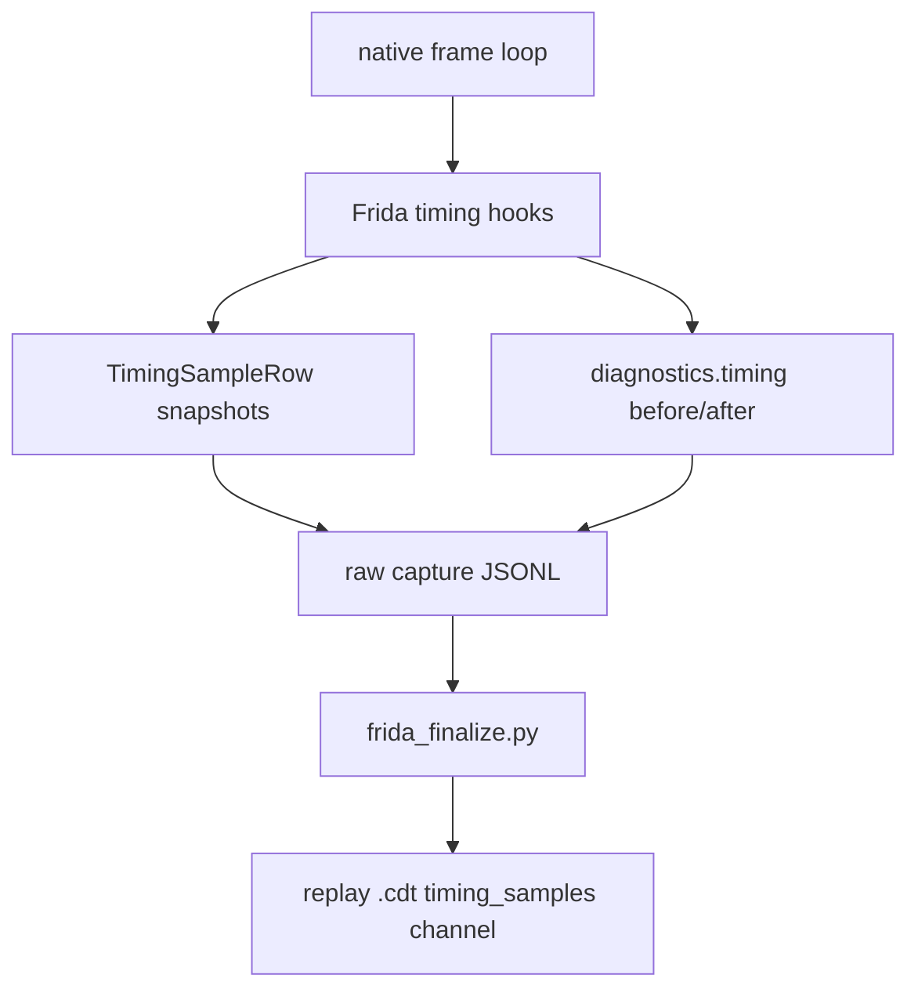
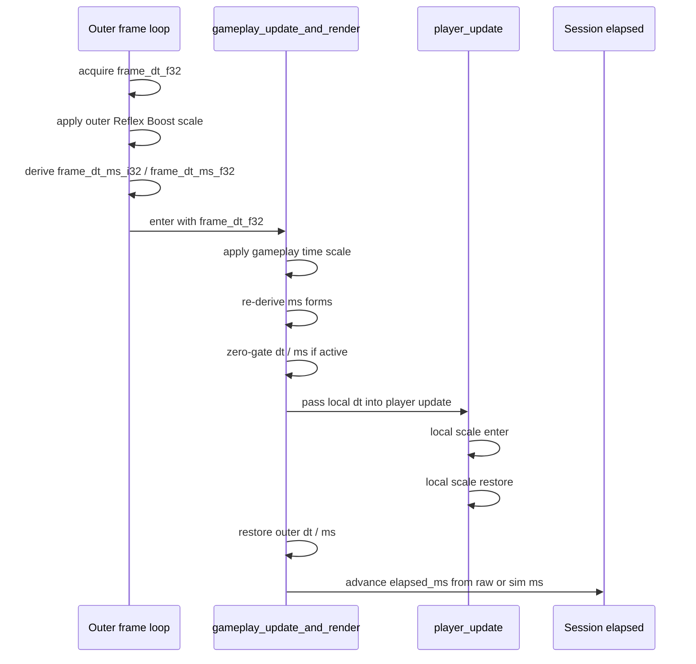
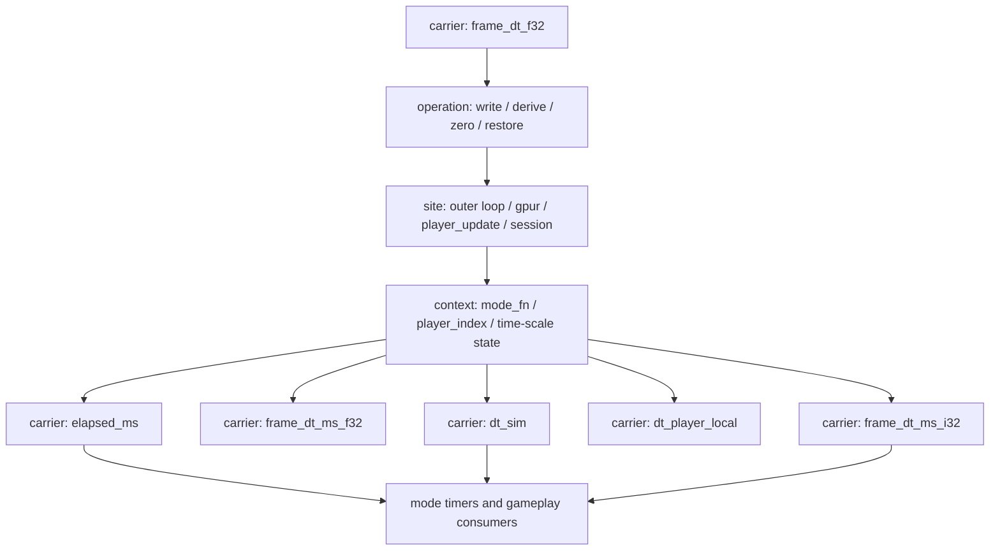

# Timing Samples Memo

## Purpose

`timing_samples` only matter if they help answer deterministic parity questions quickly.

The useful question is not "what timing-related values existed on this tick?" It is:

- where did `dt` come from?
- where was it scaled, converted, zeroed, restored, or accumulated?
- which site did that work?
- which downstream time representations were derived from it?

That is the lens for this memo.

## Current Timing Carriers

The repo currently has a few different timing *carriers* and a larger set of downstream timers.

### Core carriers

| Carrier | Current source | What it means |
| --- | --- | --- |
| `frame_dt_f32` | Native globals via Frida; Python `FrameTiming.dt` | The outer frame delta in float32 form |
| `frame_dt_ms_i32` | Native globals via Frida; Python `ftol_ms_i32(dt)` | Integer ms derived from frame dt using native-style float32 scaling + truncation |
| `frame_dt_ms_f32` | Native globals via Frida | Float ms copy of frame dt as kept by native |
| `dt_sim` | Python `FrameTiming.compute()` | The delta actually fed into most deterministic world update code after time scaling and zero gating |
| `dt_player_local` | Python `FrameTiming.dt_player_local` | The special player-local movement delta after the Reflex Boost round-trip |
| `elapsed_ms` | Session/runtime accumulation | The running elapsed time used by modes and some progression logic |

### Control inputs, not carriers

These affect timing, but they are not themselves the transported `dt`:

- `time_scale_active_entry`
- `time_scale_active_current`
- `time_scale_factor`
- `bonus_reflex_boost_timer`
- zero-gate state

### Downstream consumers, not core timing carriers

These consume time, but they are not the main frame-time transport path:

- `survival_elapsed_ms`
- `presentation_elapsed_ms`
- spawn timers
- reload timers
- effect timers
- local bonus countdowns

Those values still matter for gameplay parity, but they are better understood as *consumers of time* rather than the core `timing_samples` contract.

## Current Original-Side Capture

The Frida capture script already records a fairly rich timing timeline in `scripts/frida/gameplay_diff_capture.js`.

`TimingSampleRow` currently stores:

- tick/frame identity
- `phase`
- `write_kind`
- `frame_dt_f32`
- `frame_dt_ms_i32`
- `frame_dt_ms_f32`
- time-scale state and factor
- `bonus_reflex_boost_timer`
- optional `mode_fn`
- optional `player_index`

Important detail: each row is a *named snapshot of current globals*. It is not yet an explicit before/after mutation record.

### Current Frida timing phases

The script captures these named moments today:

| Phase | Kind | Meaning |
| --- | --- | --- |
| `outer_get_frame_dt` | `frame_dt_write` | Outer loop reads or writes the base frame dt |
| `outer_reflex_boosted_scale` | `frame_dt_write` | Outer loop applies Reflex Boost scaling |
| `outer_rederive_ms` | `frame_dt_ms_write` | Outer loop re-derives integer/float ms forms |
| `outer_console_zero_dt` | `frame_dt_write` | Outer loop zeroes dt for console/demo cases |
| `gpur_enter` | `snapshot` | Entry snapshot around `gameplay_update_and_render` |
| `gpur_after_gameplay_scale` | `frame_dt_write` | Gameplay-side scaling after time-scale logic |
| `gpur_after_gameplay_scale_ms` | `frame_dt_ms_write` | Gameplay-side ms re-derive after scale |
| `gpur_zero_gate_ms` | `frame_dt_ms_write` | Zero-gate affects ms copy |
| `gpur_zero_gate_dt` | `frame_dt_write` | Zero-gate affects dt |
| `gpur_time_scale_state_write` | `snapshot` | Time-scale state write |
| `gpur_bonus_reflex_timer_decrement` | `snapshot` | Bonus timer changes that influence time scale |
| `player_local_scale_enter` | `frame_dt_write` | `player_update` local movement scaling begins |
| `player_local_scale_restore` | `frame_dt_write` | `player_update` restores the scaled local dt |
| `gpur_restore_dt` | `frame_dt_write` | Gameplay loop restores outer dt |
| `gpur_restore_ms` | `frame_dt_ms_write` | Gameplay loop restores ms forms |

### What the capture path gives us today

It already gives us enough evidence to answer:

- what the native globals looked like at each marked phase
- whether dt changed before or after a specific phase
- whether ms forms were re-derived or restored
- whether local player dt scaling happened

What it does *not* give us cleanly yet:

- a first-class carrier name
- a first-class operation name
- before/after values for a mutation
- a stable "site did this" identity beyond the phase label

### Current original capture flow



## Current Replay Timing Model

Python replay models the actual timing math in code, but it does not currently emit parallel timing provenance rows.

### Replay-side timing math

`src/crimson/sim/timing.py` currently does the core timing derivation:

- quantize input `dt` through float32
- apply Reflex Boost time scaling to produce `dt_sim`
- zero `dt_sim` when zero-gate is active
- derive `dt_ms_i32` with `ftol_ms_i32`
- derive `dt_player_local` from the `player_update` round-trip math

`src/crimson/gameplay.py` also has `player_frame_dt_after_roundtrip()` to mirror the local player scaling/restore behavior.

`src/crimson/sim/sessions.py` advances `elapsed_ms` from either raw or sim milliseconds:

- `dt_raw_ms = timing.dt_ms_i32`
- `dt_sim_ms = timing.dt_sim_ms_i32`
- `elapsed_ms += dt_raw_ms` or `dt_sim_ms` depending on `elapsed_uses_raw_dt`

### Replay trace emission gap

`src/crimson/dbg/record.py` currently writes:

- real checkpoints
- real `rng_stream`
- real entity and sim-state snapshots
- `timing_samples=[]`

So the replay path has timing *math* but not timing *evidence*.

### Current replay flow

```mermaid
flowchart TD
    A[replay tick dt] --> B[FrameTiming.compute]
    B --> C[dt]
    B --> D[dt_sim]
    B --> E[dt_ms_i32]
    B --> F[dt_player_local]
    D --> G[world.step]
    F --> G
    E --> H[session elapsed advance]
    G --> I[checkpoint / trace assembly]
    I --> J[timing_samples = []]
```

## What `dbg` Does With Timing Today

The current consumers do not line up with the producer reality.

- `src/crimson/dbg/diff.py` treats `timing_samples` as a required parity-significant channel.
- `src/crimson/dbg/channel_compare.py` compares `timing_samples` by strict structural equality.
- `src/crimson/dbg/health.py` only counts timing rows; it does not explain whether they are meaningful.
- `src/crimson/dbg/focus.py` does not surface timing mismatches the way it does checkpoints or RNG.

This is why `timing_samples` is still the least-settled part of the trace contract:

- original capture has meaningful timing samples
- replay capture emits none
- diff still treats them as first-class parity evidence

## The Useful Mental Model

The useful model is: `timing_samples` should describe **timing provenance**.

Each meaningful row should answer:

- which carrier changed?
- what happened to it?
- where did that happen?
- what state controlled the change?

That is more valuable than treating the channel as a bag of snapshots.

### Per-tick timing lifecycle



## What A Better Timing Sample Contract Should Capture

If the goal is quick root-cause analysis, each row should be understandable as:

- `carrier`: what value is being tracked
- `operation`: what happened
- `site`: which function / hook / phase caused it
- `context`: optional `mode_fn`, `player_index`, or similar subject info
- `value`: the relevant observed or derived value

Suggested operation vocabulary:

- `capture`
- `write`
- `derive`
- `zero`
- `restore`
- `advance`

Suggested carrier vocabulary:

- `frame_dt_f32`
- `frame_dt_ms_i32`
- `frame_dt_ms_f32`
- `dt_sim`
- `dt_player_local`
- `elapsed_ms`

This is also where the "other times" question becomes clearer:

- `frame_dt_ms_i32` is not a side detail; it is a first-class derived carrier because native often consumes integer ms
- `frame_dt_ms_f32` is worth tracking because native may compare or propagate float-ms forms separately
- `elapsed_ms` is a first-class accumulator because it feeds modes and progression
- bonus timers and mode timers are usually context or downstream consumers, not the carrier itself

## Target Direction

The target shape is not "more timing fields". It is a cleaner provenance story.

### Recommended target behavior

- Treat timing samples as provenance rows, not generic snapshots.
- Explicitly distinguish carrier from control state.
- Keep ms conversions visible as first-class derived events.
- Treat `elapsed_ms` advance as part of the timing story, not an unrelated bookkeeping detail.
- Keep downstream timers out of the core timing channel unless they directly explain a deterministic branch.

### Target provenance flow



## Bottom Line

The current Frida path already captures enough information to be useful, but the row shape is still closer to "snapshot at named phase" than "explicit timing provenance".

The replay path has the right timing math, but it does not yet emit comparable timing evidence.

So the practical target is:

- make timing samples explain *where timing changed and why*
- keep integer/float ms conversions explicit
- include elapsed-time advancement in the story
- avoid mixing core timing transport with every downstream timer in the game

That is the version of `timing_samples` that would actually help find parity bugs.
