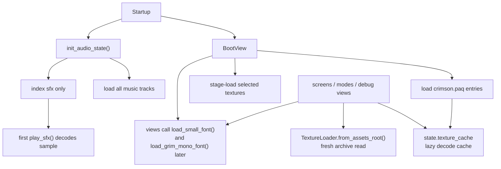
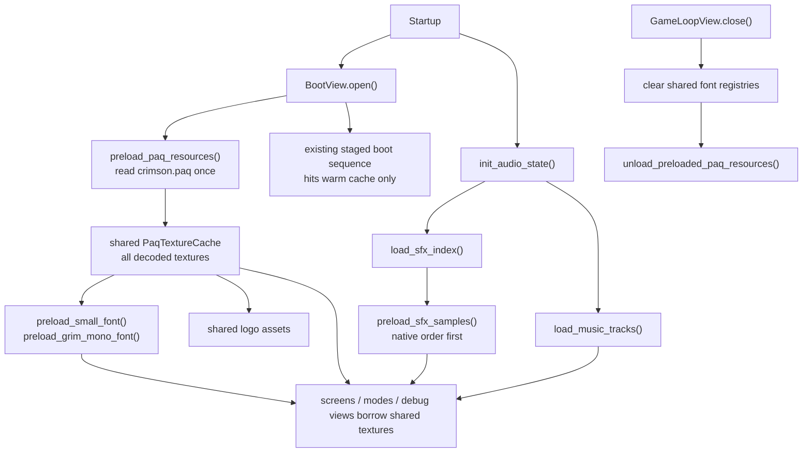

# Asset Loading Memo

## Goal

Simplify asset ownership without changing visible behavior or RNG behavior.

The hard constraint is strict parity. Asset loading must not introduce new randomness, and it must not move any gameplay RNG consumption. Startup work is acceptable because the shipped archives are small enough to load eagerly on modern hardware.

## Studied Paq Surface

The actual `.paq` files are not checked into this workspace, so this shape is inferred from the code paths and load maps the runtime uses.

- `crimson.paq`: mostly `ui/`, plus smaller `load/`, `game/`, and `ter/` groups
- `music.paq`: 6 named tracks
- `sfx.paq`: 72 native-load-order samples plus 3 extra present-but-unreferenced samples

Referenced `crimson.paq` paths cluster roughly like this:

- `ui/`: 39
- `load/`: 13
- `game/`: 11
- `ter/`: 8

That shape matters. Most of the runtime is borrowing from a small, stable asset surface, not browsing a large dynamic content tree.

## Problems In The Old Design

- `crimson.paq` was read once for boot, then re-read by `TextureLoader.from_assets_root()`, `load_small_font()`, and `load_grim_mono_font()`.
- `BootView` only preloaded a staged subset of textures. The rest of the UI still loaded textures on demand.
- music was eager, but SFX was still first-use decoded.
- screens and debug views owned font textures ad hoc and manually called `rl.unload_texture(...)`.
- ownership was implicit. The same run mixed shared cache textures, per-view loaders, per-view fonts, and lazy SFX samples.

The result was more code, more lifetime ambiguity, and more “first use” behavior than the game actually needs.

## Previous Architecture

## Implemented Design

This branch moves startup loading to a single shared ownership model while keeping the boot sequence visuals unchanged.

### 1. Startup-owned resource Paq cache

`BootView.open()` now:

- loads `crimson.paq` once
- eagerly decodes all texture-bearing entries once
- builds one shared `PaqTextureCache`
- stores shared logo assets from that cache

The staged boot logic still runs, but it now walks a warm cache instead of performing real decode work frame by frame. That preserves the current presentation while removing runtime texture churn.

### 2. Shared startup-owned UI fonts

`smallWhite` and `default_font_courier` are now borrowed from the same preloaded resource Paq cache.

The code now has explicit helpers for:

- preloading shared small and grim-mono fonts at startup
- borrowing those shared font handles later
- releasing per-view fallback fonts without unloading shared startup textures

That removes the old “every screen owns the font texture” rule.

### 3. Eager SFX decode at audio init

`init_audio_state()` now:

- indexes SFX
- eagerly decodes all samples at startup
- preserves native `SFX_LOAD_ORDER` first
- then loads the 3 known extra entries
- then loads any remaining keys

Playback behavior is otherwise unchanged. Variant choice, per-play pitch scaling, and all RNG consumption still happen at play time, not at startup.

### 4. Shutdown is explicit

App shutdown now:

- closes views and console first
- clears shared font registries
- unloads the shared preloaded resource Paq textures once

That gives the branch one clear owner for startup-loaded textures.

## Current Architecture On This Branch

## Parity Notes

- No gameplay RNG calls were moved into startup loading.
- Boot visuals were intentionally left alone. The old staged sequence still advances the same way; the cache is simply hot underneath it.
- SFX eager loading preserves native order first so startup sample creation is deterministic and easy to reason about.
- music was already startup-loaded, so this branch does not change its policy.

## What Is Still Worth Cleaning Up

The ownership model is much better, but the API surface is still more path-oriented than it should be.

Remaining worthwhile cleanup:

- replace remaining raw `\"ui/...\"` and `\"game/...\"` lookups with typed bundles
- make `TextureLoader.from_assets_root()` a thin compatibility layer over the shared startup cache, then gradually remove it from UI code
- collapse screen-local asset bundle builders into a few app-owned classic UI bundles
- eventually remove the old distinction between “boot preload” and “normal runtime texture access”, because they are now the same resource set

## Recommended Direction

Keep the current ownership model and continue simplifying on top of it.

The right next step is not another loader. It is fewer call sites that know archive paths at all.

That means:

1. keep one startup-owned Paq-backed texture cache
2. keep shared startup-owned fonts
3. keep eager SFX and eager music
4. move UI code toward typed shared bundles instead of path strings

That gets the codebase smaller without risking parity.
