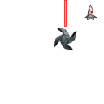
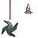

# Sprite atlas cutting (Crimsonland)

**Status:** In progress

This is based on the decompiled engine in `source/decompiled/crimsonland.exe_decompiled.c`.
The engine does **not** load atlas metadata from disk; all slicing is hard‑coded.

## UV grid tables

`FUN_0041fed0` precomputes UV grids for **2×2, 4×4, 8×8, 16×16**.
It fills tables with `(u, v)` pairs for each cell in row‑major order.
Step sizes:

- 2×2: 0.5
- 4×4: 0.25
- 8×8: 0.125
- 16×16: 0.0625


The renderer later uses these tables to build quads:

- `u0 = table[idx].u`, `v0 = table[idx].v`
- `u1 = u0 + step`, `v1 = v0 + step`


## Sprite table (engine‑hardcoded)

`FUN_0042e0a0` reads a table at **VA 0x004755F0**.
Each entry is `(cell_code, group_id)`; `cell_code` maps to grid size:

- `0x80 → 2`, `0x40 → 4`, `0x20 → 8`, `0x10 → 16`.


Extracted table (index → `(cell_code, group_id)`):
```
0:  (0x80, 0x2)
1:  (0x80, 0x3)
2:  (0x20, 0x0)
3:  (0x20, 0x1)
4:  (0x20, 0x2)
5:  (0x20, 0x3)
6:  (0x20, 0x4)
7:  (0x20, 0x5)
8:  (0x20, 0x8)
9:  (0x20, 0x9)
10: (0x20, 0xA)
11: (0x20, 0xB)
12: (0x40, 0x5)
13: (0x40, 0x3)
14: (0x40, 0x4)
15: (0x40, 0x5)
16: (0x40, 0x6)
```

The `group_id` is passed to the renderer alongside the grid size;
its semantics aren’t obvious from the decompile.

## Non-uniform sub-rects (grim_set_sub_rect)

The engine sometimes uses Grim2D vtable `0x108` (`grim_set_sub_rect`) to pick a
rectangle that spans multiple grid cells (not a single cell).

Known uses:

- `assets/crimson/ui/ui_wicons.png` uses an **8×8** grid but selects **2×1**
  sub-rects. The `frame` argument is derived from the weapon table
  (`weapon_id * 2`) and is reused across HUD + menu renders.
- Some UI paths call `grim_set_sub_rect` twice in a row to draw two adjacent
  slices from the same sheet (split-screen layouts).

## Manual UV overrides (grim_set_uv_point)

Some effects bypass atlas slicing and write UVs directly.

- In `projectile_render`, beam/chain effects (type_id `0x15/0x16/0x17/0x2d`)
  call `grim_set_uv_point` to force all U values to `0.625` and V to `0..0.25`,
  then draw a quad strip. This targets a thin vertical slice inside
  `projs.png`, so `projs/grid2/frame001` is further sub‑cut at runtime.
- The same path later resets UVs with `grim_set_uv(0,0,1,1)`.
- `grim_set_atlas_frame` itself only takes `(atlas_size, frame)` in `grim.dll`;
  any extra pointer args seen in the decompile are ignored.

### UV debug (grid2 frame 1)

`grim_set_uv_point` uses `u=0.625`, `v=0..0.25`, which lands inside the
top‑right grid2 cell. The overlays below show the sub‑slice used for beam
effects.





## How slicing is used in practice

The engine uses **two patterns**:

1) **Direct grid selection**: calls the renderer with an explicit grid size
   (`+0x104` with first arg = 2/4/8) and a frame index.

2) **Sprite table selection**: calls `FUN_0042e0a0(index)` which looks up the
   grid size from the table above and passes that to the renderer.

### Known assets and grids

- `assets/crimson/game/projs.png` (DAT_0048f7d4)
  - Uses **grid=4** (e.g. `+0x104(4, …)` around `source/decompiled/crimsonland.exe_decompiled.c:18448`).
  - Uses **grid=2** for some effects (e.g. `+0x104(2, 0)` around `:16479`).
  - Several projectile/beam effects draw **repeated quads** along a vector
    using a single frame (segment tiling instead of unique frames).
  - One beam path calls `set_atlas_frame(4,2,<dir>,<dir>)` with extra vector
    pointers; this likely orients the UVs for directional beam segments.

- `assets/crimson/game/bonuses.png` (DAT_0048f7f0)
  - Uses **sprite table index 0x10** (call at `:18550`), which maps to **grid=4**.
  - Sheet is 128×128 → 32×32 cells.

- `assets/crimson/game/particles.png` (DAT_0048f7ec)
  - Uses **grid=8** for the main particle system (see `+0x104(8, …)` at `:9704`).
  - Uses **sprite table indices 0x10, 0x0e, 0x0d, 0x0c** for UI/overlay effects
    (calls at `:996?`, `:16217`, `:16854`, `:18788`, `:18824`). These indices map to **grid=4**.

- `assets/crimson/ui/ui_wicons.png` (DAT_0048f7e4)
  - Uses **grid=8**, but rendered via `grim_set_sub_rect(8, 2, 1, frame)`.
  - This implies each weapon icon spans **2×1 cells** (wider than a single cell).

### Projectile frames (projs.png)

In `projectile_render`, the projectile `type_id` is stored as an int but shows
up as float constants in the decompile (e.g. `2.66247e-44` = `0x13`).

Known `projs.png` frame selections:

| type_id | grid | frame | Source | Notes |
| --- | --- | --- | --- | --- |
| `0x13` | 2 | 0 | Jackhammer | Draws a small glow/splash; size scales with life. |
| `0x1d` | 4 | 3 | Gauss Shotgun | Beam/segment style when life is `0.4`. |
| `0x19` | 4 | 6 | Spider Plasma | Beam/segment style when life is `0.4`. |
| `0x15` | 4 | 2 | Ion Minigun | Repeated along a vector to build beam/trail segments; also used by Man Bomb (perk id 53). |
| `0x16` | 4 | 2 | Ion Cannon | Repeated along a vector to build beam/trail segments; also used by Man Bomb (perk id 53). |
| `0x17` | 4 | 2 | Shrinkifier 5k | Repeated along a vector to build beam/trail segments. |
| `0x2d` | 4 | 2 | Fire Bullets bonus + Fire Cough perk | Used by the Fire Bullets bonus (bonus id 14) and the Fire Cough perk (perk id 54). The bonus path spawns `DAT_004d7aa0[weapon_id]` pellets per shot. |

The same path also calls `grim_set_atlas_frame(2, …)` for these beam types, but
the exact grid2 index is still unclear from the decompile.

- Enemy sheets (`assets/crimson/game/zombie.png`, `assets/crimson/game/lizard.png`,
  `assets/crimson/game/alien.png`, `assets/crimson/game/spider_sp1.png`,
  `assets/crimson/game/spider_sp2.png`, `assets/crimson/game/trooper.png`)
  - Drawn via **grid=8** (`+0x104(8, …)` in the enemy render path around `:9704`).
  - Per‑enemy base frame offsets are stored in the enemy data struct
    (e.g. `_DAT_00482760 = 0x20`, `_DAT_004827a4 = 0x10`, etc).


## Replicating the atlas cutting

`src/crimson/atlas.py` provides the same slicing math used by the engine:

- `grid_size_from_code(code)`
- `grid_size_for_index(table_index)`
- `uv_for_index(grid, index)`
- `rect_for_index(width, height, grid, index)`
- `slice_index(image, grid, index)`
- `slice_grid(image, grid)`


This is sufficient to reproduce the engine’s sprite cuts for any of the
uniform grids (2/4/8/16).

## Exporting frames and manifests

`scripts/atlas_export.py` slices a sprite sheet into per‑frame PNGs and writes
out a JSON manifest with rect/UV data.

```bash
uv run python scripts/atlas_export.py --image assets/crimson/game/projs.png --grid 4
```

Outputs:

- Frames under `output/atlas/projs/grid4/` (e.g. `frame_000.png`).
- `manifest.json` with `image`, `grid`, `cell_size`, and `frames` entries.

Use `--indices 0-3,8-11` to export a subset, or `--table-index 0x10` to use the
engine sprite table (grid 4).

### Bulk export

To export all textures referenced by the static scan into `assets_frames/`,
run:

```bash
uv run python scripts/atlas_scan.py --output-json output/atlas/atlas_usage.json
uv run python scripts/atlas_export.py --all
```

The output layout is:

- `assets_frames/<relative_path>/<texture_name>/grid<grid>/frame_###.png`
- `assets_frames/<relative_path>/<texture_name>/grid<grid>/manifest.json`

Manifests include `used_indices` when the static scan reported concrete frame
indices for a grid.

## Atlas usage by texture (static scan)

The notes below come from scanning `source/decompiled/crimsonland.exe_decompiled.c`
for texture binds (`+0xc4`) followed by atlas selection (`+0x104` or
`FUN_0042e0a0`). Use:

```bash
uv run python scripts/atlas_scan.py --output-json output/atlas/atlas_usage.json
```

The JSON output includes `texture`, `direct` (grid/index), and `table_indices`
per bound texture.

They list which grids and indices are used, but not the semantic meaning of
each frame.

- `assets/crimson/game/projs.png` (`projs`)
  - Direct grid calls: **4×4** indices `2`, `3`, `6` (plus one call with extra
    parameters using `grid=4, index=2`), and **2×2** index `0`.
  - Table index `0x10` → **4×4**.

- `assets/crimson/game/bonuses.png` (`bonuses`)
  - Direct grid calls: **4×4** index `0`, plus dynamic indices `iVar6` and
    `iVar6 + 1` (frame selection happens in code).

- `assets/crimson/game/bodyset.png` (`bodyset`)
  - Table index `0x10` → **4×4**.

- `assets/crimson/game/particles.png`
  - Table indices `0x10`, `0x0e`, `0x0d`, `0x0c` → **4×4**.
  - Table index `0x02` → **8×8**.
  - Direct grid calls: **2×2**, **4×4**, **8×8**, **16×16** with a dynamic
    index (`uVar2`).

- `ground` texture (terrain)
  - Direct grid call: **8×8** with dynamic index.

## Enemy animation slices (grid 8)

Enemies are rendered from 8×8 sheets (`+0x104(8, frame)`) with two selection
paths in `FUN_00418b60`:

- **32‑frame strip**: `frame = floor(anim_phase)` (0..31), optionally mirrored
  if the type table flag `(&DAT_00482768)[type * 0x44] & 1` is set. If the
  per‑creature flags include `0x10`, the frame offset shifts by `+0x20`
  (indices 32..63).
- **8‑frame ping‑pong strip**: `frame = base + 0x10 + pingpong(floor(anim_phase))`
  where `base = *(int *)(&DAT_00482760 + type * 0x44)` and ping‑pong folds a
  0..15 phase into 0..7..0.

Examples from the type init table (`FUN_00412dc0`):

- Zombie: base `0x20`
- Lizard: base `0x10`
- Spider SP1/SP2: base `0x10`
- Alien: base `0x20`

The animation phase itself lives at creature offset `0x94` and is advanced in
`FUN_00426220` using a per‑type rate (`&DAT_0048275c + type * 0x44`).

These sheets often pack **multiple animations** for the same type (long strip
plus short ping‑pong strip), and in some cases **multiple type variants** share
one sheet by selecting different base offsets.

### Enemy type table (DAT_00482728)

The render helper indexes a 0x44‑byte type table starting at `DAT_00482728`.
Known entries from `FUN_00412dc0`:

| Type id | Texture | Base (short strip) | Anim rate (hex) | Mirror flag | Notes |
| --- | --- | --- | --- | --- | --- |
| 0 | `zombie.png` | `0x20` | `0x3f99999a` | 0 | uses 32‑frame strip by default |
| 1 | `lizard.png` | `0x10` | `0x3fcccccd` | 1 | mirror flag set (`DAT_004827ac = 1`) |
| 2 | `alien.png` | `0x20` | `0x3faccccd` | 0 | alt strip via creature flag `0x10` |
| 3 | `spider_sp1.png` | `0x10` | `0x3fc00000` | 1 | mirror flag set (`DAT_00482834 = 1`) |
| 4 | `spider_sp2.png` | `0x10` | `0x3fc00000` | 1 | mirror flag set (`DAT_00482878 = 1`) |
| 5 | `trooper.png` | unknown | unknown | unknown | not initialized in `FUN_00412dc0` |

### Creature flags that select animation strips

Creature flags are written in the spawn helper `FUN_00430af0` and control which
strip is used in `FUN_00418b60`.

Examples:

- `param_1 == 0x3a` sets `DAT_0049bfc4 = 0x10` (forces the `+0x20` strip).
- Many IDs (e.g. `0x7`, `0x8`, `0x9`, `0x0b`) set `DAT_0049bfc4 = 0x4` (short strip).
- `param_1 == 0` sets `DAT_0049bfc4 = 0x44`, which still uses the long strip
  because bit `0x40` overrides the short‑strip branch.
