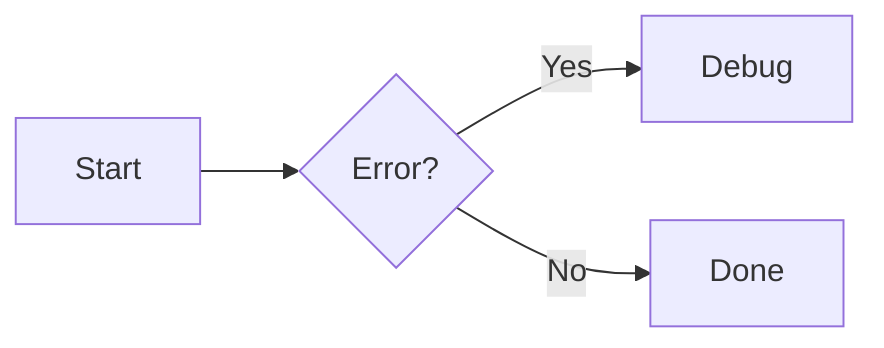

# Zensical.org Markdown cheat sheet

Zensical (and the docs site at zensical.org) is built on **Python Markdown** plus a curated set of **Markdown extensions**. If you don’t configure extensions yourself, Zensical applies a default set that enables most authoring features shown in the documentation. ([zensical.org][1])

Below is a practical “what you can write” cheat sheet: **core Markdown** + the **supported extension syntax** + the **theme/authoring patterns** (buttons, grids, etc.) that Zensical explicitly documents. ([zensical.org][1])

---

## 1) Core Markdown (baseline)

These are the “normal Markdown” bits you can assume work:

### Headings

```md
# H1
## H2
### H3
```

### Paragraphs & line breaks

```md
A paragraph.

Another paragraph.

A forced line break  
(using two trailing spaces)
```

### Emphasis

```md
*italic* or _italic_
**bold** or __bold__
***bold italic***
```

### Blockquotes

```md
> Quoted text
>
> Another paragraph in the quote.
```

### Inline code

```md
Use `inline_code()` for identifiers.
```

### Horizontal rule

```md
---
```

### Links

```md
[Link text](https://example.com)
```

### Images

```md

```

---

## 2) What Zensical explicitly supports (extensions list)

Zensical documents support for (at least) the following extensions:

* Abbreviations
* Admonition
* Arithmatex (math)
* Attribute Lists
* Caret, Mark & Tilde (underline/highlight/sub/sup)
* Definition Lists
* Details (collapsible blocks)
* Emoji
* Footnotes
* Highlight (code highlighting)
* Keys (keyboard key styling)
* Markdown in HTML
* SmartSymbols
* Snippets
* SuperFences (enhanced fenced blocks)
* Tabbed (content tabs)
* Table of Contents
* Tables
* Tasklist ([zensical.org][1])

---

## 3) Attribute Lists (attach classes/attrs with `{ ... }`)

Attribute Lists are a cornerstone of Zensical authoring patterns (buttons, aligned images, styled icons, etc.). ([zensical.org][2])

### Add CSS classes to a thing

```md
[Some link](#){ .some-class }
```

### Add HTML-ish attributes

```md
{ width="300" loading=lazy }
```

---

## 4) Buttons (links styled as buttons)

Zensical’s theme provides button styling by adding classes to links (via Attribute Lists). ([zensical.org][2])

### Basic button

```md
[Subscribe](#){ .md-button }
```

### Primary filled button

```md
[Subscribe](#){ .md-button .md-button--primary }
```

### Button with an icon/emoji shortcode

```md
[Send :fontawesome-solid-paper-plane:](#){ .md-button }
```

(Icon shortcodes are covered below.) ([zensical.org][2])

---

## 5) Icons & Emojis (shortcodes)

Zensical supports emojis and a large set of icons using shortcode-like syntax. ([zensical.org][3])

### Emojis

Put the emoji shortcode between colons:

```md
:smile:
```

([zensical.org][3])

### Icons

Icons use the same `:...:` pattern, but refer to an icon “path” transformed into a shortcode (slashes become hyphens). Example:

```md
:fontawesome-regular-face-laugh-wink:
```

([zensical.org][3])

### Add a class to an icon (e.g., for color/animation)

```md
:fontawesome-brands-youtube:{ .youtube }
```

This relies on Attribute Lists. ([zensical.org][3])

---

## 6) Admonitions (callout blocks) and Details (collapsible callouts)

Zensical supports **Admonition** and **Details**. ([zensical.org][1])

### Standard admonition

Common pattern (indent the content under the admonition):

```md
!!! note
    This is a note.
```

### Custom title

```md
!!! warning "Be careful"
    This action can’t be undone.
```

### Collapsible (details-style) admonition

A common “details” pattern is the same block but collapsible:

```md
??? info "Click to expand"
    Hidden until expanded.
```

> Tip: If you’re contributing to zensical.org docs, you can verify the exact look by checking the Admonitions page examples in their docs. ([zensical.org][1])

---

## 7) Lists (unordered, ordered, definition lists, task lists)

Zensical supports standard unordered/ordered lists, plus **definition lists** and **task lists** via extensions. ([zensical.org][4])

### Unordered lists

Use `-`, `*`, or `+`:

```md
- Item A
- Item B
  - Nested item
```

([zensical.org][4])

### Ordered lists

Numbers don’t need to be consecutive (they’ll be renumbered on render):

```md
1. First
1. Second
1. Third
```

([zensical.org][4])

### Definition lists

```md
Term
:   Definition text

Another term
:   Another definition
```

([zensical.org][4])

### Task lists (checkboxes)

```md
- [x] Done
- [ ] Not done
  - [x] Nested done
```

([zensical.org][4])

---

## 8) Tables

Zensical supports the **Tables** extension. ([zensical.org][1])

A typical pipe-table looks like:

```md
| Column A | Column B |
|---------:|:---------|
| right    | left     |
| 123      | abc      |
```

(Exact alignment rules follow the common Markdown “tables” extension behavior.)

---

## 9) Footnotes

Footnotes are supported and render at the bottom of the page. ([zensical.org][5])

### Footnote references

```md
Here is a statement with a footnote.[^1]
```

([zensical.org][5])

### Footnote definitions (single line)

```md
[^1]: The footnote content goes here.
```

([zensical.org][5])

### Footnote definitions (multi-line)

Indent continuation lines by 4 spaces:

```md
[^2]:
    This footnote has multiple lines.
    It keeps going here.
```

([zensical.org][5])

### Footnote tooltips

Zensical can render footnotes as tooltips via a theme feature, and the docs note it’s enabled on their documentation. ([zensical.org][5])

---

## 10) Tooltips (link titles + site-wide glossary)

### Link title tooltips

Standard Markdown link titles become tooltips (and look nicer if “improved tooltips” is enabled in the theme). ([zensical.org][6])

```md
[Hover me](https://example.com "I'm a tooltip!")
```

([zensical.org][6])

### Glossary-style abbreviations

Zensical uses **Abbreviations** + **Snippets** to build a site-wide glossary file you can auto-append to all pages. ([zensical.org][6])

Define abbreviations like:

```md
*[HTML]: Hyper Text Markup Language
*[W3C]: World Wide Web Consortium
```

([zensical.org][6])

---

## 11) Content tabs

Zensical supports tabbed content blocks. ([zensical.org][7])

### Tabs grouping code blocks

````md
=== "C"

    ``` c
    #include <stdio.h>
    int main(void) { return 0; }
    ```

=== "C++"

    ``` c++
    #include <iostream>
    int main(void) { return 0; }
    ```
````

([zensical.org][7])

### Linked tabs across the whole site

There’s a theme feature that links tabs by label so selecting a tab on one page selects the same-labeled tab elsewhere. ([zensical.org][7])

---

## 12) Code blocks and fenced blocks (general)

Zensical supports enhanced fenced blocks via **SuperFences** and code highlighting via **Highlight**. ([zensical.org][1])

### Standard fenced code block

````md
``` python
print("Hello")
```
````

### Fences used for non-code features

Many “features” are just fenced blocks with a special info string (language), like `mermaid` (diagrams) or the tabbed example above. ([zensical.org][8])

---

## 13) Diagrams (Mermaid)

Zensical integrates with Mermaid.js and will initialize Mermaid when a page contains a `mermaid` code block. ([zensical.org][8])

### Mermaid flowchart

````md

````

([zensical.org][8])

Zensical documents other Mermaid diagram types too (state diagrams, class diagrams, etc.). ([zensical.org][8])

---

## 14) Math (LaTeX-style)

Zensical supports math via **Arithmatex** and documents integration with MathJax or KaTeX. ([zensical.org][9])

### Block math

Use either `$$...$$` or `\[...\]` on separate lines:

```md
$$
\cos x=\sum_{k=0}^{\infty}\frac{(-1)^k}{(2k)!}x^{2k}
$$
```

([zensical.org][9])

### Inline math

Use `$...$` or `\(...\)`:

```md
The map $f$ is injective iff \(\ker(f)=\{e\}\).
```

([zensical.org][9])

---

## 15) Images (alignment, captions, lazy-loading, light/dark variants)

### Align images left/right

Add `align=left` or `align=right` via Attribute Lists:

```md
{ align=left }
```

([zensical.org][10])

### Captions

**Option A: HTML figure + Markdown in HTML**

```md
<figure markdown="span">
  { width="300" }
  <figcaption>Image caption</figcaption>
</figure>
```

([zensical.org][10])

**Option B: Caption blocks**

```md
{ width="300" }
/// caption
Image caption
///
```

([zensical.org][10])

### Lazy-loading

```md
{ loading=lazy }
```

([zensical.org][10])

### Light/dark mode images

Append `#only-light` / `#only-dark` to the image URL:

```md


```

([zensical.org][10])

---

## 16) Grids (card grids + generic grids)

Grids are authored using HTML containers plus `markdown` processing (Markdown in HTML) so you can write Markdown inside. ([zensical.org][11])

### Card grid (list syntax)

```md
<div class="grid cards" markdown>
- **Card 1** — text
- **Card 2** — text
- **Card 3** — text
</div>
```

([zensical.org][11])

### Card grid (block syntax)

Add `{ .card }` to blocks inside a `.grid` container:

```md
<div class="grid" markdown>

**Card A**
{ .card }

> A blockquote can also live in the grid.

</div>
```

([zensical.org][11])

### Generic grids

Wrap arbitrary blocks (tabs, code blocks, admonitions, etc.) inside:

```md
<div class="grid" markdown>

=== "Tab 1"
    Content

=== "Tab 2"
    Content

</div>
```

([zensical.org][11])

---

## 17) “Caret, Mark & Tilde” and “Keys” quick syntax

Zensical supports these formatting extensions. ([zensical.org][1])

Common patterns (as used by these extensions):

```md
==highlight==

^^underline^^

~~strikethrough~~

H~2~O        (subscript)
X^2^         (superscript)

++ctrl+alt+del++   (keyboard keys)
```

(Exact rendering depends on the enabled extensions/theme, but these are the standard syntaxes for the supported set.) ([zensical.org][1])

---

## 18) Table of contents and heading permalinks

Zensical enables a Table of Contents extension and (in the documented defaults) sets `permalink: true`, which adds permalink anchors to headings. ([zensical.org][1])

Practical authoring takeaway:

* Use meaningful heading structure (`##`, `###`, …).
* Expect headings to get linkable anchors/permalinks when that feature is enabled. ([zensical.org][1])

---

## Notes on “what’s enabled on zensical.org” vs “what Zensical supports”

* The list above is the **supported** set (what Zensical can parse/render). ([zensical.org][1])
* Some behaviors are explicitly **theme features** (e.g., improved tooltips, footnote tooltips, linked tabs) and depend on site configuration; the docs call out how to enable them. ([zensical.org][6])
* Zensical’s docs also mention it’s working toward **CommonMark** support in the future. ([zensical.org][1])

If you tell me whether you’re (a) writing docs for the zensical.org repo specifically or (b) authoring your own Zensical site, I can tailor this into a “minimal subset that’s enabled by default” vs “optional features you must enable.”

[1]: https://zensical.org/docs/setup/extensions/ "https://zensical.org/docs/setup/extensions/"
[2]: https://zensical.org/docs/authoring/buttons/ "https://zensical.org/docs/authoring/buttons/"
[3]: https://zensical.org/docs/authoring/icons-emojis/ "https://zensical.org/docs/authoring/icons-emojis/"
[4]: https://zensical.org/docs/authoring/lists/ "https://zensical.org/docs/authoring/lists/"
[5]: https://zensical.org/docs/authoring/footnotes/ "https://zensical.org/docs/authoring/footnotes/"
[6]: https://zensical.org/docs/authoring/tooltips/ "https://zensical.org/docs/authoring/tooltips/"
[7]: https://zensical.org/docs/authoring/content-tabs/ "https://zensical.org/docs/authoring/content-tabs/"
[8]: https://zensical.org/docs/authoring/diagrams/ "https://zensical.org/docs/authoring/diagrams/"
[9]: https://zensical.org/docs/authoring/math/ "https://zensical.org/docs/authoring/math/"
[10]: https://zensical.org/docs/authoring/images/ "https://zensical.org/docs/authoring/images/"
[11]: https://zensical.org/docs/authoring/grids/ "https://zensical.org/docs/authoring/grids/"
