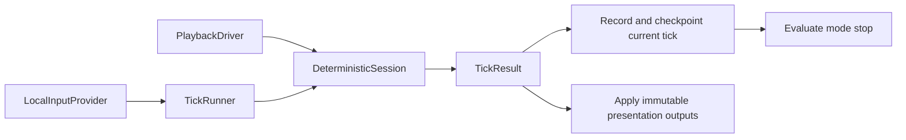

---
tags:
  - status-parity
---

# Deterministic Step Pipeline

Live gameplay, replay verification/playback, and headless harnesses step the same
`DeterministicSession` in `src/crimson/sim/sessions.py`.

## Tick contract

`ResolvedTick` carries a tick index, delta, a tuple of `PlayerInput` values in slot
order, and commands. Live input comes from `LocalInputProvider`; replay input
comes from `PlaybackDriver`. Replay preludes and postludes retain their own
between-tick timing contract.

The session returns one `DeterministicSessionTick` containing:

- effective delta and native frame timing;
- simulation events and optional presentation RNG trace;
- an immutable `DeterministicPresentationPlan`, including quest sound and music requests;
- elapsed time, creature count, and quest completion state for that tick.

`TickResult` adds the source input and optional replay index. There is no nested
step payload. Presentation profiling time lives on the session and is collected
by the outer loop, outside the deterministic result.



## Step and application order

For each live tick, the runner steps the session, records the replay input,
applies metadata, records the checkpoint, and evaluates the mode callback before
advancing another tick. A terminal callback stops the batch immediately. The
final tick is recorded before a callback can save the finished replay.

Audio, camera, and terrain application can be batched after simulation because
all presentation requests belong to their producing tick. The shared consumer in
`src/crimson/sim/batch_apply.py` calls `AudioBridge.apply_plan`, applies camera and
terrain output, then calls `AudioBridge.apply_post_plan` for bonus/quest sounds
and completion music. Consumers do not reconstruct reactions from current quest
state. Replay fast-forward can suppress audio without changing simulation RNG.

Native hit audio and terrain effects consume authoritative RNG, so headless
verification still builds the presentation plan even without rendering or audio.

Frame orchestration is in `src/crimson/sim/frame_pump.py` and
`src/crimson/replay/driver/playback_pump.py`. These preserve distinct live and
replay source timing while sharing result application.

## Input and timer ownership

Local input keeps unconsumed button edges across zero-tick render frames, uses
the latest held controls and aim, and clears true edges after the first tick.
Pausing clears pending edges and clock debt while retaining explicit commands.
Movement fields named `*_pressed` represent held controls in the existing format.

Survival and rush time belongs to `DeterministicSession.elapsed_ms`; quest time
belongs to `QuestSpawnState.spawn_timeline_ms`. Render/HUD animation time is a
separate `SimWorldState.presentation_elapsed_ms` cache.

Custom network play has been removed; see [Netplay](netplay.md) for the deferred
scope and requirements for any future implementation.

## Phase ownership

Perk timing and death effects are direct calls in `WorldState`; per-player and
global perk effects have explicit ordered calls in `perks/runtime/player_ticks.py`
and `perks/runtime/effects.py`. See [Perks architecture](perks-architecture.md).
Bonus pickup effects live in `bonuses/pickup_fx.py`, and projectile decals live in
`features/presentation/projectile_decals.py`.

## RNG Policy

The deterministic pipeline uses one authoritative RNG stream:

- simulation + presentation RNG: `state.rng`

`WorldState.step`, the deterministic session hooks, and replay verification all
consume that stream in a stable per-tick order.

### RNG Trace Mode

Replay verification and checkpoint verification expose `--trace-rng`:

```bash
uv run crimson replay verify replay.crd --trace-rng
uv run crimson replay verify-checkpoints replay.crd --trace-rng
```

When enabled, the replay driver records per-tick presentation/gameplay RNG draw
rows while building the usual checkpoint or verifier trace. Checkpoint sidecars
still compare the stable checkpoint schema: state, RNG state, deaths, events,
score/kills, and mode snapshots.

## Replay Verify

`replay verify` runs the replay headlessly through `PlaybackDriver` and emits
the simulated run result: ticks, elapsed time, score, kills, weapon/shots
stats, and RNG state.

```bash
uv run crimson replay verify replay.crd
uv run crimson replay verify replay.crd --format json
```

Header claimed-stat mismatches still return exit code `3`.

## Replay Info

`replay info` runs the same deterministic replay simulation and emits a
chronological event timeline sourced from `collect_replay_info(driver, ...)`.

```bash
uv run crimson replay info replay.crd
uv run crimson replay info replay.crd --format json --json-out analysis/replay/info.json
```

The machine-readable payload is versioned (`schema_version=2`) and includes a
summary plus ordered timeline events.

## Replay Benchmark And Render

`replay benchmark` and `replay render` also build on the same replay-driver contract.

```bash
uv run crimson replay benchmark replay.crd --runs 8 --warmup-runs 2
uv run crimson replay benchmark replay.crd --mode render --runs 8 --warmup-runs 2
uv run crimson replay render replay.crd
```

Headless benchmark uses the verify driver. Render benchmark and replay render
use replay playback mode on top of the same deterministic replay stepping.

## Replay Checkpoints Comparison

Replay checkpoints are compared by replaying through the same deterministic
driver path and diffing checkpoint state, RNG marks, deaths, events, and score/kills metadata.

```bash
uv run crimson replay verify-checkpoints replay.crd
uv run crimson replay diff-checkpoints expected.crd.chk actual.crd.chk
```

This keeps checkpoint verification aligned with the same deterministic contract
used by headless replay validation and replay playback.

## Differential Testing Path

For original-game comparison, use unified trace (`.cdt`) tooling.
Frida capture host finalizes raw JSONL directly into `.cdt`.
