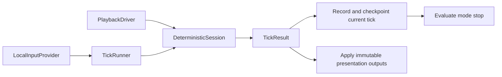

---
tags:
  - status-parity
---

# Deterministic session

All five gameplay modes initialize through `RunSpec` and `initialize_run`; see
[run startup](replay-run-start.md). Live gameplay, replay verification/playback,
and headless harnesses step the same
`DeterministicSession` in `src/crimson/sim/sessions.py`.

## Tick contract

`ResolvedTick` carries a tick index, delta, a tuple of `PlayerInput` values in slot
order, and commands. Live input comes from `LocalInputProvider`; replay input
comes from `PlaybackDriver`. Replay preludes and postludes retain their own
between-tick timing contract.

The session returns one `DeterministicSessionTick` containing:

- effective delta and native frame timing;
- simulation events and optional presentation RNG trace;
- an immutable `DeterministicPresentationPlan`, including quest sound and music requests;
- elapsed time, creature count, and quest completion state for that tick.

`TickResult` holds that result in `payload`, alongside the source input and
optional replay index. Presentation profiling time lives on the session and is collected
by the outer loop, outside the deterministic result.

## Step and application order

For each live tick, the runner steps the session, records the replay input,
applies metadata, records the checkpoint, and evaluates the mode callback before
advancing another tick. A terminal callback stops the batch immediately. The
final tick is recorded before a callback can save the finished replay.

Audio, camera, and terrain application can be batched after simulation because
all presentation requests belong to their producing tick. The shared consumer in
`src/crimson/sim/batch_apply.py` calls `AudioBridge.apply_plan`, applies camera and
terrain output, then calls `AudioBridge.apply_post_plan` for bonus/quest sounds
and completion music. Consumers do not reconstruct reactions from current quest
state. Replay fast-forward can suppress audio without changing simulation RNG.

Native hit audio and terrain effects consume authoritative RNG, so headless
verification still builds the presentation plan even without rendering or audio.

Frame orchestration is in `src/crimson/sim/frame_pump.py` and
`src/crimson/replay/driver/playback_pump.py`. These preserve distinct live and
replay source timing while sharing result application.

## Input and timer ownership

Local input keeps unconsumed button edges across zero-tick render frames, uses
the latest held controls and aim, and clears true edges after the first tick.
A pending fire press resolves to `fire_down=True` for one tick, so wheel input
and clicks released before a tick still fire. Pausing clears pending edges and clock debt while retaining explicit commands.
Movement fields named `*_pressed` represent held controls in the existing format.

Survival and rush time belongs to `DeterministicSession.elapsed_ms`; quest time
belongs to `QuestSpawnState.spawn_timeline_ms`. Render/HUD animation time is a
separate `SimWorldState.presentation_elapsed_ms` cache.

Custom network play has been removed; see [Netplay](netplay.md) for the deferred
scope and requirements for any future implementation.

## Phase ownership

Perk timing and death effects are direct calls in `WorldState`; per-player and
global perk effects have explicit ordered calls in `perks/runtime/player_ticks.py`
and `perks/runtime/effects.py`. See [Perks architecture](perks-architecture.md).
Bonus pickup effects live in `bonuses/pickup_fx.py`, and projectile decals live in
`features/presentation/projectile_decals.py`.

## RNG Policy

The deterministic pipeline uses one authoritative RNG stream:

- simulation + presentation RNG: `state.rng`

`WorldState.step`, the deterministic session hooks, and replay verification all
consume that stream in a stable per-tick order.

## Validation and tools

`tests/sim/test_step_pipeline_parity.py` covers live batching and playback
behavior; `tests/replay/test_live_run_start.py` compares full session state
through actual mode startup and recording. Compact checkpoints support native
comparison but omit state: use `session_digest` in `src/crimson/dbg/state_digest.py`
for same-build port regression checks.

Replay play, verify, info, benchmark and render all use this simulation contract.
Use `uv run crimson replay --help` and command-specific help for options. Native
capture comparisons use the [CDT contract](trace-format-alignment.md) and
[differential playbook](../frida/differential-playbook.md).
