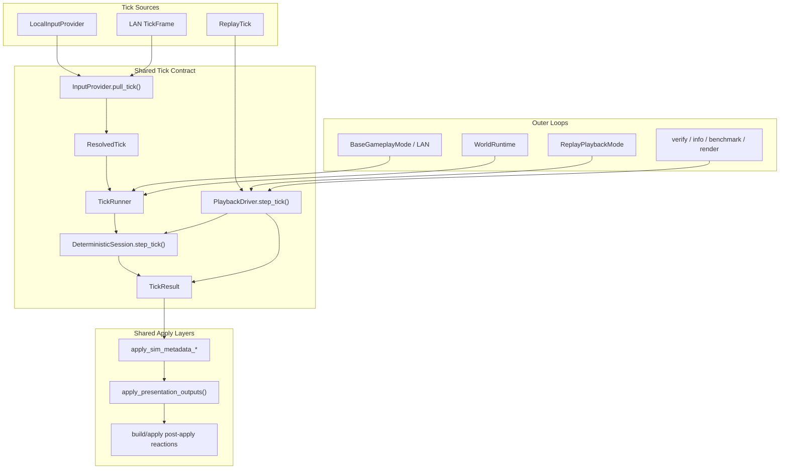
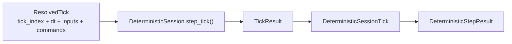
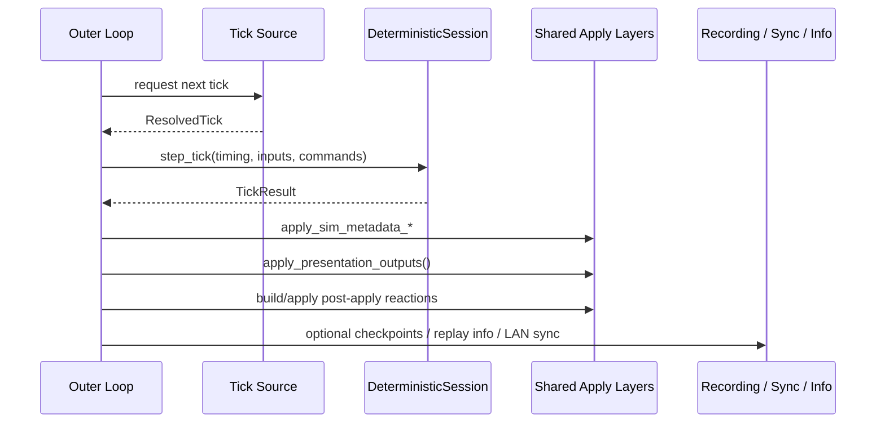

---
tags:
  - status-parity
---

# Deterministic Step Pipeline

This page describes the current per-tick contract shared by:

- live gameplay via `TickRunner`
- replay verification and replay info via `PlaybackDriver`
- replay playback mode
- world/runtime harnesses that step deterministic ticks directly

The core deterministic step lives in `src/crimson/sim/step_pipeline.py`.
Session orchestration lives in `src/crimson/sim/sessions.py`.
Canonical tick input lives in `src/crimson/sim/input_providers.py`.
Shared frame/apply helpers live in `src/crimson/sim/frame_pump.py`,
`src/crimson/sim/driver/playback_pump.py`, `src/crimson/sim/batch_apply.py`,
and `src/crimson/sim/presentation_reactions.py`.

## Architecture Overview



The important architectural point is that live, LAN, replay verification, and
replay playback no longer invent separate in-memory tick/result shapes. They
all converge on `ResolvedTick -> DeterministicSession -> TickResult`, then fan
out into shared apply layers plus mode- or tool-specific outer loops.

## Tick Contract

At the runtime boundary, one deterministic tick is one `ResolvedTick`:

- `tick_index`
- `dt_seconds`
- `inputs`
- `commands`

Live/LAN paths receive it through `InputProvider.pull_tick(...) -> TickSupply`.
Replay paths synthesize the same shape inside `PlaybackDriver.step_tick(...)`.

The deterministic result shape is shared too:

- `TickResult.source_tick` carries the canonical `ResolvedTick`
- `TickResult.payload` carries `DeterministicSessionTick`
- replay stepping additionally sets `TickResult.replay_tick_index`

`DeterministicSession.step_tick(...)` produces a `DeterministicSessionTick`
whose `step` is a `DeterministicStepResult` with:

- `dt_sim`: effective dt after deterministic scaling
- `events`: deterministic sim events
- `presentation`: deterministic presentation commands
- `post_apply_sfx_keys`: post-apply presentation reactions triggered by successful command effects
- optional RNG trace data when replay trace mode is enabled



## Shared Step / Apply Path

The runtime is now split into a consistent sequence:

1. get a canonical `ResolvedTick`
2. step `DeterministicSession`
3. apply sim metadata to the runtime world
4. apply presentation outputs
5. apply post-apply reactions
6. optionally record checkpoints, replay stats, or sync network state

Shared helpers own the bookkeeping around that sequence:

- live `TickRunner` frame advancement:
  `src/crimson/sim/frame_pump.py`
- replay playback frame advancement:
  `src/crimson/sim/driver/playback_pump.py`
- sim metadata apply and presentation output apply:
  `src/crimson/sim/batch_apply.py`
- post-apply presentation reactions:
  `src/crimson/sim/presentation_reactions.py`

This keeps live gameplay, replay playback, headless verification, and runtime
harnesses close to the same deterministic contract even when their outer loops differ.



### Timer Ownership

Timer semantics are now explicit instead of implicit:

- survival and rush runtime timing comes from `DeterministicSession.elapsed_ms`
- quest progression/replay timing comes from `QuestSpawnState.spawn_timeline_ms`
- render/HUD animation caches use `SimWorldState.presentation_elapsed_ms`

That separation is deliberate. The session or spawn state owns authoritative
runtime time; `presentation_elapsed_ms` is only a presentational cache for
world rendering and HUD animation.

## Why This Matters

The old split between live gameplay, replay verification, and replay playback
made parity drift easier: different tick shapes, duplicated loop bookkeeping,
and mode-specific side effects wired in different places.

The current model is simpler:

- live/LAN/replay all step through the same `DeterministicSession`
- replay uses the same in-memory tick/result shapes as live
- mode-specific runtime state is authoritative in spawn/session state, not echoed through generic tick types
- presentation reactions are applied through one shared post-apply layer

That makes replay verification, checkpoint comparison, LAN parity, and diff
investigation much easier to reason about.

## Studyability Hook Topology

The deterministic step still routes selected behavior through explicit hook registries:

- perk world-step hooks:
  - manifest: `src/crimson/perks/runtime/manifest.py`
  - contracts: `src/crimson/perks/runtime/hook_types.py`
- bonus pickup presentation hooks:
  - registry: `src/crimson/bonuses/pickup_fx.py`
- projectile decal presentation hooks:
  - registry: `src/crimson/features/presentation/projectile_decals.py`

This keeps `WorldState.step` and `apply_world_presentation_step` focused on orchestration.

## RNG Policy

The deterministic pipeline uses one authoritative RNG stream:

- simulation + presentation RNG: `state.rng`

`WorldState.step`, the deterministic session hooks, and replay verification all
consume that stream in a stable per-tick order.

### RNG Trace Mode

Replay verification and checkpoint verification expose `--trace-rng`:

```bash
uv run crimson replay verify replay.crd --trace-rng
uv run crimson replay verify-checkpoints replay.crd --trace-rng
```

When enabled, the replay driver records per-tick presentation/gameplay RNG draw
rows while building the usual checkpoint or verifier trace. Checkpoint sidecars
still compare the stable checkpoint schema: state, RNG state, deaths, events,
score/kills, and mode snapshots.

## Replay Verify

`replay verify` runs the replay headlessly through `PlaybackDriver` and emits
the simulated run result: ticks, elapsed time, score, kills, weapon/shots
stats, and RNG state.

```bash
uv run crimson replay verify replay.crd
uv run crimson replay verify replay.crd --format json
```

Header claimed-stat mismatches still return exit code `3`.

## Replay Info

`replay info` runs the same deterministic replay simulation and emits a
chronological event timeline sourced from `collect_replay_info(driver, ...)`.

```bash
uv run crimson replay info replay.crd
uv run crimson replay info replay.crd --format json --json-out analysis/replay/info.json
```

The machine-readable payload is versioned (`schema_version=2`) and includes a
summary plus ordered timeline events.

## Replay Benchmark And Render

`replay benchmark` and `replay render` also build on the same replay-driver contract.

```bash
uv run crimson replay benchmark replay.crd --runs 8 --warmup-runs 2
uv run crimson replay benchmark replay.crd --mode render --runs 8 --warmup-runs 2
uv run crimson replay render replay.crd
```

Headless benchmark uses the verify driver. Render benchmark and replay render
use replay playback mode on top of the same deterministic replay stepping.

## Replay Checkpoints Comparison

Replay checkpoints are compared by replaying through the same deterministic
driver path and diffing checkpoint state, RNG marks, deaths, events, and score/kills metadata.

```bash
uv run crimson replay verify-checkpoints replay.crd
uv run crimson replay diff-checkpoints expected.crd.chk actual.crd.chk
```

This keeps checkpoint verification aligned with the same deterministic contract
used by headless replay validation and replay playback.

## Differential Testing Path

For original-game comparison, use unified trace (`.cdt`) tooling.
Frida capture host finalizes raw JSONL directly into `.cdt`.
