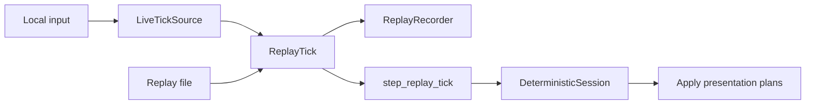

---
tags:
  - status-parity
---

# Deterministic session

All five gameplay modes initialize through `RunSpec` and `initialize_run`; see
[run startup](replay-run-start.md). Live gameplay, replay verification/playback,
and headless harnesses step the same
`DeterministicSession` in `src/crimson/sim/sessions.py`.

## Tick contract

A tick is a `ReplayTick`: packed per-player inputs in slot order (f32 axes and
flag words) and ordered commands, stepped with the fixed `REPLAY_TICK_DT`.
`step_replay_tick` in `src/crimson/replay/ticks.py` is the only way live play
and replays advance a session. Live play packs each tick with `LiveTickSource`,
records it, then steps that same tick, so the simulation never sees input the
replay cannot store. Original-capture playback (`crimson.dbg`) keeps its own
per-tick native delta and between-tick preludes and postludes.

The session returns one `DeterministicSessionTick` containing:

- effective delta and native frame timing;
- simulation events and optional presentation RNG trace;
- an immutable `DeterministicPresentationPlan`, including quest sound and music requests;
- elapsed time, creature count, and quest completion state for that tick.

Replay drivers wrap it in a `TickResult` with the tick index.

```mermaid
flowchart LR
    Local[Local input] --> Source[LiveTickSource]
    Source --> Tick[ReplayTick]
    Tick --> Recorder[ReplayRecorder]
    File[Replay file] --> Tick
    Tick --> Step[step_replay_tick]
    Step --> Session[DeterministicSession]
    Session --> Present[Apply presentation plans]
```

## Step and application order

For each live tick, the mode builds the tick, records it, steps it, advances
the presentation clock, records the checkpoint, and evaluates the mode callback before
advancing another tick. A terminal callback ends the frame immediately. The
final tick is recorded before a callback can save the finished replay.

Audio, camera, and terrain application can be batched after simulation because
all presentation requests belong to their producing tick. The shared consumer in
`src/crimson/sim/batch_apply.py` calls `AudioBridge.apply_plan`, applies camera and
terrain output, then calls `AudioBridge.apply_post_plan` for bonus/quest sounds
and completion music. Consumers do not reconstruct reactions from current quest
state. Replay fast-forward can suppress audio without changing simulation RNG.

Sound requests carry their ID, event position (or `None` for centered UI audio),
and gain. Their plan captures demo attenuation and the Reflex Boost pitch timer.
The consumer uses the viewport before each tick's camera update, so deferred
sounds never read a later player's or creature's position.

SFX cooldowns advance after each consumed tick's sound requests, using
`FrameTiming.dt_audio`: the native frame delta after Reflex Boosted perk scaling
but before Reflex Boost slow motion. Music streams are serviced every render
frame; gameplay passes `advance_sfx=False` to that service to avoid advancing
cooldowns twice. Screens without simulation ticks advance cooldowns with their
audio update. Headless runs still consume sound-selection RNG, but do not own
device playback or cooldown state.

Native hit audio and terrain effects consume authoritative RNG, so headless
verification still builds the presentation plan even without rendering or audio.

A `FixedStepClock` turns render-frame time into ticks for live play,
the attract demo, debug views and replay playback
(`src/crimson/replay/driver/playback_pump.py`).

## Input and timer ownership

`LiveTickSource` polls local input once per render frame. It keeps undelivered
button edges across zero-tick frames, uses the latest held controls and aim,
and clears edges after the first tick. A pending fire press resolves to
`fire_down=True` for one tick, so wheel input and clicks released before a tick
still fire. Pausing clears pending edges and clock debt while retaining queued
commands.
Movement fields named `*_pressed` represent held controls in the existing format.

Survival and rush time belongs to `DeterministicSession.elapsed_ms`; quest time
belongs to `QuestSpawnState.spawn_timeline_ms`. Render/HUD animation time is a
separate `WorldRuntime.presentation_elapsed_ms` clock.

Custom network play has been removed; see [Netplay](netplay.md) for the deferred
scope and requirements for any future implementation.

## Phase ownership

Perk timing and death effects are direct calls in `WorldState`; per-player and
global perk effects have explicit ordered calls in `perks/runtime/player_ticks.py`
and `perks/runtime/effects.py`. See [Perks architecture](perks-architecture.md).
Bonus pickup effects are drawn inside `bonus_apply`, as in native, so each pickup's RNG draws
precede the next pickup applied in the same tick. Projectile decals are queued in
`sim/presentation_step.py`.

## RNG Policy

The deterministic pipeline uses one authoritative RNG stream:

- simulation + presentation RNG: `state.rng`

`WorldState.step`, the deterministic session hooks, and replay verification all
consume that stream in a stable per-tick order.

## Validation and tools

`tests/modes/test_live_replay_invariant.py` drives the live loop with real
controller interpretation, ragged frame times and perk commands, then replays
the recording and compares complete session state along the way;
`tests/replay/test_live_run_start.py` compares full session state through
actual mode startup and recording. Compact checkpoints support native
comparison but omit state: use `session_digest` in `src/crimson/dbg/state_digest.py`
for same-build port regression checks.

Replay play, verify, info, benchmark and render all use this simulation contract.
Use `uv run crimson replay --help` and command-specific help for options. Native
capture comparisons use the [CDT contract](trace-format-alignment.md) and
[differential playbook](../frida/differential-playbook.md).
