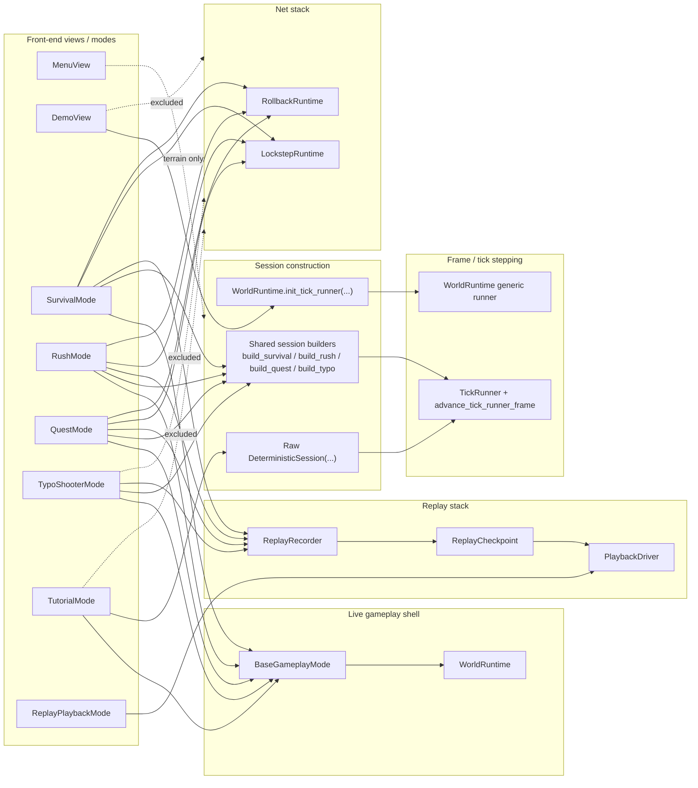
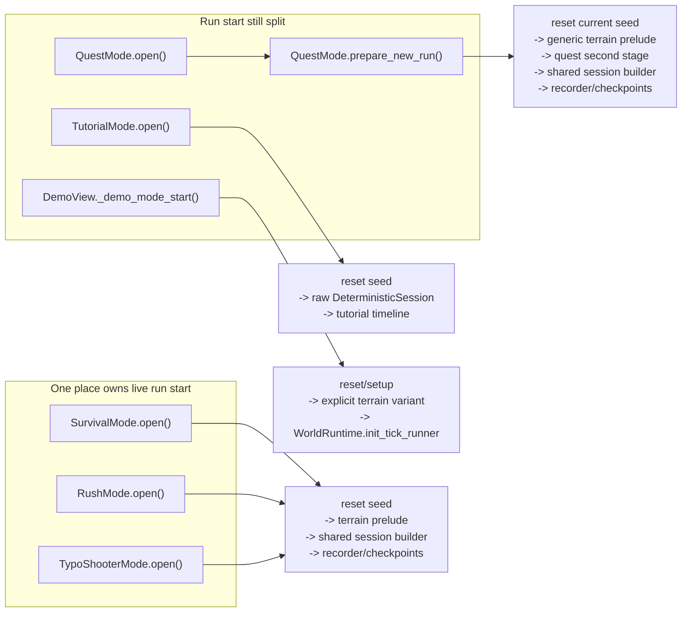
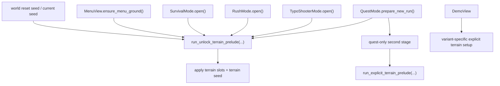
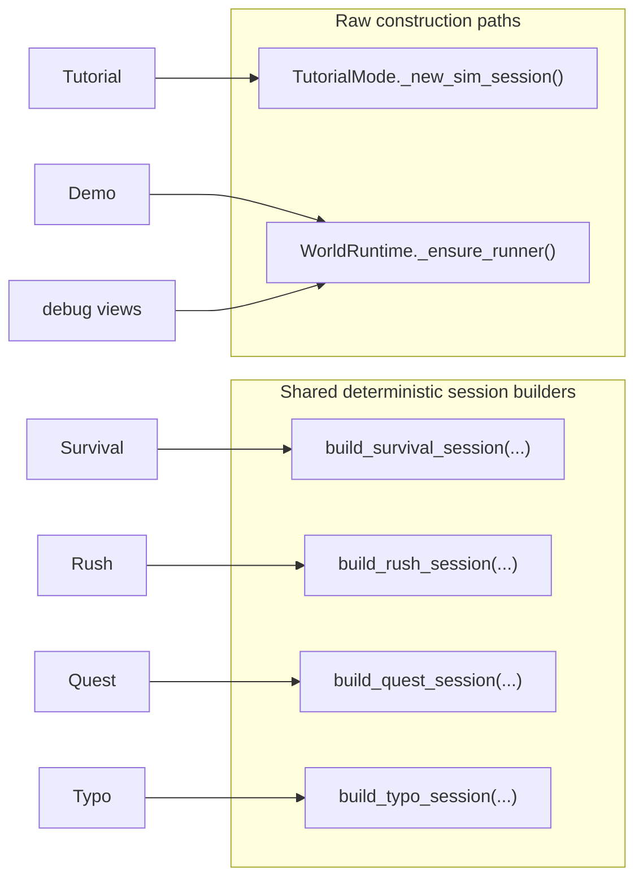
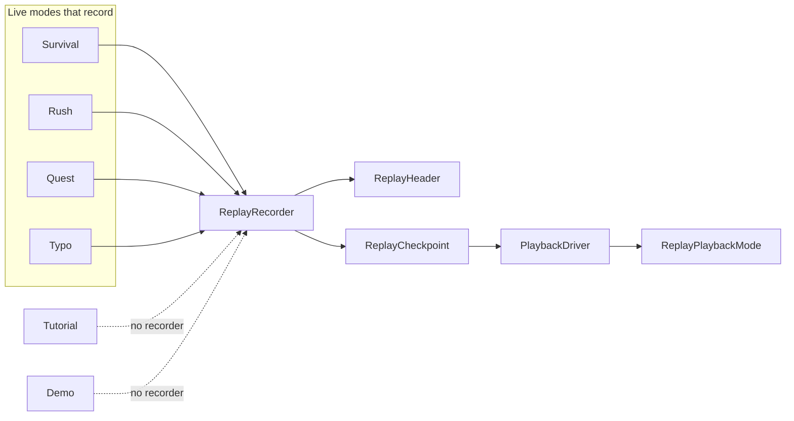
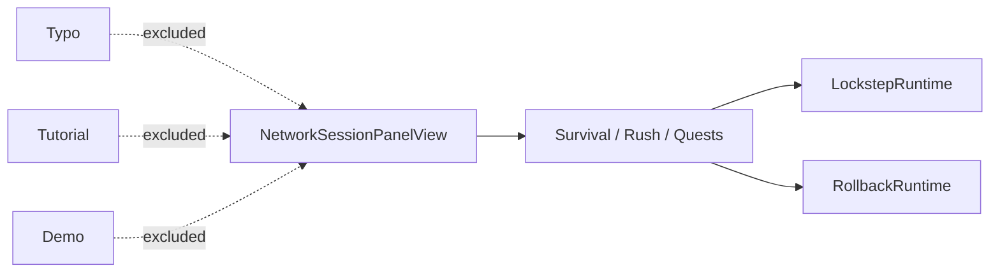

---
tags:
  - rewrite
  - architecture
---

# Mode Systems

This is an architecture memo for how the current front-end modes fit through
the shared runtime, deterministic sim, replay, and net systems.

The question behind it is simple:

- which modes already follow one shared path
- which modes still bypass that path
- which seams are now small enough to collapse next

## Short version

- `Survival`, `Rush`, and `Typo` now share the cleanest live-mode shape:
  - `BaseGameplayMode`
  - `WorldRuntime`
  - terrain prelude
  - shared session builder
  - shared tick runner
  - replay recorder
  - checkpoints
- `Quest` shares almost all of that stack, but its real run start still lives in
  `prepare_new_run(...)`, not `open()`.
- `Tutorial` already uses `BaseGameplayMode`, `WorldRuntime`, and the shared tick
  runner, but still constructs a raw `DeterministicSession` and has no
  replay/checkpoint path.
- `Demo` uses `WorldRuntime` plus a generic raw tick-runner path, but still owns
  its own setup variants, timing, and purchase-screen flow.
- `Menu` is not a sim mode, but it already uses the same terrain-prelude family
  as gameplay.

The main architectural split is no longer `Typo` vs everything else. The main
split is now:

- shared gameplay/replay modes: `Survival`, `Rush`, `Typo`
- shared core but split start ownership: `Quest`
- shared runtime shell but raw session path: `Tutorial`, `Demo`

## Mode Matrix

| Mode | Front-end owner | Start owner | Session construction | Tick stepping | Replay/checkpoints | Net | Notes |
| --- | --- | --- | --- | --- | --- | --- | --- |
| Survival | `SurvivalMode` | `open()` | shared builder | shared | yes | yes | cleanest shared path |
| Rush | `RushMode` | `open()` | shared builder | shared | yes | yes | same shape as survival |
| Quests | `QuestMode` | `prepare_new_run()` | shared builder | shared | yes | yes | run start still split |
| Typ-o-Shooter | `TypoShooterMode` | `open()` | shared builder | shared | yes | no | single-player only, native-backed |
| Tutorial | `TutorialMode` | `open()` | raw `DeterministicSession(...)` | shared | no | no | already close to shared path |
| Demo | `DemoView` | `_demo_mode_start()` | raw `WorldRuntime.init_tick_runner(...)` | shared runner shell | no | no | intentionally front-end heavy |
| Replay playback | `ReplayPlaybackMode` | `PlaybackDriver` | shared playback builders | shared playback pump | playback only | no | supports survival/rush/quests/typo |
| Menu | `MenuView` | `ensure_menu_ground()` | n/a | n/a | no | no | uses shared terrain-prelude family |

## All Modes Through the Current Systems

## Start Ownership Is the Main Remaining Split

### What this means

- `Quest` is no longer a different deterministic pipeline. It is mostly the
  same pipeline with an extra second-stage startup layer and split ownership.
- `Tutorial` and `Demo` are not special because they tick differently. They are
  special because they still bypass shared session construction and
  replay/checkpoint infrastructure.

## Terrain Startup Is Already Mostly Shared

### Important observation

- Terrain startup is not really mode-specific anymore.
- `Menu`, `Survival`, `Rush`, `Typo`, and the generic first stage of `Quest`
  already use the same family of helpers.
- `Quest` differs because it has a real native-backed second stage.
- `Demo` differs because it chooses a canned attract-mode variant rather than an
  unlock-driven random prelude.

## Session Construction Split

### Important observation

The remaining structural escape hatch is not a hidden second gameplay engine. It
is the raw session path:

- `TutorialMode._new_sim_session()`
- `WorldRuntime._ensure_runner()`

That raw path is what still separates `Tutorial`, `Demo`, and some debug views
from the shared session-builder layer.

## Replay / Checkpoint Coverage

### Important observation

After the Typo work, the replay/checkpoint gap is now concentrated almost
entirely in `Tutorial` and `Demo`.

`Quest` is no longer a replay outlier. It is a start-orchestration outlier.

## Net Support

### Important observation

- `Typo` being excluded is correct and decompile-backed.
- `Tutorial` and `Demo` being excluded also look intentional.
- Net support is not the next collapse target.

## Best Collapse Targets From Here

### 1. Tutorial

Why it looks best next:

- already inherits `BaseGameplayMode`
- already uses `WorldRuntime`
- already uses `_run_deterministic_session_ticks(...)`
- already looks like a live gameplay mode, not a separate front-end universe
- does not need LAN/multiplayer complexity

What is still custom:

- raw `DeterministicSession(...)` construction
- no shared `build_tutorial_session(...)`
- no replay recorder
- no checkpoints
- tutorial timeline still owns more orchestration than shared hooks/state do

Best end state:

- add `build_tutorial_session(...)`
- move tutorial-specific logic into shared deterministic state + session hooks
- add replay/checkpoint support

### 2. Quest run-start ownership

Why it still looks split-brain:

- `open()` is not the run start
- `prepare_new_run(...)` owns the real reset/terrain/session/recorder work
- quest result/fail/retry flow keeps that start seam outside the normal
  live-mode lifecycle

Best end state:

- keep the quest-specific second stage
- keep result/fail screens
- collapse the actual run start to one obvious ownership point that still
  matches the shared reset-seed seam

### 3. Raw `WorldRuntime.init_tick_runner(...)`

Why it matters:

- this is now the general escape hatch around shared session builders
- `Demo` uses it
- debug views use it
- it is structurally the alternative to the new `build_*_session(...)`
  direction

Best end state:

- either keep it explicitly as a debug/demo-only raw path
- or move more of its callers onto real shared session builders

### 4. Demo setup

Why it is lower priority:

- some front-end heaviness is probably correct there
- attract-mode flow and purchase-screen transitions are not obviously
  gameplay-mode abstractions

But it still has a real cleanup seam:

- variant setup
- explicit terrain setup
- raw runtime runner path

If it keeps growing, that startup/setup logic should probably move out of the
front-end shell.

## Bottom Line

After the Typo refactor, the repo no longer has a large "Typo special case"
problem.

The remaining architecture is easier to read:

- `Survival`, `Rush`, `Typo`:
  - best shared deterministic/replay shape
- `Quest`:
  - shared core, but split run-start ownership
- `Tutorial`:
  - shared runtime/tick shell, but still outside shared session-builder +
    replay/checkpoint infrastructure
- `Demo`:
  - intentionally front-end heavy, but still using the raw runner path

If the goal is to collapse the next meaningful seam, `Tutorial` looks like the
cleanest next candidate, followed by `Quest` run-start ownership.
