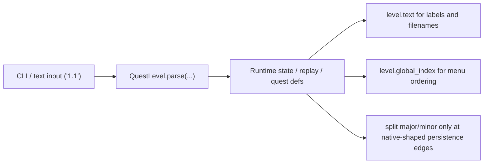

---
tags:
  - status-analysis
---

# Quest identifiers

`QuestLevel` is the canonical quest identifier across live runtime state and
msgspec wire types.

## Canonical shape

Use `QuestLevel` in `src/crimson/quests/level.py`
for:

- gameplay/runtime state
- replay headers
- quest definitions and quest registry lookups
- UI/view state after text input has been parsed

The value object intentionally stays small:

- `major`
- `minor`
- `text`
- `title`
- `global_index`
- `QuestLevel.from_global_index(...)`
- `QuestLevel.parse(...)`
- `QuestLevel.try_parse(...)`

## Boundary shapes

We still keep split quest stage integers only at external or native-shaped
boundaries:

- `crimson.cfg` persistence
- high score record bytes
- raw/debug trace rows
- filenames and human-facing labels

Those boundaries should convert to or from `QuestLevel` exactly once.

## Rules

- Live runtime logic should accept `QuestLevel | None`, not `"1.1"` and not
  `(major, minor)`.
- If a caller already has a `QuestLevel`, do not reparse or reformat it just to
  pass it deeper.
- Use `level.text` only for text I/O.
- Use `level.global_index` only for ordered quest-table traversal.
- Keep quest counter math out of `QuestLevel`; it lives in
  `src/crimson/quests/status.py`.

## Boundary map

