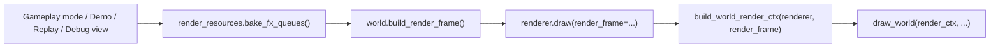
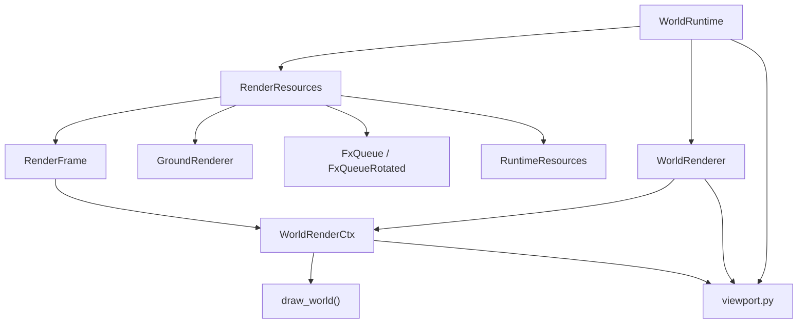
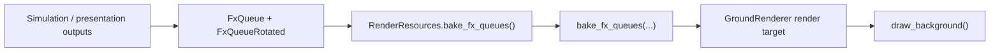
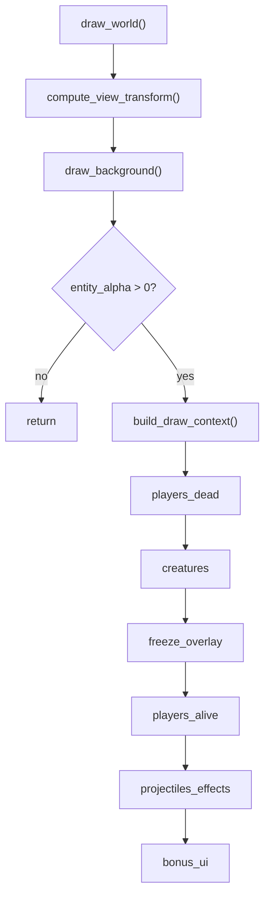
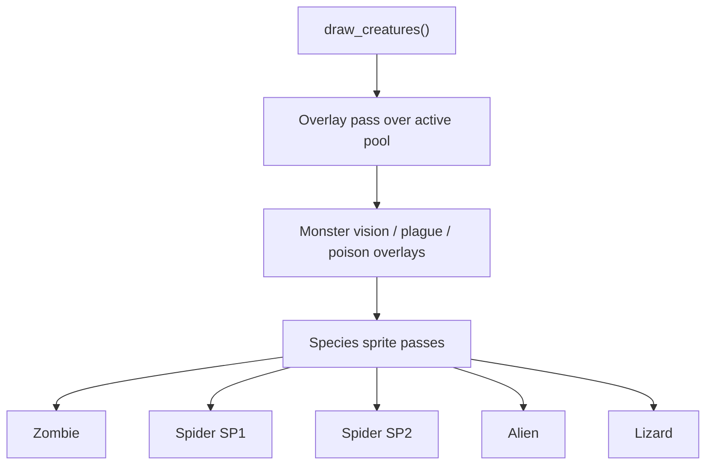
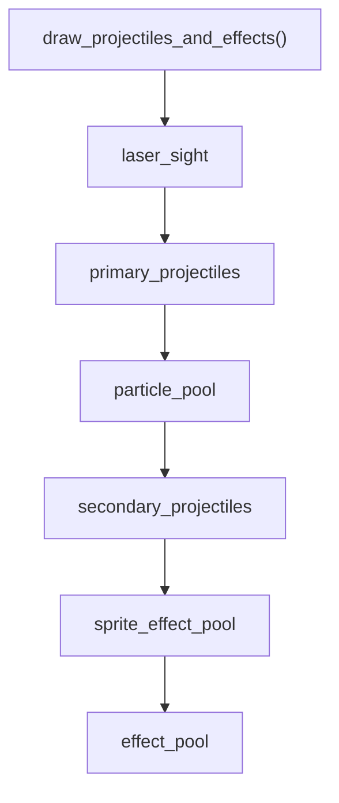
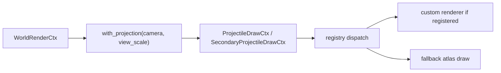
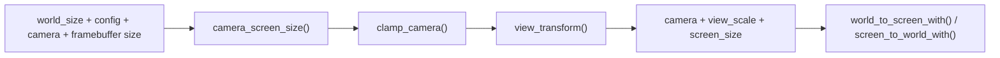

---
tags:
  - rewrite
  - rendering
  - modules
  - architecture
---

# Rendering pipeline

This page documents the current live rendering path in the Python rewrite.

Scope:

- world/gameplay rendering in `src/crimson/render/world/*`
- the pre-draw terrain/FX bake step in `src/crimson/world/render_resources.py`
- the camera/viewport math used by both rendering and runtime camera updates

This is the live draw path. Headless simulation does not need `RuntimeResources`
or GPU textures and does not enter this pipeline.

## Top-level frame flow

The same world renderer is used by gameplay modes, demo, replay playback, and
the main debug views.

Important detail:

- decal baking happens outside `WorldRenderer`
- `WorldRenderer` assumes the caller already baked pending FX into terrain
- the frame passed into `draw()` already carries concrete `RuntimeResources`

## Runtime object graph

Responsibilities:

- `WorldRuntime`
  - owns camera state, live world state, and the render/audio/terrain adapters
- `RenderResources`
  - binds the session-wide `RuntimeResources`
  - owns mutable render-side state: `GroundRenderer`, FX queues, baked FX textures
  - builds `RenderFrame`
- `RenderFrame`
  - per-frame snapshot of world references and concrete resources
  - lightweight: it carries references, not deep copies
- `WorldRenderer`
  - owns current viewport inputs (`world_size`, `config`, `camera`)
  - exposes helper transforms like `world_to_screen()`
  - orchestrates `build_world_render_ctx()` and `draw_world()`
- `WorldRenderCtx`
  - draw-time context passed down the render tree
  - combines frame data, resources, and projection-aware helpers

## Pre-draw terrain and FX bake

Before any world draw, callers run:

- `RenderResources.bake_fx_queues()`

That step consumes:

- `fx_queue`
- `fx_queue_rotated`
- `fx_textures`
- `GroundRenderer`

and stamps decals, corpse imagery, and other terrain-bound FX into the ground
render target.

This is why the terrain background pass can stay cheap during the main draw:
most decal-like work has already been folded into the ground texture.

## Render frame construction

`RenderResources.build_render_frame()` assembles the draw snapshot from:

- world geometry: `world_size`, `camera`, `ground`
- gameplay state: `state`, `players`, `creatures`
- resources: concrete `RuntimeResources`
- presentation toggles: elapsed time, bonus animation phase, LAN aim/ring flags
- render mode: `rtx_mode`

`RenderFrame` is the contract between the live runtime and the render tree.
Nothing below it should need to guess whether resources are available.

## Main pass order

The main world pass lives in `draw_world()` in `src/crimson/render/world/draw.py`.

### Background

`draw_background()`:

- clears the backbuffer
- blits `GroundRenderer` using the current camera/view window

The live world path now treats terrain as required. Missing `ground` is no
longer a supported fallback mode in `draw_world()`.

### Entity passes

The world entity passes run under `_maybe_alpha_test(...)`, so terrain/entity
cutout behavior stays aligned with the classic fixed-function alpha-test path.
The shader shim is required; initialization failure is treated as a hard error.

The order is deliberate:

1. dead players
2. creatures
3. freeze overlay
4. living players
5. projectiles and transient effects
6. bonuses and UI-like overlays inside the world

## Creature pass details

The creature pass is not a single flat loop.

The sprite order mirrors the native pass structure:

- all active creature overlays first
- then fixed species buckets in native order
- pool order is preserved within each species bucket

That ordering matters for parity and should not be “simplified” into arbitrary
sorting.

## Projectile and effect branch

The projectile/effects branch is the busiest part of the frame.

### Primary / secondary projectile rendering

Projectile draws use a projection-bound render context:

Current behavior:

- primary and secondary projectile renderers try the registry path first
- if no specialized renderer handles the projectile, the code falls back to
  shared atlas-based drawing
- bullet trails and the Sharpshooter laser sight use low-level quad drawing
  rather than only `draw_texture_pro(...)`

Related modules:

- `src/crimson/render/world/projectiles.py`
- `src/crimson/render/projectile_draw/*`
- `src/crimson/render/projectile_render_registry.py`

## Bonus and world-UI pass

The final world-space pass is `draw_bonus_and_ui()`.

It currently does:

1. bonus pickup sprites
2. hovered bonus labels
3. aim indicators, if enabled and not in demo mode
4. direction arrows
5. aim enhancement sprites, if enabled and not in demo mode

This pass is still part of world rendering, not the out-of-world HUD.

## Camera and viewport math

Viewport math now lives in `src/crimson/render/world/viewport.py`.

Three places use the same math:

- `WorldRuntime.update_camera()`
- `WorldRenderer` helper transforms
- `WorldRenderCtx` draw-time transforms

That keeps pre-draw camera updates and live rendering on one consistent set of
transform rules.

## Boundary rules

The current intended boundary is:

- headless sim and semantic presentation output stay resource-free
- live rendering starts only once concrete `RuntimeResources` are available
- `RenderFrame` and `WorldRenderCtx` are live-draw types, not optional-resource
  compatibility shims
- live world drawing also assumes `ground` is initialized

Practical consequences:

- post-boot screens and gameplay rendering should assert resources once at the
  boundary, not carry repeated `if resources is None` branches
- missing terrain in the main world draw path is now treated as an invariant
  failure, not as a debug fallback
- terrain bootstrap is the only place that should still need registry lookups
  outside a bound live runtime
- render callsites should pass explicit `RenderFrame` objects instead of
  relying on implicit “active frame” state

## Related docs

- [Terrain (rewrite)](terrain.md)
- [Beam rendering (classic + RTX)](beam-rendering.md)
- [Deterministic step pipeline](deterministic-step-pipeline.md)
- [Original exe rendering notes](../crimsonland-exe/rendering.md)
