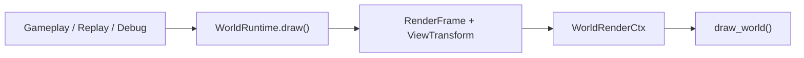
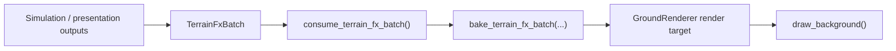
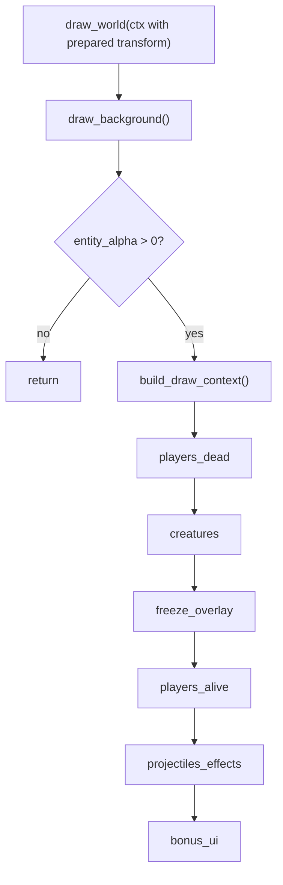
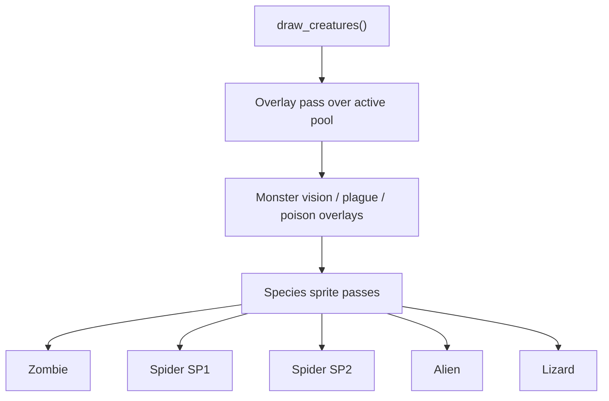
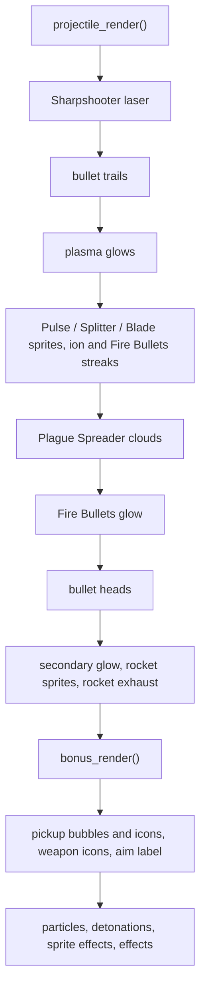
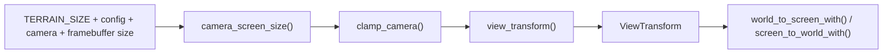

---
tags:
  - rewrite
  - rendering
  - modules
  - architecture
---

# Rendering pipeline

This page documents the current live rendering path in the Python rewrite.

Scope:

- world/gameplay rendering in `src/crimson/render/world/*`
- the pre-draw terrain/FX bake step in `src/crimson/world/render_resources.py`
- the camera/viewport math used by both rendering and runtime camera updates

This is the live draw path. Headless simulation does not need `RuntimeResources`
or GPU textures and does not enter this pipeline.

## Top-level frame flow

The same world renderer is used by gameplay modes, replay playback, and the main
debug views.

```mermaid
flowchart LR
    A["Gameplay / Replay / Debug"] --> B["WorldRuntime.draw()"]
    B --> C["RenderFrame + ViewTransform"]
    C --> D["WorldRenderCtx"]
    D --> E["draw_world()"]
```

Terrain FX are baked before drawing. `RenderFrame` carries concrete resources
and references to the current world; it does not copy simulation state.

## Application compositing and resource lifetime

Alpha-test shaders are loaded lazily and owned by `GroundRenderer` and
`RuntimeResources`. Their owners release them before graphics teardown;
there is no process-wide cached shader handle. Terrain target/shader scopes
unwind on failure, and interrupted generation retains its pending seed.

The application loop applies non-default gamma to the completed frame, after
world and UI shaders finish. Its intermediate framebuffer uses physical pixel
dimensions while the captured scene retains logical drawing coordinates. The
loop resizes and releases the framebuffer and gamma shader together.

Timed-bonus HUD slots carry one value for a global timer or a sequence in local
player order. Speed, Shield, and Fire Bullets include all players. The 1P/2P
bar positions remain native; 3P/4P extend the same vertical stack.

## Runtime object graph

- `WorldRuntime` owns the camera and world size. Coordinate conversion derives
  a transform directly from those values and the current window dimensions.
- `RenderResources` owns the ground render target and pending terrain FX batches,
  borrows the application textures, and builds `RenderFrame`.
- `ViewTransform` contains the clamped camera, view scale, logical screen size,
  and output size. A draw computes it once and passes it through every pass.
- `WorldRenderCtx` combines the frame and its transform. It has no back-reference
  to a mutable renderer or per-projectile projection overrides.
- `WorldDrawContext` contains pass-specific textures, alpha, and overlay flags;
  projection data lives only in `ViewTransform`.

Input coordinate conversion sees camera changes and window resizes immediately.
An already prepared draw retains its captured transform.

## Pre-draw terrain and FX bake

Before any world draw, callers run:

- `RenderResources.consume_terrain_fx_batch()` and `process_ground_pending()`

That step consumes:

- `TerrainFxBatch`
- `fx_textures`
- `GroundRenderer`

and stamps decals, corpse imagery, and other terrain-bound FX into the ground
render target.

```mermaid
flowchart LR
    A["Simulation / presentation outputs"] --> B["TerrainFxBatch"]
    B --> C["consume_terrain_fx_batch()"]
    C --> D["bake_terrain_fx_batch(...)"]
    D --> E["GroundRenderer render target"]
    E --> F["draw_background()"]
```

This is why the terrain background pass can stay cheap during the main draw:
most decal-like work has already been folded into the ground texture.

## Render frame construction

`RenderResources.build_render_frame()` assembles the draw snapshot from:

- world geometry: `camera`, `ground` (the arena is always `TERRAIN_SIZE`)
- gameplay state: `state`, `players`, `creatures`
- resources: concrete `RuntimeResources`
- presentation toggles: elapsed time and bonus animation phase
- render mode: `rtx_mode`

`RenderFrame` is the contract between the live runtime and the render tree.
Nothing below it should need to guess whether resources are available.

## Main pass order

The main world pass lives in `draw_world()` in `src/crimson/render/world/draw.py`.

```mermaid
flowchart TD
    A["draw_world(ctx with prepared transform)"] --> C["draw_background()"]
    C --> D{"entity_alpha > 0?"}
    D -- "no" --> Z["return"]
    D -- "yes" --> E["build_draw_context()"]
    E --> F["players_dead"]
    F --> G["creatures"]
    G --> H["freeze_overlay"]
    H --> I["players_alive"]
    I --> J["projectiles_effects"]
    J --> K["bonus_ui"]
```

### Background

`draw_background()`:

- clears the backbuffer
- blits `GroundRenderer` using the current camera/view window

The live world path now treats terrain as required. Missing `ground` is no
longer a supported fallback mode in `draw_world()`.

### Entity passes

The world entity passes run under `_maybe_alpha_test(...)`, so terrain/entity
cutout behavior stays aligned with the classic fixed-function alpha-test path.
The shader shim is required; initialization failure is treated as a hard error.

The order is deliberate:

1. dead players
2. creatures
3. freeze overlay
4. living players
5. projectiles and transient effects
6. bonuses and UI-like overlays inside the world

## Creature pass details

The creature pass is not a single flat loop.

```mermaid
flowchart TD
    A["draw_creatures()"] --> B["Overlay pass over active pool"]
    B --> C["Monster vision / plague / poison overlays"]
    C --> D["Species sprite passes"]
    D --> E["Zombie"]
    D --> F["Spider SP1"]
    D --> G["Spider SP2"]
    D --> H["Alien"]
    D --> I["Lizard"]
```

The sprite order mirrors the native pass structure:

- all active creature overlays first
- then fixed species buckets in native order
- pool order is preserved within each species bucket

That ordering matters for parity and should not be “simplified” into arbitrary
sorting.

## Projectile render and bonus render

The world ends with native `gameplay_render_world`'s last two calls. Each is a
sequence of passes, and each pass walks a whole pool with one texture and blend
before the next pass starts, so a layer of one projectile never lands between
the layers of another.

```mermaid
flowchart TD
    A["projectile_render()"] --> B["Sharpshooter laser"]
    B --> C["bullet trails"]
    C --> D["plasma glows"]
    D --> E["Pulse / Splitter / Blade sprites, ion and Fire Bullets streaks"]
    E --> F["Plague Spreader clouds"]
    F --> G["Fire Bullets glow"]
    G --> H["bullet heads"]
    H --> I["secondary glow, rocket sprites, rocket exhaust"]
    I --> J["bonus_render()"]
    J --> K["pickup bubbles and icons, weapon icons, aim label"]
    K --> L["particles, detonations, sprite effects, effects"]
```

Each pass is one `match` on the type ids it draws, in native order, with the
native sizes and colors inline (`src/crimson/render/world/projectiles.py`,
`src/crimson/render/world/draw.py`). Only the Gauss trail ignores the world
transition alpha, so at zero transition it is all `projectile_render` shows.

Not reproduced: native render-state carries between passes (the rotation, atlas
frame or UVs a pass inherits from the previous one), the Fire Bullets glow gate
that reads a stale pointer to slot 95, and the muzzle-glow pass that reads the
player slot past the last player.

The aim circle, direction arrows and aim enhancement are not part of the world
pass. Like native `gameplay_update_and_render`, each mode draws the world, then
the perk prompt, then `ui_render_aim_indicators`, then the HUD over them, then
the perk menu and other UI.

## Camera and viewport math

Viewport math now lives in `src/crimson/render/world/viewport.py`.

```mermaid
flowchart LR
    A["TERRAIN_SIZE + config + camera + framebuffer size"] --> B["camera_screen_size()"]
    B --> C["clamp_camera()"]
    C --> D["view_transform()"]
    D --> E["ViewTransform"]
    E --> F["world_to_screen_with() / screen_to_world_with()"]
```

Three places use the same math:

- `WorldRuntime.update_camera()`
- `WorldRuntime` input coordinate conversions
- `WorldRenderCtx` draw-time transforms

That keeps pre-draw camera updates and live rendering on one consistent set of
transform rules.

## Boundary rules

The current intended boundary is:

- headless sim and semantic presentation output stay resource-free
- live rendering starts only once concrete `RuntimeResources` are available
- `RenderFrame` and `WorldRenderCtx` are live-draw types, not optional-resource
  compatibility shims
- live world drawing also assumes `ground` is initialized

Practical consequences:

- post-boot screens and gameplay rendering should assert resources once at the
  boundary, not carry repeated `if resources is None` branches
- missing terrain in the main world draw path is now treated as an invariant
  failure, not as a debug fallback
- terrain bootstrap is the only place that should still need registry lookups
  outside a bound live runtime
- render callsites should pass explicit `RenderFrame` objects instead of
  relying on implicit “active frame” state

## Related docs

- [Terrain (rewrite)](terrain.md)
- [Beam rendering (classic + RTX)](beam-rendering.md)
- [Deterministic step pipeline](deterministic-step-pipeline.md)
- [Original exe rendering notes](../crimsonland-exe/rendering.md)
