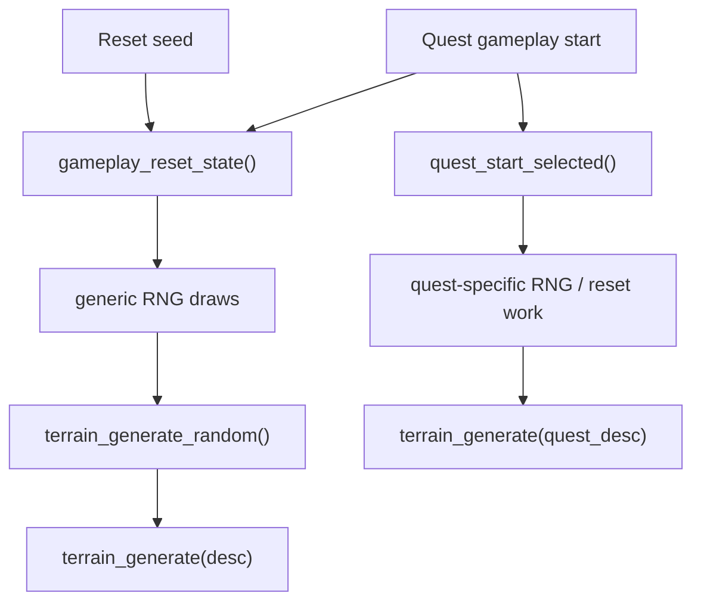
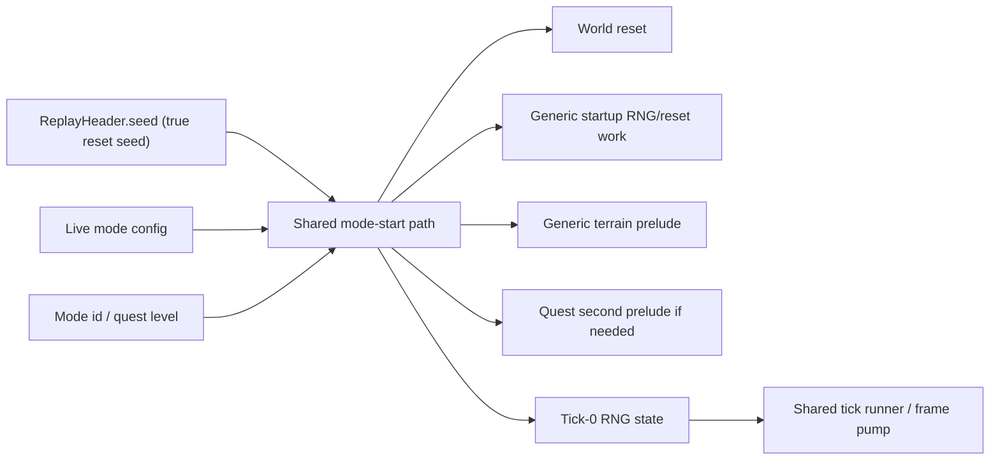

---
tags:
  - status-analysis
---

# Replay run start

## Thesis

After reading the native decompile again, the right simplification is stronger than a better
`bootstrap_kind` type.

The native game does not have a replay-specific "bootstrap mode" abstraction at all. It has:

- a shared gameplay-reset/startup path that performs terrain work and consumes RNG
- a quest-specific second prelude layered on top of that shared path

So the clean end shape in our code is:

- `ReplayHeader.seed` always means the true reset seed for the run
- replay calls the same mode-start path that live gameplay uses
- replay schema does not carry `bootstrap_kind` / `bootstrap_seed`
- any legacy compatibility is normalized at load/codec boundaries only

## Native picture

### 1. Startup / menu terrain

Native startup sets up terrain before gameplay exists:

- `game_startup_init_prelude()` seeds the CRT RNG and calls `gameplay_reset_state()`
- `gameplay_reset_state()` ends by calling `terrain_generate_random()`
- later menu/UI transitions can also request another terrain regeneration through config var `0x57`, again routing to `terrain_generate_random()`

Relevant evidence:

- [crimsonland.exe_decompiled.c#L23799](/Users/banteg/.codex/worktrees/1c4c/crimson/analysis/ghidra/raw/crimsonland.exe_decompiled.c#L23799)
- [crimsonland.exe_decompiled.c#L11785](/Users/banteg/.codex/worktrees/1c4c/crimson/analysis/ghidra/raw/crimsonland.exe_decompiled.c#L11785)
- [crimsonland.exe_decompiled.c#L7495](/Users/banteg/.codex/worktrees/1c4c/crimson/analysis/ghidra/raw/crimsonland.exe_decompiled.c#L7495)

So there is already a generic terrain prelude in native, separate from quests.

### 2. Gameplay entry

Entering gameplay always goes through `gameplay_reset_state()` first:

- `game_state_set(GAME_STATE_GAMEPLAY)` calls `gameplay_reset_state()` before branching by mode
- for survival/rush, that generic reset terrain is the terrain
- for quests, native immediately follows with `quest_start_selected(...)`

Relevant evidence:

- [crimsonland.exe_decompiled.c#L40891](/Users/banteg/.codex/worktrees/1c4c/crimson/analysis/ghidra/raw/crimsonland.exe_decompiled.c#L40891)

### 3. Quest entry is a second prelude, not a fresh universe

This is the subtle but important part.

`quest_start_selected()` does this:

- reset creatures and several quest/session counters again
- consume another `crt_rand()` for `highscore_record_random_tag`
- reset projectile pools again
- recenter the player
- call `terrain_generate(&quest_selected_meta + ...)`
- equip the quest start weapon
- build the quest spawn script

Relevant evidence:

- [crimsonland.exe_decompiled.c#L32949](/Users/banteg/.codex/worktrees/1c4c/crimson/analysis/ghidra/raw/crimsonland.exe_decompiled.c#L32949)
- [crimsonland.exe_decompiled.c#L32986](/Users/banteg/.codex/worktrees/1c4c/crimson/analysis/ghidra/raw/crimsonland.exe_decompiled.c#L32986)

That means quests do not have a totally separate terrain-generation story in native.

They share the generic gameplay reset prelude, then run a second quest-specific startup layer.

The first terrain pass is visually superseded, but its RNG consumption still happened, and the quest path adds more RNG/reset work after that.

### 4. The generic prelude already burns RNG before terrain

`gameplay_reset_state()` is not a pure structural reset.

Before it reaches `terrain_generate_random()`, native already does RNG work, including:

- one `crt_rand()` for a high-score/random tag
- a per-creature-pool loop that consumes `crt_rand()` while initializing creature state
- another `crt_rand()` for the high-score/random tag before terrain generation

Relevant evidence:

- [crimsonland.exe_decompiled.c#L11692](/Users/banteg/.codex/worktrees/1c4c/crimson/analysis/ghidra/raw/crimsonland.exe_decompiled.c#L11692)
- [crimsonland.exe_decompiled.c#L11746](/Users/banteg/.codex/worktrees/1c4c/crimson/analysis/ghidra/raw/crimsonland.exe_decompiled.c#L11746)
- [crimsonland.exe_decompiled.c#L11783](/Users/banteg/.codex/worktrees/1c4c/crimson/analysis/ghidra/raw/crimsonland.exe_decompiled.c#L11783)

So the clean cut for "the beginning of the mode" is not "before terrain bootstrap".

It is:

- at the reset seed
- before the first run-owned RNG draw in the startup sequence

## Native terrain entry points

There are really only two terrain entry points:

1. `terrain_generate_random()`
2. `terrain_generate(desc)`

`terrain_generate_random()` is the generic path used by startup/menu/gameplay reset.
It:

- does a few early `crt_rand()` calls
- checks unlock-gated random variant branches
- falls back to the default descriptor `(0, 1, 0)` when no gated branch wins
- calls `terrain_generate(desc)`

Relevant evidence:

- [crimsonland.exe_decompiled.c#L13997](/Users/banteg/.codex/worktrees/1c4c/crimson/analysis/ghidra/raw/crimsonland.exe_decompiled.c#L13997)

`terrain_generate(desc)` is the concrete renderer/generator:

- if fallback mode is active, choose a tile texture
- otherwise render the terrain into the ground render target
- consume deterministic RNG for rotation/x/y per stamp

Relevant evidence:

- [crimsonland.exe_decompiled.c#L13881](/Users/banteg/.codex/worktrees/1c4c/crimson/analysis/ghidra/raw/crimsonland.exe_decompiled.c#L13881)

So the native architecture is:

That is one shared startup pipeline with a quest-specific second prelude, not separate replay bootstrap modes.

## What our current rewrite still does

Today we still encode a replay-specific split:

- survival/rush write
  - `header.seed = post-bootstrap tick-0 RNG`
  - `header.bootstrap_seed = pre-bootstrap reset seed`
  - `header.bootstrap_kind = "terrain_v1"`
- quests write
  - `header.seed = reset/current seed`
  - `header.bootstrap_kind = "none"`

Then replay reconstructs that split in:

- [bootstrap.py](/Users/banteg/.codex/worktrees/1c4c/crimson/src/crimson/replay/bootstrap.py)
- [types.py](/Users/banteg/.codex/worktrees/1c4c/crimson/src/crimson/replay/types.py)
- [replay_playback_mode.py](/Users/banteg/.codex/worktrees/1c4c/crimson/src/crimson/modes/replay_playback_mode.py)

This is the split brain:

- live mode startup owns one flavor of terrain/RNG prelude
- replay schema encodes another copy of that decision
- quests are special-cased differently in both

## Where we already diverge from native

The decompile also sharpens one important divergence in our current model:

- native quest start still passes through generic `gameplay_reset_state()`, which already calls `terrain_generate_random()`
- native quest start then does more quest-specific reset/RNG work before building the quest
- our current quest path models only the quest-specific terrain/session setup, not that full two-stage startup

That may be an intentional simplification, but if we want the architecture to make sense, that logic should live in one shared mode-start path, not in replay header fields.

Another native quirk worth remembering:

- `terrain_generate_random()` burns a few `crt_rand()` calls before settling on either a gated unlock descriptor or the default descriptor

If we decide those calls matter for parity, they should be modeled once in the shared terrain-start path. They should not force replay to carry extra bootstrap schema forever.

## Better end shape

The correct abstraction boundary is not "replay bootstrap kind".

It is:

- `start a run from reset seed S in mode M`

That path should own all of:

- reset world state
- generic startup RNG/reset work
- generic terrain reset prelude
- quest-specific second prelude when mode is quests
- any resulting terrain setup needed by live rendering
- final authoritative tick-0 RNG state

Replay should then be:

- load replay header
- get true reset seed
- call the same shared start path
- feed recorded inputs into the shared runner

Like this:

## Cleanup direction

### Schema

- redefine `ReplayHeader.seed` to always mean true reset seed
- delete `bootstrap_kind`
- delete `bootstrap_seed`

### Runtime

- delete [bootstrap.py](/Users/banteg/.codex/worktrees/1c4c/crimson/src/crimson/replay/bootstrap.py)
- delete `_world_reset_seed_for_replay(...)`
- stop having replay mode understand terrain bootstrap policy at all

### Startup path

Unify the existing mode-start path so both live gameplay and replay use the same beginning-of-run semantics.

That path should decide:

- which startup RNG/reset work belongs to every run
- whether to run generic random terrain prelude
- whether to layer quest-specific second-stage startup
- what terrain setup to pass to `TerrainRuntime`
- what the resulting tick-0 RNG state is

### Legacy compatibility

If old replay files still matter:

- normalize them in [codec.py](/Users/banteg/.codex/worktrees/1c4c/crimson/src/crimson/replay/codec.py)
- convert legacy `(seed, bootstrap_kind, bootstrap_seed)` into the new canonical true-reset-seed interpretation during decode
- keep that compatibility code out of live replay/runtime paths

If old replay files do not matter, drop the compatibility entirely.

## Bottom line

The decompile makes the answer clearer:

- native has one shared terrain/startup pipeline
- quests are a second-stage startup layered on top of that shared path, not a separate bootstrap universe
- our replay `bootstrap_kind` split is scaffolding around inconsistent seed semantics

So the right cleanup is:

- unify seed semantics
- align all modes on one shared beginning-of-run path from reset seed
- keep any legacy replay translation at the codec edge only
