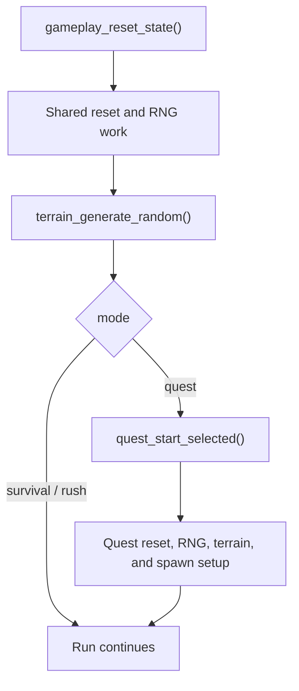
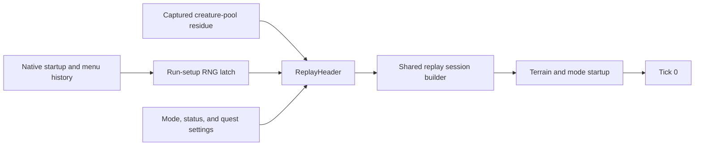

---
tags:
  - status-analysis
  - replay
  - differential-testing
---

# Replay run start

The native game has one shared reset/startup path and a quest-specific second
prelude. The current replay format records the exact state needed at our chosen
run boundary instead of trying to reconstruct earlier menu history.

For original captures that boundary is:

- the CRT RNG state immediately before the run's first terrain draw
- the creature-pool residue present at that point
- the mode, quest level, complete status blob, retry/hardcore/detail/violence
  settings, tick rate, and world size

The session's most recent `crt_srand` argument is not sufficient. Menus and
earlier startup work may already have consumed draws before gameplay begins.
Frida therefore records `rng_state_before_bootstrap`,
`rng_state_after_bootstrap`, and `rng_bootstrap_calls`. Finalization requires
the complete boundary to form an exact LCG chain and stores the before-state as
`ReplayHeader.seed`. Original captures always set
`ReplayHeader.preserve_bugs=true`; run settings are copied exactly instead of
falling back to rewrite defaults.

## Native startup shape

Entering gameplay calls `gameplay_reset_state()` before branching by mode. That
shared path resets gameplay structures, consumes RNG, and calls
`terrain_generate_random()`.

Survival and rush continue from that generic terrain. Quest mode then calls
`quest_start_selected()`, which performs additional resets and RNG work,
generates quest terrain, equips the start weapon, and builds the quest spawn
script.

The architecture is therefore:

Relevant native evidence is address-keyed:

- `gameplay_reset_state` at `0x00412dc0`
- `terrain_generate_random` at `0x004181b0`
- `quest_start_selected` at `0x0043a790`
- `game_state_set` at `0x004461c0`

## Why the replay boundary is later

Replaying the whole process from a stale session seed would require recording
and reproducing unrelated menu and startup draws. It would also hide the real
question when a run diverges: whether the same run-setup state produces the
same gameplay behavior.

The current boundary is the state latched just before the first run terrain
draw. For native captures, creature slots can still contain reset-relevant
residue at that point, so the raw `run_start.pool_residue` is copied to
`ReplayHeader.initial_creature_pool`. A port-recorded replay uses `None` and
starts from a fresh pool.

This preserves native state directly while keeping replay startup small and
deterministic.

## Current replay contract

CRD replay format 16 is the only supported version. A `ReplayHeader` includes
the run seed/state, mode, player count, status, quest settings, and optional
initial creature-pool residue.
The file envelope is exactly one zstd frame containing the typed msgpack replay;
raw msgpack, concatenated frames, trailing bytes, and invalid frame checksums are
rejected. Checkpoint sidecars use the same single-frame rule with checkpoint
format 5. Replay envelopes are capped at 65 MiB compressed and 64 MiB decoded;
checkpoint envelopes are capped at 257 MiB compressed and 256 MiB decoded in
both Python and Zig.

Every `ReplayTick` carries:

- `dt`: the exact finite, non-negative f32 delta
- `inputs`: one f32-quantized packed input row per player
- `prelude`: ordered `game_frame_rng_advance`, `perk_menu_open`, and `perk_pick` operations
  applied before simulation
- `postlude`: ordered `perk_menu_open` operations applied after simulation while
  tick RNG tracing remains active
- `commands`: Typ-o commands applied as part of the tick

Live perk commands use the same ordered handler as the recorded prelude.
Simulation timing is calculated after those commands, so a Reflex Boosted pick
affects the same tick in live play and playback. Each pick's immediate effects
see the timing established by earlier picks. These corrections retain format
16's existing prelude semantics; there is no alternate legacy execution path.

Frida capture format 22 writes the same five values in each raw tick's
`channels.replay_step`. Finalization uses that channel to build the CRD sidecar,
and CDT schema 15 preserves it for direct comparison with replay-recorded
traces.

There is no independent replay-input stream or inferred movement input.
`replay_step` is the single authority for what drove the tick.

## Startup and tick evidence

The channels intentionally separate cause from effect:

- `replay_step` records the time step, input intent, ordered prelude and
  postlude, and commands
- `checkpoint` provides a compact deterministic state hash/input to fast
  localization
- `sim_state` records player movement state including `heading`, `move_speed`,
  `move_phase`, `aim`, and `aim_heading`
- `entity_samples` records stable-UID pool state
- `rng_stream` records draw values and state transitions
- `timing_samples` ties the native update boundary to `replay_step.dt`

When movement diverges, compare `replay_step` first. Matching inputs with a
different `sim_state` point at integration or state-reset behavior; different
inputs point at capture or replay-driving data.

For same-build port-to-port regression tests, `crimson.dbg.state_digest`
provides `session_state_bytes` and `session_digest`. These include complete
player, mode, pool, allocator, RNG, and terrain-queue state, including inactive
slot residue. Compact checkpoints remain useful for native comparisons and
readable diagnostics, but do not prove that all deterministic state agrees.
The inspection encoding excludes file paths, dirty flags, RNG trace sinks,
and profiling samples. It is neither a persisted replay format nor a
recoverable session snapshot.

## Latest-only policy

- CRD loaders require replay format 16.
- Frida finalization requires raw capture format 22.
- CDT readers require container 2 and schema 15.
- Unknown fields and incomplete lifecycle rows are rejected.
- Older throwaway artifacts are regenerated, not migrated.

This keeps startup semantics in one current implementation and prevents
compatibility code from masking a parity difference.
