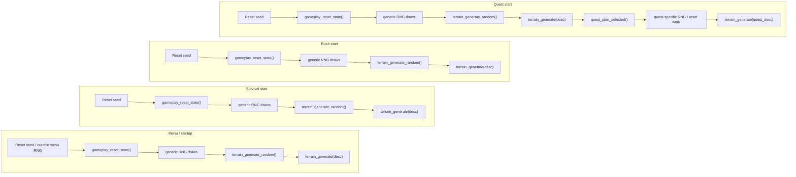
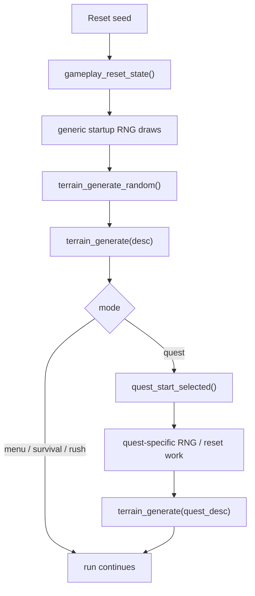
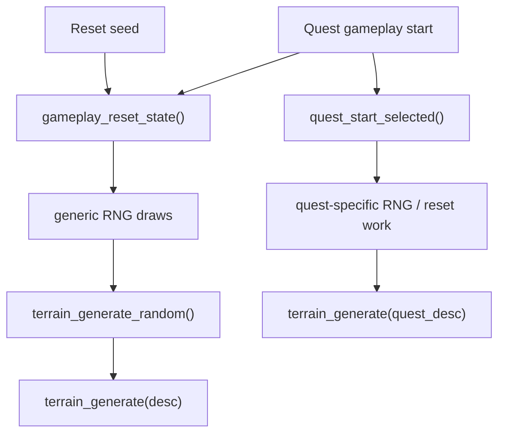
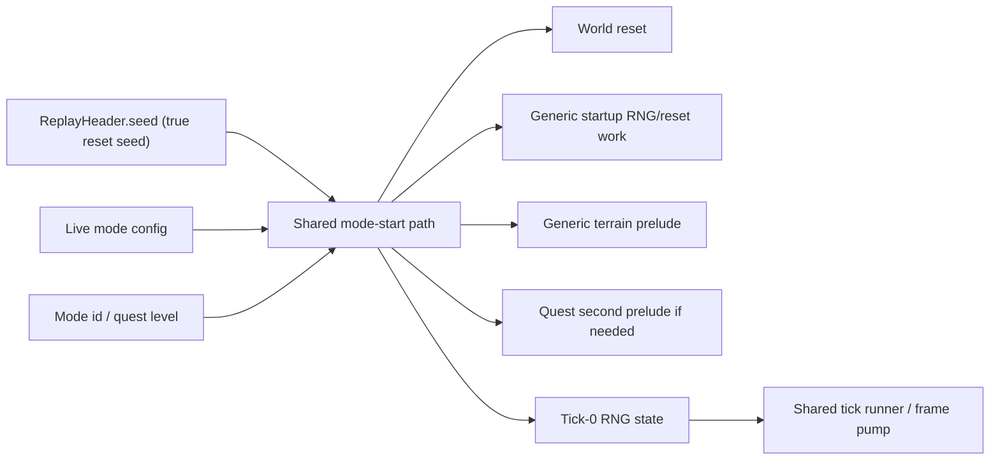

---
tags:
  - status-analysis
---

# Replay run start

## Thesis

After reading the native decompile again, the right simplification was stronger than a better
replay bootstrap type.

The native game does not have a replay-specific "bootstrap mode" abstraction at all. It has:

- a shared gameplay-reset/startup path that performs terrain work and consumes RNG
- a quest-specific second prelude layered on top of that shared path

So the clean end shape in our code is:

- `ReplayHeader.seed` always means the true reset seed for the run
- replay calls the same mode-start path that live gameplay uses
- replay schema carries no separate bootstrap fields
- old replay files and old Frida raw traces are intentionally rejected

## Native picture

### 1. Startup / menu terrain

Native startup sets up terrain before gameplay exists:

- `game_startup_init_prelude()` seeds the CRT RNG and calls `gameplay_reset_state()`
- `gameplay_reset_state()` ends by calling `terrain_generate_random()`
- later menu/UI transitions can also request another terrain regeneration through config var `0x57`, again routing to `terrain_generate_random()`

Relevant evidence:

- [crimsonland.exe_decompiled.c#L23799](/Users/banteg/.codex/worktrees/1c4c/crimson/analysis/ghidra/raw/crimsonland.exe_decompiled.c#L23799)
- [crimsonland.exe_decompiled.c#L11785](/Users/banteg/.codex/worktrees/1c4c/crimson/analysis/ghidra/raw/crimsonland.exe_decompiled.c#L11785)
- [crimsonland.exe_decompiled.c#L7495](/Users/banteg/.codex/worktrees/1c4c/crimson/analysis/ghidra/raw/crimsonland.exe_decompiled.c#L7495)

So there is already a generic terrain prelude in native, separate from quests.

### 2. Gameplay entry

Entering gameplay always goes through `gameplay_reset_state()` first:

- `game_state_set(GAME_STATE_GAMEPLAY)` calls `gameplay_reset_state()` before branching by mode
- for survival/rush, that generic reset terrain is the terrain
- for quests, native immediately follows with `quest_start_selected(...)`

Relevant evidence:

- [crimsonland.exe_decompiled.c#L40891](/Users/banteg/.codex/worktrees/1c4c/crimson/analysis/ghidra/raw/crimsonland.exe_decompiled.c#L40891)

### 3. Quest entry is a second prelude, not a fresh universe

This is the subtle but important part.

`quest_start_selected()` does this:

- reset creatures and several quest/session counters again
- consume another `crt_rand()` for `highscore_record_random_tag`
- reset projectile pools again
- recenter the player
- call `terrain_generate(&quest_selected_meta + ...)`
- equip the quest start weapon
- build the quest spawn script

Relevant evidence:

- [crimsonland.exe_decompiled.c#L32949](/Users/banteg/.codex/worktrees/1c4c/crimson/analysis/ghidra/raw/crimsonland.exe_decompiled.c#L32949)
- [crimsonland.exe_decompiled.c#L32986](/Users/banteg/.codex/worktrees/1c4c/crimson/analysis/ghidra/raw/crimsonland.exe_decompiled.c#L32986)

That means quests do not have a totally separate terrain-generation story in native.

They share the generic gameplay reset prelude, then run a second quest-specific startup layer.

The first terrain pass is visually superseded, but its RNG consumption still happened, and the quest path adds more RNG/reset work after that.

### 3.5 Mode-by-mode terrain flow

The terrain story lines up much better across modes than our current replay schema suggests:

So the real branching is minimal:

- menu, survival, and rush all use the same generic random terrain path
- quest uses that same generic path first, then overwrites terrain through quest metadata
- the real special case is quest's second-stage startup, not an entirely different terrain system

### 3.6 Shared path view

The same picture becomes simpler if we collapse the duplicated columns and show only the shared path plus the quest-only tail:

This is the version that matters architecturally:

- there is one shared beginning-of-run path
- quest is an extra startup stage after that path, not a separate terrain policy
- replay should line up with this shared path from the reset seed instead of encoding a different midpoint

### 4. The generic prelude already burns RNG before terrain

`gameplay_reset_state()` is not a pure structural reset.

Before it reaches `terrain_generate_random()`, native already does RNG work, including:

- one `crt_rand()` for a high-score/random tag
- a per-creature-pool loop that consumes `crt_rand()` while initializing creature state
- another `crt_rand()` for the high-score/random tag before terrain generation

Relevant evidence:

- [crimsonland.exe_decompiled.c#L11692](/Users/banteg/.codex/worktrees/1c4c/crimson/analysis/ghidra/raw/crimsonland.exe_decompiled.c#L11692)
- [crimsonland.exe_decompiled.c#L11746](/Users/banteg/.codex/worktrees/1c4c/crimson/analysis/ghidra/raw/crimsonland.exe_decompiled.c#L11746)
- [crimsonland.exe_decompiled.c#L11783](/Users/banteg/.codex/worktrees/1c4c/crimson/analysis/ghidra/raw/crimsonland.exe_decompiled.c#L11783)

So the clean cut for "the beginning of the mode" is not "before terrain bootstrap".

It is:

- at the reset seed
- before the first run-owned RNG draw in the startup sequence

## Native terrain entry points

There are really only two terrain entry points:

1. `terrain_generate_random()`
2. `terrain_generate(desc)`

`terrain_generate_random()` is the generic path used by startup/menu/gameplay reset.
It:

- does a few early `crt_rand()` calls
- checks unlock-gated random variant branches
- falls back to the default descriptor `(0, 1, 0)` when no gated branch wins
- calls `terrain_generate(desc)`

Relevant evidence:

- [crimsonland.exe_decompiled.c#L13997](/Users/banteg/.codex/worktrees/1c4c/crimson/analysis/ghidra/raw/crimsonland.exe_decompiled.c#L13997)

`terrain_generate(desc)` is the concrete renderer/generator:

- if fallback mode is active, choose a tile texture
- otherwise render the terrain into the ground render target
- consume deterministic RNG for rotation/x/y per stamp

Relevant evidence:

- [crimsonland.exe_decompiled.c#L13881](/Users/banteg/.codex/worktrees/1c4c/crimson/analysis/ghidra/raw/crimsonland.exe_decompiled.c#L13881)

So the native architecture is:

That is one shared startup pipeline with a quest-specific second prelude, not separate replay bootstrap modes.

## Implemented shape

The rewrite now follows that model directly.

### Replay schema

- `ReplayHeader.seed` always means the true reset seed
- replay format version is `10`
- old replay files are rejected instead of translated
- Frida raw capture format version is `11`
- old raw traces with extra replay-start fields are rejected instead of normalized

### Live start path

- menu, survival, and rush all run the same unlock-driven random terrain prelude
- quest start now runs that same generic prelude first
- quest then runs its second-stage startup work and overwrites terrain with the quest descriptor
- terrain setup is passed around only as the final `(slots, seed)` needed by the live render boundary

### Replay start path

- replay playback resets from `header.seed`
- replay then runs the same startup ordering as live gameplay for the selected mode
- replay no longer reconstructs a later seed or branches on replay-only terrain policy
- replay session construction reuses the shared session builders used by live startup

That makes the real boundary explicit:

- `start a run from reset seed S in mode M`

Like this:

## Notes on parity

Two native details matter here:

- `terrain_generate_random()` burns a few `crt_rand()` calls before settling on either a gated unlock descriptor or the default descriptor
- quest start is not a separate universe; it is a second-stage startup layered after the shared gameplay reset prelude

Those are exactly the kinds of details that belong in one shared start path. They should not be encoded a second time in replay-specific schema.

## Breaking changes

- replay format `9` is unsupported; the loader requires format `10`
- Frida raw capture format `10` is unsupported; finalization requires format `11`
- the reset seed is the only recorded seed in the replay pipeline
- replay tooling and playback reject extra legacy run-start fields instead of translating them

## Bottom line

The decompile makes the answer clearer:

- native has one shared terrain/startup pipeline
- quests are a second-stage startup layered on top of that shared path, not a separate bootstrap universe
- the rewrite is cleanest when replay starts from the same reset-seed boundary as live gameplay

So the implemented cleanup is:

- unify seed semantics
- align all modes on one shared beginning-of-run path from reset seed
- reject old replay artifacts instead of carrying compatibility logic through the runtime path
