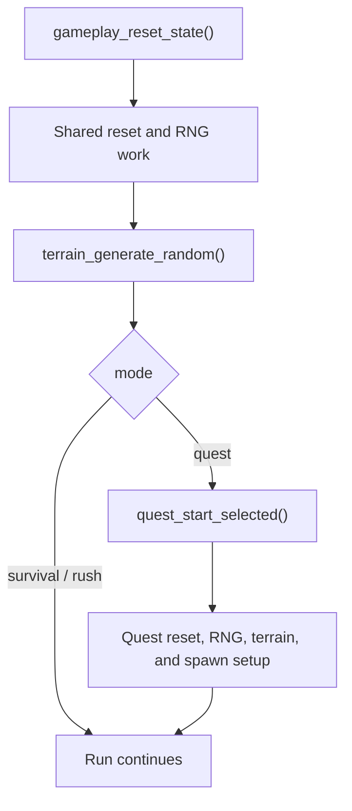

---
tags:
  - status-analysis
  - replay
  - differential-testing
---

# Replay run start

The native game has one shared reset/startup path and a quest-specific second
prelude. Replays and capture replays record the exact state needed at our chosen
run boundary instead of trying to reconstruct earlier menu history.

For original captures that boundary, stored in the debug-only capture replay
(`.ccr`), is:

- the CRT RNG state immediately before the run's first terrain draw
- the creature-pool residue present at that point
- the mode, quest level, complete status blob, retry/hardcore/detail/violence
  settings, tick rate, and world size

The session's most recent `crt_srand` argument is not sufficient. Menus and
earlier startup work may already have consumed draws before gameplay begins.
Frida therefore records `rng_state_before_bootstrap`,
`rng_state_after_bootstrap`, and `rng_bootstrap_calls`. Finalization requires
the complete boundary to form an exact LCG chain and stores the before-state as
the run seed. Original captures always set `preserve_bugs=true`; run settings
are copied exactly instead of falling back to rewrite defaults.

## Native startup shape

Entering gameplay calls `gameplay_reset_state()` before branching by mode. That
shared path resets gameplay structures, consumes RNG, and calls
`terrain_generate_random()`.

Survival and rush continue from that generic terrain. Quest mode then calls
`quest_start_selected()`, which performs additional resets and RNG work,
generates quest terrain, equips the start weapon, and builds the quest spawn
script.

The architecture is therefore:

Relevant native evidence is address-keyed:

- `gameplay_reset_state` at `0x00412dc0`
- `terrain_generate_random` at `0x004181b0`
- `quest_start_selected` at `0x0043a790`
- `game_state_set` at `0x004461c0`

## Why the replay boundary is later

Replaying the whole process from a stale session seed would require recording
and reproducing unrelated menu and startup draws. It would also hide the real
question when a run diverges: whether the same run-setup state produces the
same gameplay behavior.

The current boundary is the state latched just before the first run terrain
draw. For native captures, creature slots can still contain reset-relevant
residue at that point, so the raw `run_start.pool_residue` is copied into the
capture replay. Port replays carry no residue and start from a fresh pool.

This preserves native state directly while keeping replay startup small and
deterministic.

## Settings during a run

Simulation detail and violence settings stay fixed at the values in the
starting `RunSpec`. Changing effect density in Options applies
to the next game: changing these values mid-run would change RNG consumption
without a corresponding replay operation. Visual-only flags, audio volume,
and input preferences can still apply live.

## Current replay contract

Only the current [replay/trace formats](trace-format-alignment.md#current-only-contract) are supported;
the replay layout itself is specified in [Replays](../formats/replay.md). A
replay's `RunSpec` holds the run seed, mode, player count, the run-relevant
status fields, and quest and presentation settings; port runs always start from
a fresh creature pool. Replay envelopes are capped at 65 MiB compressed and
64 MiB decoded. Checkpoint sidecars use the same single-frame zstd rule with
checkpoint format 5, capped at 257 MiB compressed and 256 MiB decoded in both
Python and Zig.

Every tick runs at the fixed float32 1/60 s delta and carries one f32-quantized
packed input row per player plus an ordered command list. Perk commands apply
before frame timing is derived, so a Reflex Boosted pick affects the same tick
in live play and playback, and each pick's immediate effects see the timing
established by earlier picks. Typ-o commands apply after the mode's pre-step
hook. Live play and playback share one command handler.

Original captures also need native frame deltas, top-level RNG draws made
between ticks, and perk-menu activity observed inside a tick. The Frida capture
producer writes them in each raw tick's `channels.replay_step` (`dt`, `inputs`,
`prelude`, `postlude`, `commands`). Finalization uses that channel to build the
capture replay, and CDT preserves it for direct comparison with recorded
traces. Prelude operations run between ticks, outside the tick RNG trace;
postlude menu opens run after simulation, inside it. Replays never carry these
operations.

There is no independent replay-input stream or inferred movement input.
`replay_step` is the single authority for what drove the tick.

## Startup and tick evidence

The channels intentionally separate cause from effect:

- `replay_step` records the time step, input intent, ordered prelude and
  postlude, and commands
- `checkpoint` provides a compact deterministic state hash/input to fast
  localization
- `sim_state` records player movement state including `heading`, `move_speed`,
  `move_phase`, `aim`, and `aim_heading`
- `entity_samples` records stable-UID pool state
- `rng_stream` records draw values and state transitions
- `timing_samples` ties the native update boundary to `replay_step.dt`

When movement diverges, compare `replay_step` first. Matching inputs with a
different `sim_state` point at integration or state-reset behavior; different
inputs point at capture or replay-driving data.

For same-build port-to-port regression tests, `crimson.dbg.state_digest`
provides `session_state_bytes` and `session_digest`. These include complete
player, mode, pool, allocator, RNG, and terrain-queue state, including inactive
slot residue. Compact checkpoints remain useful for native comparisons and
readable diagnostics, but do not prove that all deterministic state agrees.
The inspection encoding excludes file paths, dirty flags, RNG trace sinks,
and profiling samples. It is neither a persisted replay format nor a
recoverable session snapshot.

## Latest-only policy

- Readers require the current [version matrix](trace-format-alignment.md#current-only-contract).
- `uv run crimson dbg verify` checks Python, Zig and Frida declarations for drift.
- Unknown fields and incomplete lifecycle rows are rejected.
- Older throwaway artifacts are regenerated, not migrated.

This keeps startup semantics in one current implementation and prevents
compatibility code from masking a parity difference.

## Shared port startup

`sim.run_spec.RunSpec` describes the pre-start inputs; a replay adds only
recording metadata and its result. `sim.run_init.initialize_run` constructs the world and mode
session for all five gameplay modes and playback. It consumes generic terrain,
then the quest score tag, quest terrain and spawn draws when applicable, before
assigning starting weapons. The returned terrain setup is consumed separately by
the renderer.

Live play binds the actual save object; replay binds a detached copy of the same
pre-start snapshot. Starting weapon usage and quest play counters are applied
once on both paths. Snapshotting after weapon assignment would count it twice
on replay. Native creature residue is an explicit `initialize_run` input supplied
only by capture replays, while port runs always allocate fresh pools. The reset and residue types live in the
simulation layer without importing the replay codec.

`tests/replay/test_live_run_start.py` compares complete session state at startup
and after input ticks through actual mode open/start and recorder/playback paths,
including multiplayer-sized local runs, preserved quirks, and non-default visual
settings. Typ-o commands retain their inside-tick phase, after loadout enforcement;
perk picks run before timing is derived.

## Terrain RNG and rendering

`src/crimson/sim/bootstrap.py` owns terrain RNG advancement. Both
`advance_unlock_terrain` and `advance_explicit_terrain` mutate the supplied RNG
through all procedural stamping draws and return a `TerrainSetup` with the
selected slots, the state before stamping, and the generation kind.
Unlock-driven generation first consumes the native three-draw prelude and
unlock-gated slot selection; explicit generation uses the supplied slots.

The authoritative stream is already past the terrain window when simulation
continues. `GroundRenderer` reconstructs the image from a local `CrtRand` seeded
with `TerrainSetup.terrain_seed`; drawing or replacing a render target must not
advance gameplay RNG again. The setup is derived during initialization, not
stored as a second replay seed or serialized `TerrainSetup` in the CRD header.

Quest ordering is generic unlock terrain, score-tag draw, explicit quest terrain,
then spawn-table construction. Menu terrain uses the unlock helper; attract-mode
variants use explicit terrain. Keep those native differences at setup call sites.
See `tests/sim/test_terrain_bootstrap.py` and
`tests/render/test_terrain_runtime_boundaries.py` for the boundary tests.
