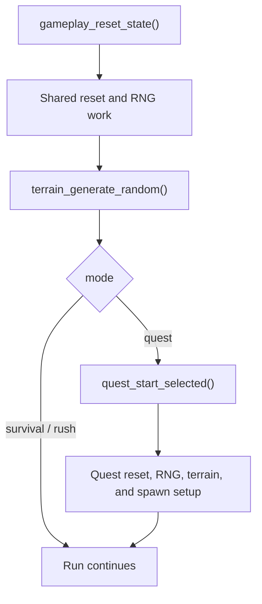

---
tags:
  - status-analysis
  - replay
  - differential-testing
---

# Replay run start

The native game has one shared reset/startup path and a quest-specific second
prelude. Replays record the exact state needed at our chosen run boundary
instead of trying to reconstruct earlier menu history.

The session's most recent `crt_srand` argument is not sufficient. Menus and
earlier startup work may already have consumed draws before gameplay begins, so
the run seed is the CRT RNG state entering `gameplay_reset_state()`.

## Native startup shape

Entering gameplay calls `gameplay_reset_state()` before branching by mode. That
shared path resets gameplay structures, consumes RNG, and calls
`terrain_generate_random()`.

Survival and rush continue from that generic terrain. Quest mode then calls
`quest_start_selected()`, which performs additional resets and RNG work,
generates quest terrain, equips the start weapon, and builds the quest spawn
script.

The architecture is therefore:

```mermaid
flowchart TD
    A["gameplay_reset_state()"] --> B["Shared reset and RNG work"]
    B --> C["terrain_generate_random()"]
    C --> D{"mode"}
    D -->|"survival / rush"| E["Run continues"]
    D -->|"quest"| F["quest_start_selected()"]
    F --> G["Quest reset, RNG, terrain, and spawn setup"]
    G --> E
```

Relevant native evidence is address-keyed:

- `gameplay_reset_state` at `0x00412dc0`
- `terrain_generate_random` at `0x004181b0`
- `quest_start_selected` at `0x0043a790`
- `game_state_set` at `0x004461c0`

## The run boundary

Replaying the whole process from a stale session seed would require recording
and reproducing unrelated menu and startup draws. It would also hide the real
question when a run diverges: whether the same run-setup state produces the
same gameplay behavior.

Every mode's run starts in `game_state_set` with `gameplay_reset_state()`, so
the seed is the RNG state entering it. Run setup then replays native exactly:

1. the reset's draws: the score tag, one `anim_phase` per creature slot, the
   score tag again
2. `terrain_generate_random()`
3. the mode's own setup (Quests: `quest_start_selected()`)
4. the frame's end: `game_frame_update` ends every frame with a discarded
   `crt_rand()`, and run setup happens inside a frame

Each tick is one native gameplay frame: the gameplay update, then that same
end-of-frame draw. Native frames outside gameplay (pause, the perk menu and its
transitions) draw it too, but how many there are depends on wall-clock time, so
the port fixes them at zero; see [settings that steer the RNG](parity/environment-rng.md).

Native creature slots can still contain residue once the reset has run; port
replays carry none and start from a fresh pool.

Native `effect_spawn_detail_skip_counter` is residue of the same kind: at detail
presets 1 and 2 `effect_spawn` drops every other effect, and the counter lives
for the whole process (`effect_defaults_reset` leaves it alone), so a run's first
low-detail effect is kept or dropped depending on every earlier run in the
session. The port's counter starts at zero with each world. Carrying it across
runs would make a replay's effects, and the decals they leave on the ground,
depend on the session it plays in, so replays would have to record it. Only
visuals differ: `effect_spawn` returns nothing, so its callers draw the same RNG
either way.

## Settings during a run

Simulation detail and violence settings stay fixed at the values in the
starting `RunSpec`. Changing effect density in Options applies
to the next game: changing these values mid-run would change RNG consumption
without a corresponding replay operation. Visual-only flags, audio volume,
and input preferences can still apply live.

## Current replay contract

Only the current [replay/trace formats](trace-format-alignment.md#current-only-contract) are supported;
the replay layout itself is specified in [Replays](../formats/replay.md). A
replay's `RunSpec` holds the run seed, mode, player count, the run-relevant
status fields, and quest and presentation settings; port runs always start from
a fresh creature pool. Replay envelopes are capped at 65 MiB compressed and
64 MiB decoded. Checkpoint sidecars use the same single-frame zstd rule with
checkpoint format 7, capped at 257 MiB compressed and 256 MiB decoded. Each
checkpoint pins the tick's RNG state and `rng_callers_crc32`, a CRC32 of the
tick's RNG call-site tags in draw order, which catches draws reordered within the
tick.

Every tick runs at the fixed float32 1/60 s delta and carries one f32-quantized
packed input row per player plus an ordered command list. Perk picks apply
before frame timing is derived, so a Reflex Boosted pick affects the same tick
in live play and playback, and each pick's immediate effects see the timing
established by earlier picks. A perk menu request opens where native opens it:
after the level-up check and before `bonus_update`, so the choices draw from the
RNG between the tick's render-time pickups and its bonus timers. Typ-o commands
apply after the mode's pre-step hook. Live play and playback share one command
handler.

There is no independent replay-input stream or inferred movement input.
`replay_step` is the single authority for what drove the tick.

## Startup and tick evidence

The channels intentionally separate cause from effect:

- `replay_step` records the time step, input intent, ordered prelude and
  postlude, and commands
- `checkpoint` provides a compact deterministic state hash/input to fast
  localization
- `sim_state` records player movement state including `heading`, `move_speed`,
  `move_phase`, `aim`, and `aim_heading`
- `entity_samples` records stable-UID pool state
- `rng_stream` records draw values and state transitions
- `timing_samples` ties the native update boundary to `replay_step.dt`

When movement diverges, compare `replay_step` first. Matching inputs with a
different `sim_state` point at integration or state-reset behavior; different
inputs point at replay-driving data.

For same-build port-to-port regression tests, `tests/support/state_digest.py`
provides `session_state_bytes` and `session_digest`. These include complete
player, mode, pool, allocator, RNG, and terrain-queue state, including inactive
slot residue. Compact checkpoints remain useful for native comparisons and
readable diagnostics, but do not prove that all deterministic state agrees.
The inspection encoding excludes file paths, dirty flags, RNG trace sinks,
and profiling samples. It is neither a persisted replay format nor a
recoverable session snapshot.

## Latest-only policy

- Readers require the current [version matrix](trace-format-alignment.md#current-only-contract).
- Unknown fields and incomplete lifecycle rows are rejected.
- Older throwaway artifacts are regenerated, not migrated.

This keeps startup semantics in one current implementation and prevents
compatibility code from masking a parity difference.

## Shared port startup

`sim.run_spec.RunSpec` describes the pre-start inputs; a replay adds only
recording metadata and its result. `sim.run_init.initialize_run` constructs the world and mode
session for all five gameplay modes and playback. It consumes generic terrain,
then the quest score tag, quest terrain and spawn draws when applicable, before
assigning starting weapons. The returned terrain setup is consumed separately by
the renderer.

Live play binds the actual save object; replay binds a detached copy of the same
pre-start snapshot. Starting weapon usage and quest play counters are applied
once on both paths. Snapshotting after weapon assignment would count it twice
on replay. Port runs always allocate fresh pools. The reset types live in the
simulation layer without importing the replay codec.

`tests/replay/test_live_run_start.py` compares complete session state at startup
and after input ticks through actual mode open/start and recorder/playback paths,
including multiplayer-sized local runs, preserved quirks, and non-default visual
settings. Typ-o commands retain their inside-tick phase, after loadout enforcement;
perk picks run before timing is derived.

## Terrain RNG and rendering

`src/crimson/sim/terrain_generate.py` owns terrain RNG. `terrain_generate(rng, slots)` and
`terrain_generate_random(rng, unlock_index)` mirror the native functions: both draw every stamp from the
supplied RNG before returning a `TerrainSetup` of texture slots and stamp layers. The random generator
draws three overwritten texture selectors, then the unlock rolls (`>= 40`, `>= 30`, `>= 20`, each drawn only
when its threshold passes). A successful roll delegates to `terrain_generate` with quest 4.2's, 3.2's or
2.2's slots, `(6, 7, 6)`, `(4, 5, 4)` or `(2, 3, 2)`, so its stamp draws carry the explicit generator's
callers. Only the fallthrough stamps with the random generator's own callers and slots `(0, 1, 0)`.

The renderer draws the setup's stamps and never regenerates them, so drawing or re-applying a setup consumes
no RNG. `PreparedRun.terrain` is derived during initialization, not stored in the
CRD header or checkpoints. The checkpoints' call-order digests cover ticks, not initialization, so startup
ordering is pinned by the tests named below instead.

Every run's reset ends with `terrain_generate_random`. Quests then draw the score tag and generate the
quest terrain with `terrain_generate`: two complete generations, of which only the second is shown. The
first one's draws stay; only its stamps are discarded. The menu ground uses `terrain_generate_random` on
the application RNG, which stands in for native startup's generation outside the recorded run.
See `tests/sim/test_terrain_generate.py`, `tests/render/test_ground_stamp_cases.py` and
`tests/render/test_terrain_runtime_boundaries.py` for the boundary tests.
