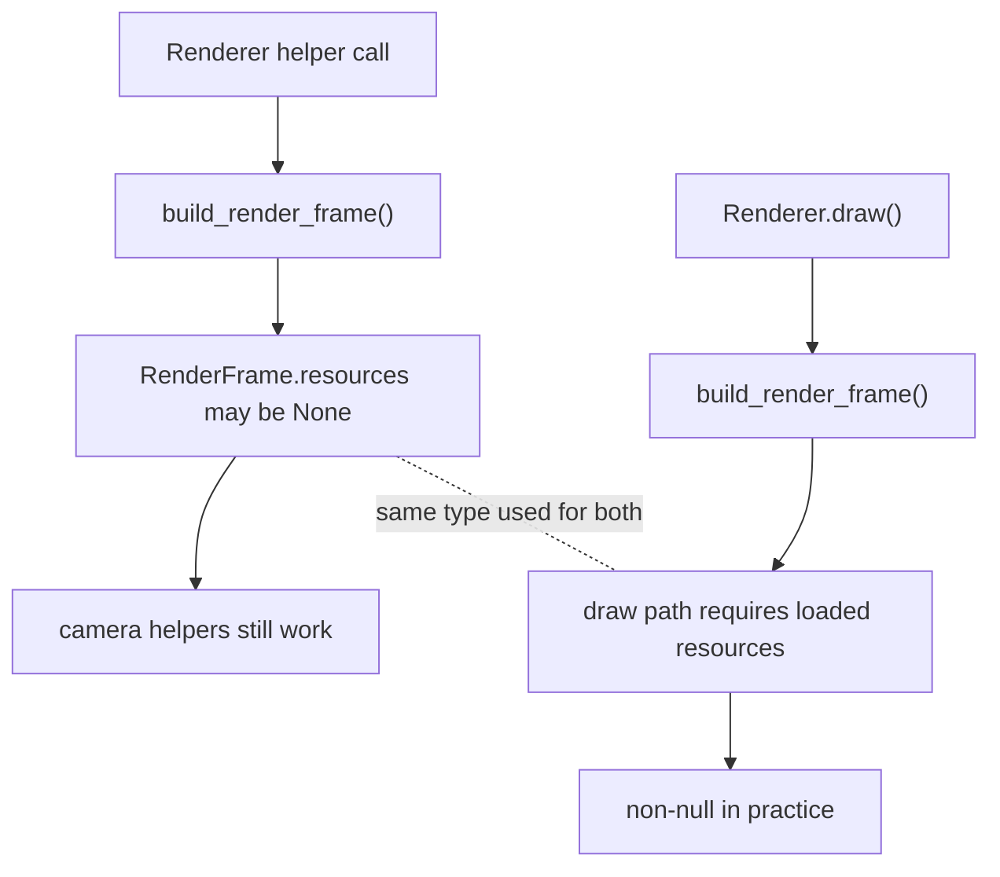
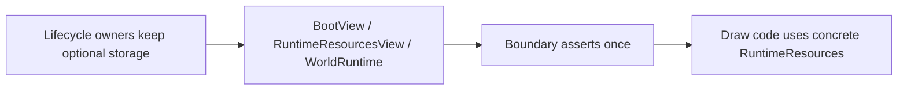

---
tags:
  - status-parity
  - architecture
---

# Resource Lifecycle Memo

This is the short version of why `resources` still looks optional in a few
places, why most consumer-side `if resources is None` branches are wrong, and
what the real leftover problem is.

## Two Different Lifecycles

### 1. App/session resources

`GameState.resources` is the session-wide asset cache. This one is genuinely
optional at startup and final shutdown.

```mermaid
flowchart LR
    A["Process starts"] --> B["GameState.resources = None"]
    B --> C["BootView.open()"]
    C --> D["load_runtime_resources()"]
    D --> E["GameState.resources = RuntimeResources"]
    E --> F["Boot / Menu / Demo / Panels / Gameplay use loaded cache"]
    F --> G["GameLoopView.close()"]
    G --> H["BootView.close()"]
    H --> I["unload_runtime_resources()"]
    I --> J["GameState.resources = None"]
```



Important point:
- `BootView.close()` is teardown, not normal boot-to-menu handoff.
- So after boot, front-end screens usually run with resources already loaded.

### 2. World-runtime resources

`WorldRuntime.render_resources._resources` is not the global asset lifetime. It
is the world-runtime binding to that already-loaded session cache.

```mermaid
flowchart LR
    A["WorldRuntime created"] --> B["RenderResources._resources = None"]
    B --> C["WorldRuntime.open_runtime()"]
    C --> D["RenderResources.open()"]
    D --> E["bind RuntimeResources + init ground/fx textures"]
    E --> F["Gameplay / debug runtime draws"]
    F --> G["WorldRuntime.close_runtime()"]
    G --> H["RenderResources.close()"]
    H --> I["RenderResources._resources = None"]
```



Important point:
- This optionality is real before `open_runtime()` and after `close_runtime()`.
- It is not real during active gameplay/debug drawing.

## The Subtle Leftover

The awkward part is `RenderFrame.resources`.

Today `RenderFrame` is used for two different jobs:

1. a real draw snapshot
2. a cheap container for renderer helpers like camera/screen-size math

Those helper paths can run before `open_runtime()`, so `build_render_frame()`
still emits:

```python
resources: RuntimeResources | None
```

That leaks optionality into the render model even though actual drawing already
requires loaded resources.



## What We Do Wrong

- We keep truthful optionality at the owner, then smear it across consumers that
  do not actually run in the unloaded state.
- `RenderFrame` mixes “draw-ready frame” and “pre-open helper frame”.
- `RenderResources.texture()` still has a fallback lookup path, which hides
  lifecycle mistakes instead of surfacing them.

That is why we end up with meaningless branches like:

```python
resources = self.render_resources.resources
if resources is None:
    return
```

inside gameplay/debug draw code that only runs after `open_runtime()`.

## Better Shape

The cleaner model is:

- keep `GameState.resources` optional at boot/teardown boundaries
- keep `RenderResources._resources` optional internally for pre-open world state
- make active draw APIs consume concrete resources
- split renderer helper state from draw-ready frame state, or at least stop
  using `RenderFrame` as both

In other words:



The real bug is not that the owners are optional. The bug is that consumer code
still acts as if every caller might be in the unloaded phase.
