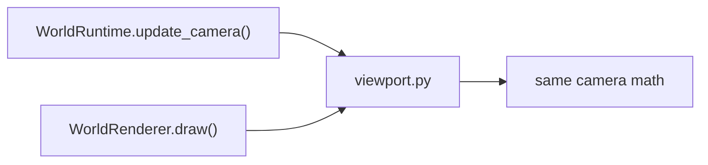
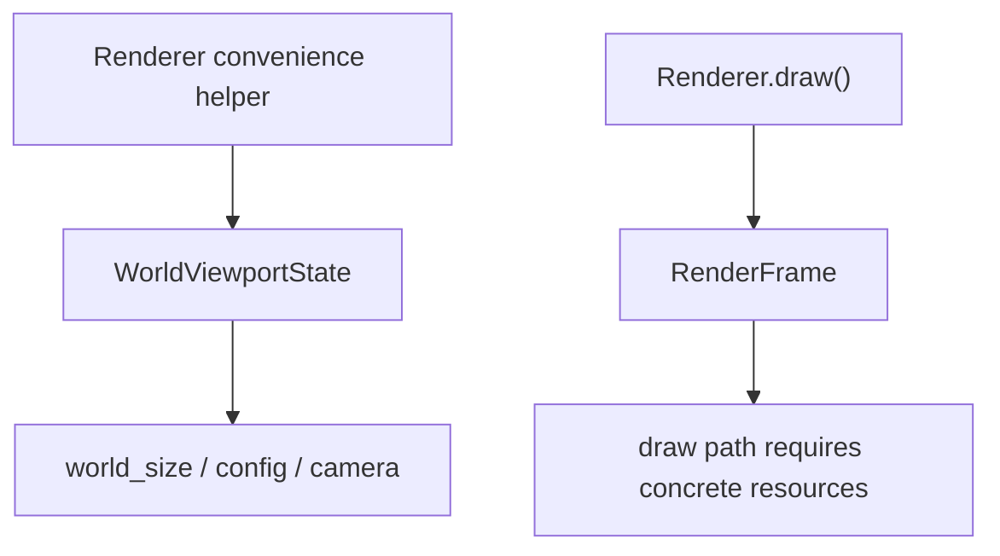
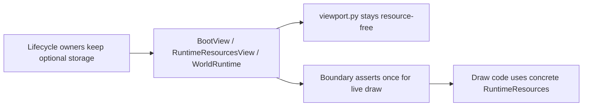

---
tags:
  - status-parity
  - architecture
---

# Resource Lifecycle Memo

This is the current shape of resource optionality after the viewport cleanup.
The old version of this memo was written before camera math was extracted out
of the renderer, so the important part now is what remains wrong, not what used
to be wrong.

## Two Real Lifecycles

### 1. App/session resources

`GameState.resources` is the session-wide asset cache. This is still genuinely
optional at process startup and final teardown.

```mermaid
flowchart LR
    A["Process starts"] --> B["GameState.resources = None"]
    B --> C["BootView.open()"]
    C --> D["load_runtime_resources()"]
    D --> E["GameState.resources = RuntimeResources"]
    E --> F["Menu / Demo / Gameplay use loaded cache"]
    F --> G["GameLoopView.close()"]
    G --> H["BootView.close()"]
    H --> I["unload_runtime_resources()"]
    I --> J["GameState.resources = None"]
```

Important point:
- `BootView.close()` is teardown, not normal boot-to-menu handoff.
- So after boot, front-end screens usually run with resources already loaded.

### 2. World-runtime resources

`WorldRuntime.render_resources._resources` is not the global asset lifetime. It
is the world-runtime binding to that already-loaded session cache.

Important point:
- This optionality is real before `open_runtime()` and after `close_runtime()`.
- It is not real during active gameplay/debug drawing.

## What We Already Fixed

The previous subtle bug was that pure camera math went through
`WorldRenderer -> WorldRenderCtx -> RenderFrame`, which forced pre-open helper
calls to share an API shape with real drawing.

That is no longer true.

- `render/world/viewport.py` now owns camera sizing, clamping, and world/screen
  transforms.
- `WorldRuntime.update_camera()` now uses that pure module directly.
- Actual drawing still uses the same math, but through live render code.

That means headless or pre-open camera logic no longer depends on a draw
context with optional resources attached to it.

## What We Fixed Next

The next leftover was the renderer convenience path.

`WorldRenderer.world_to_screen()` / `screen_to_world()` / `_world_params()`
used to keep pulling from `RenderFrame`, which meant helper transforms still
depended on a draw snapshot type.

That is now split too.

- `WorldRenderer` takes a dedicated `WorldViewportState` builder
- helper transforms read only viewport inputs
- draw still uses `RenderFrame`

## What Is Still Wrong

- Consumer code in active gameplay/debug draw paths still sometimes behaves as
  if resources might be missing, even though those paths run after
  `open_runtime()`.
- `RenderResources.texture()` still has a fallback lookup path, which hides
  lifecycle mistakes instead of surfacing them.
- `RenderFrame.resources` is still `RuntimeResources | None`, even though the
  draw entrypoint rejects unloaded frames.

## Better Shape From Here

The cleaner model now looks like this:

Concretely:

- keep `GameState.resources` optional at boot/teardown boundaries
- keep `RenderResources._resources` optional internally for pre-open world state
- keep viewport math pure and resource-free
- make active draw APIs consume concrete resources
- eventually make draw snapshots concrete enough that `RenderFrame.resources`
  does not need to represent the unloaded phase

The remaining bug is that draw snapshots and resource access still carry
optionality farther than they should.
