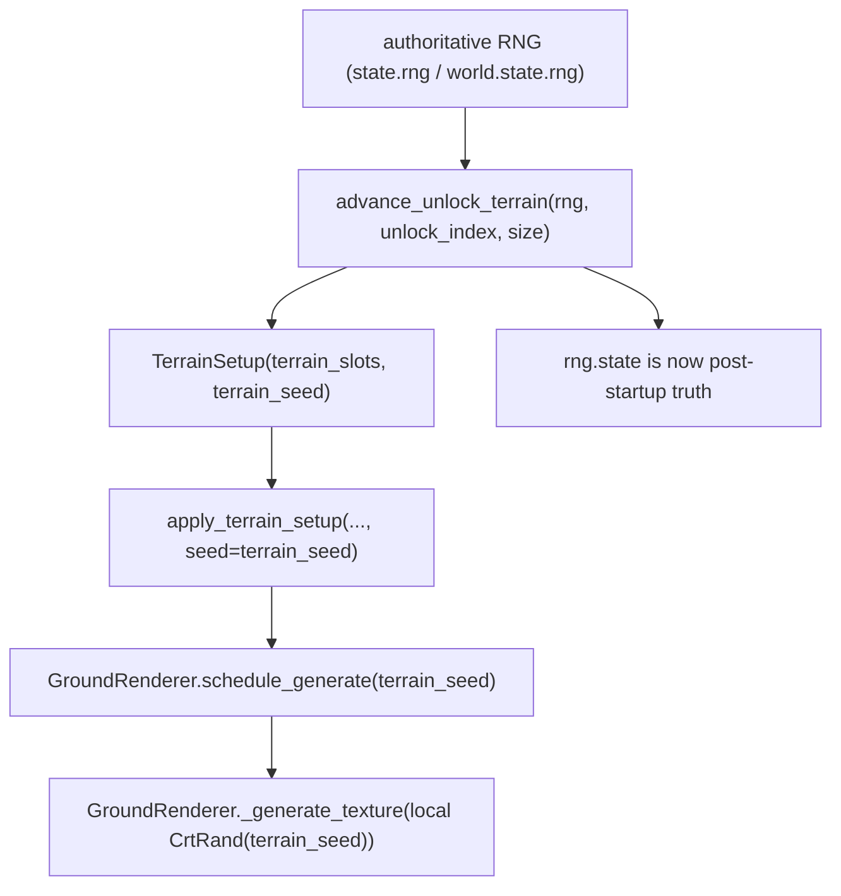
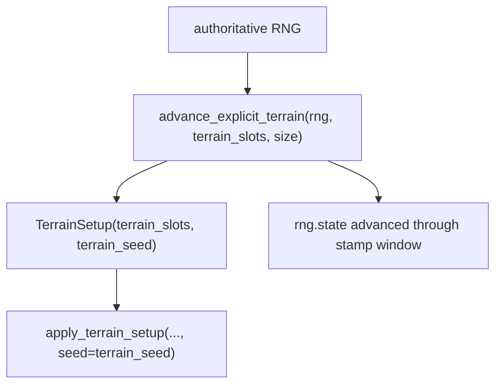
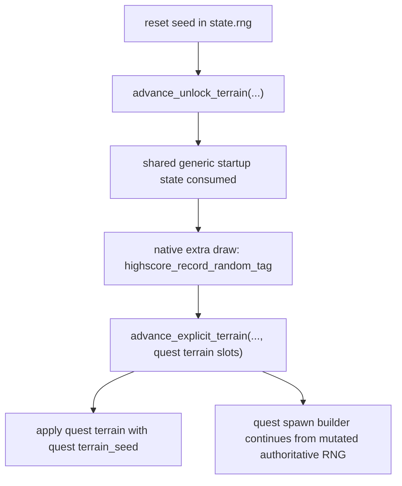

---
tags:
  - status-analysis
---

# Terrain Seed Architecture

This note documents the current terrain-startup contract after the terrain
prelude cutover.

The important shape is now small:

- one authoritative startup RNG timeline
- one minimal terrain boundary value object: `TerrainSetup`
- detached terrain rendering fed by `terrain_slots` + `terrain_seed`

## Contract

The current bootstrap contract in `src/crimson/sim/bootstrap.py` is:

- `advance_unlock_terrain(rng, ...) -> TerrainSetup`
- `advance_explicit_terrain(rng, ...) -> TerrainSetup`

`TerrainSetup` contains only:

- `terrain_slots`
- `terrain_seed`

The helpers mutate the passed RNG in place. Callers must treat `rng.state` after
the helper returns as the authoritative post-startup RNG state.

## Why this split exists

Terrain startup has two responsibilities that should not live in the same layer:

1. deterministic startup math
2. GPU texture generation

The deterministic side decides:

- which terrain descriptor is used
- which RNG state native terrain stamping starts from
- how far the authoritative run RNG must advance

The renderer side only materializes the texture:

- `GroundRenderer.schedule_generate(seed=terrain_seed)`
- later `GroundRenderer` creates a local `CrtRand(terrain_seed)`
- stamping happens against the ground render target without mutating gameplay RNG

That keeps replay and live gameplay aligned while keeping rendering detached.

## Native model

The native game effectively has one global CRT RNG and two terrain entry points:

1. `terrain_generate_random()`
2. `terrain_generate(desc)`

`terrain_generate_random()` does:

- a short prelude of CRT draws
- unlock-gated terrain variant rolls
- a call to `terrain_generate(desc)`

`terrain_generate(desc)` does:

- deterministic stamp-loop RNG consumption for terrain generation

The rewrite mirrors that with two helpers:

- `advance_unlock_terrain(...)` models the generic random entry path
- `advance_explicit_terrain(...)` models the fixed-descriptor entry path

## Current flow

### Unlock-driven modes

This covers menu terrain and the shared startup path used by survival, rush,
tutorial, typo, and the generic first stage of quest startup.

`advance_unlock_terrain(...)` currently models:

- the early native `terrain_generate_random()` draws
- the unlock-gated `1/8` terrain rolls
- capture of `terrain_seed`
- the full terrain stamping RNG window

### Explicit terrain path

This is used by quest terrain overwrite and demo variant terrain setup.

`advance_explicit_terrain(...)` is intentionally simpler:

- `terrain_seed` is the RNG state at the start of native-style stamping
- the helper then advances the authoritative RNG through the stamp window

### Quest startup

Quest is not a different terrain system. It is the shared generic startup path
plus a quest-specific second stage.

That matches the native shape much better than treating quest terrain as a
separate universe.

## Replay contract

Replay startup reconstruction now uses the same boundary type as live startup:

- `PlaybackDriver` rebuilds startup from `ReplayHeader.seed`
- replay stores only `TerrainSetup`
- replay does not carry a replay-specific terrain bootstrap wrapper

This is the important point:

- `ReplayHeader.seed` is still the one external reset seed
- replay recomputes startup deterministically from that seed
- `terrain_seed` is still only a render boundary midpoint, not replay schema

## Menu and demo

Menu and demo now follow the same rule as gameplay:

- mutate the live RNG in place
- pass only `terrain_slots` + `terrain_seed` across the render boundary

Menu uses `advance_unlock_terrain(...)`.

Demo uses `advance_explicit_terrain(...)` against `runtime.sim_world.state.rng`.

## What was removed

The previous design carried too much terrain bootstrap bookkeeping in the main
runtime API. That is gone now.

Removed from the runtime boundary:

- `seed_before`
- `seed_after`
- `selection_draws`
- `stamping_draws`
- `ReplayTerrainSetup`

Removed from the implementation:

- the synthetic per-draw `REWRITE_TERRAIN_PRELUDE_STAMPING_BURN` caller path

Those values were useful during parity work, but they were not runtime state.

## Why `terrain_seed` still exists

`terrain_seed` is still necessary because rendering is detached.

The renderer does not consume the authoritative gameplay RNG directly anymore.
It creates its own local `CrtRand(terrain_seed)` when materializing the ground
texture. Without `terrain_seed`, replay and live gameplay would need to either:

- re-couple rendering to the authoritative RNG, or
- serialize a much larger terrain-generation artifact

`terrain_seed` is the smallest correct bridge.

## Remaining invariants

The architecture should continue to preserve these invariants:

- `ReplayHeader.seed` is the only persisted run-start seed
- startup helpers mutate the passed RNG exactly once and in native order
- callers read post-startup RNG from `rng.state`, not from a duplicate snapshot
- detached terrain rendering uses only `terrain_slots` + `terrain_seed`

## References

- `src/crimson/sim/bootstrap.py`
- `src/crimson/replay/driver/playback_driver.py`
- `src/crimson/screens/chrome.py`
- `src/crimson/demo.py`
- `src/grim/terrain_render.py`
- `docs/rewrite/replay-run-start.md`
