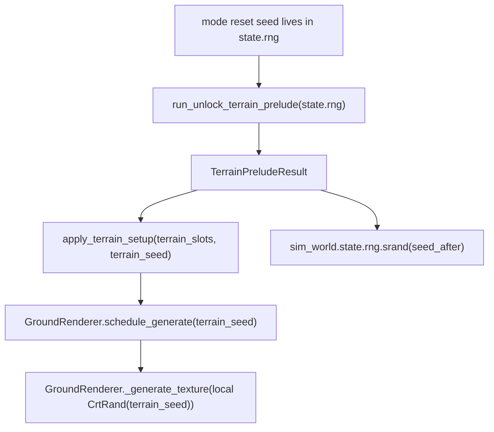
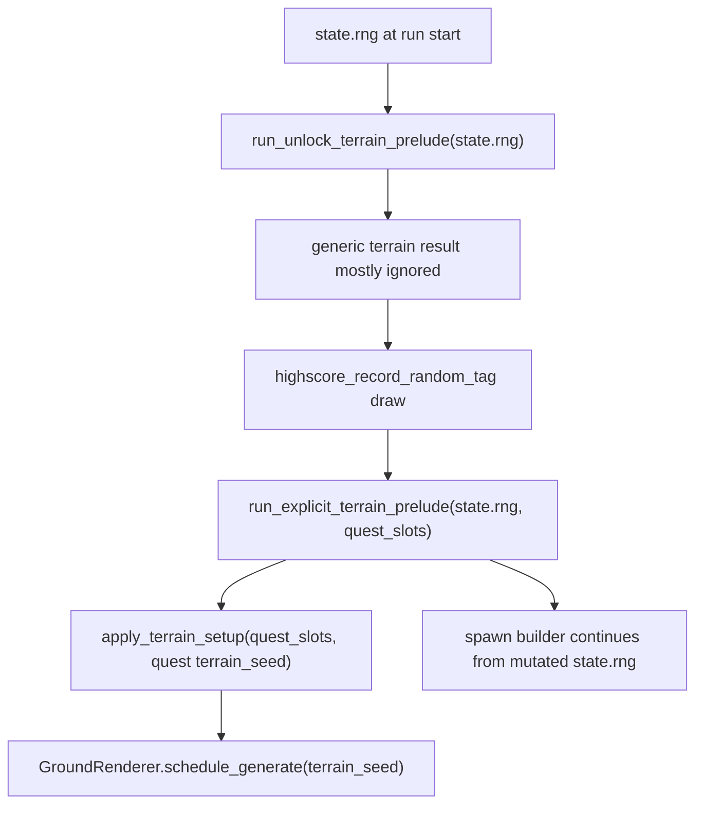
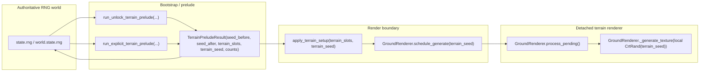
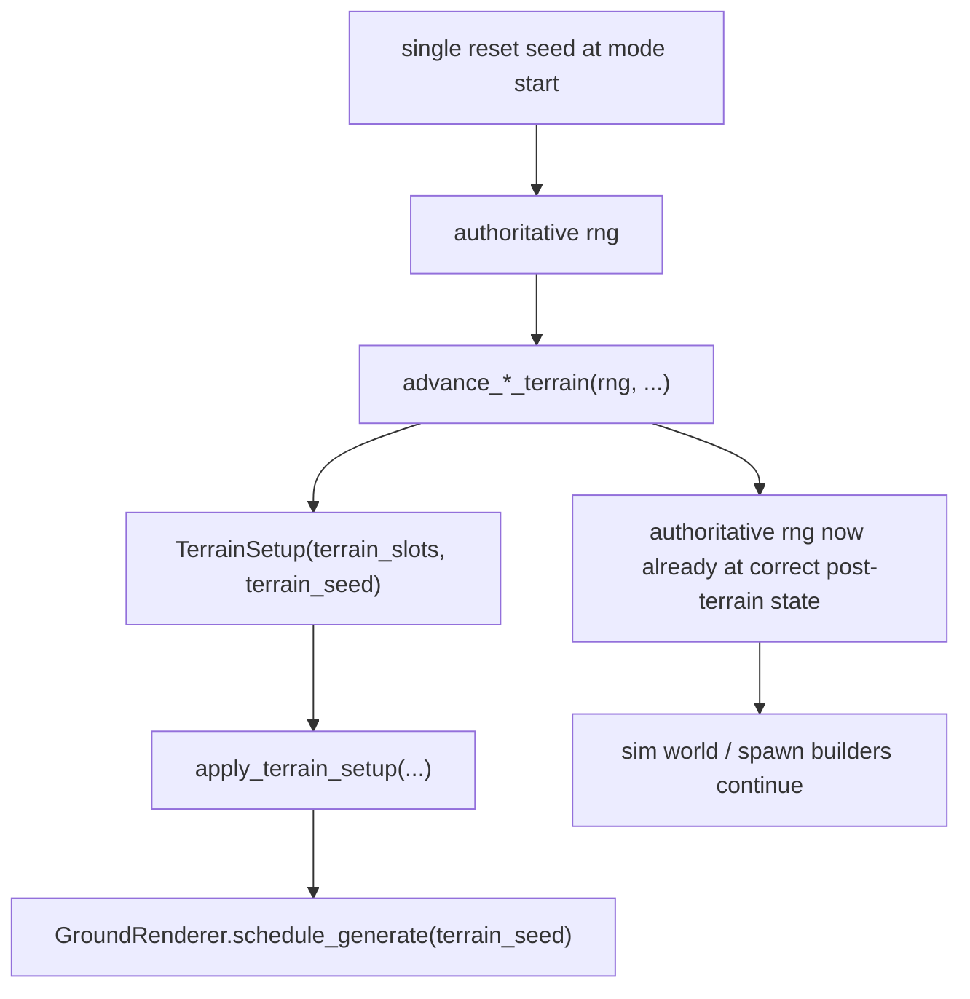

---
tags:
  - status-analysis
---

# Terrain Seed / Prelude Architecture Memo

This memo focuses on the **RNG / terrain bootstrap architecture** around:

- `src/crimson/sim/bootstrap.py`
- `src/grim/terrain_render.py`
- mode startup code (`survival`, `rush`, `tutorial`, `typo`, `quest`)
- replay startup reconstruction
- menu/demo terrain setup

It does **not** focus on terrain rendering fidelity, decal baking, or render-target
allocation. The subject here is the **seed flow** and the architectural shape
used to keep terrain generation deterministic.

## Thesis

The rewrite is carrying more terrain bootstrap state than it needs.

The important simplification is:

- the only externally meaningful seed should be the **run reset seed**
- terrain prelude helpers should **mutate the authoritative RNG in place**
- the only terrain-specific value that still needs to cross the render boundary is
  the **renderer seed** (`terrain_seed`) plus the resolved terrain descriptor

In other words:

- `terrain_seed` is real boundary data
- `seed_before` and `seed_after` are mostly bookkeeping
- `selection_draws` and `stamping_draws` are debug/accounting data, not core runtime state

## Native baseline

The original game does not carry a `TerrainPreludeResult` object at all.

It has one global CRT RNG and two terrain entry points:

1. `terrain_generate_random()`
2. `terrain_generate(desc)`

Shared gameplay/menu startup eventually routes through `terrain_generate_random()`.
Quest startup then layers an additional quest-specific pass on top:

- generic startup/reset path
- generic random terrain generation
- quest-only extra setup
- explicit quest terrain overwrite

`terrain_generate_random()` itself does:

- a few early `crt_rand()` calls
- unlock-gated terrain selection rolls
- a call to `terrain_generate(desc)`

`terrain_generate(desc)` then consumes deterministic stamp-loop RNG for:

- rotation
- position
- position

See also:

- `docs/rewrite/replay-run-start.md`
- `analysis/ghidra/raw/crimsonland.exe_decompiled.c`

## Current rewrite architecture

### Main pieces

The current rewrite splits terrain work across four layers:

1. **Authoritative RNG owner**
   - `state.rng`
   - `world.state.rng`
2. **Prelude helper**
   - `run_unlock_terrain_prelude(...)`
   - `run_explicit_terrain_prelude(...)`
3. **Renderer boundary**
   - `GroundRenderer.schedule_generate(seed=...)`
4. **Terrain renderer**
   - `GroundRenderer._generate_texture(seed)`
   - local `CrtRand(seed)`

### Current data model

`TerrainPreludeResult` currently carries:

- `seed_before`
- `seed_after`
- `terrain_slots`
- `terrain_seed`
- `selection_draws`
- `stamping_draws`

The prelude helpers in `src/crimson/sim/bootstrap.py` do two things at once:

- mutate the passed RNG to simulate native terrain-generation consumption
- package a snapshot object describing before/after state and render inputs

### Current renderer boundary

The renderer side is already fairly small:

- `GroundRenderer.schedule_generate(seed)` stores a seed
- `GroundRenderer.process_pending()` later runs generation
- `GroundRenderer._generate_texture(seed)` creates a local `CrtRand(seed)`

That means the renderer is already **deterministic and side-effect-free** with
respect to the authoritative gameplay RNG.

### Current survival / tutorial / typo / rush flow



### Current quest flow



### Current replay flow

Replay reconstructs the same terrain bootstrap shape by rerunning the same prelude
helpers against `world.state.rng`, then storing only `terrain_slots` and
`terrain_seed` in `ReplayTerrainSetup`.

That is the right direction, but the replay path still inherits the same
over-modeled prelude result shape from live mode startup.

### Current menu / demo flow

- menu uses `run_unlock_terrain_prelude(state.rng, ...)`
- demo uses `run_explicit_terrain_prelude(runtime.sim_world.state.rng, ...)`

Both already rely on the same basic architecture:

- mutate live RNG in place
- extract `terrain_seed`
- schedule deterministic rendering from that seed

## What is good about the current shape

Some parts of the current architecture are already correct and should survive.

### 1. The renderer is detached from gameplay RNG

This is a good boundary.

`GroundRenderer` no longer silently consumes the authoritative RNG. That makes:

- replay easier to reason about
- render scheduling safer
- menu/gameplay terrain ownership cleaner

### 2. Replay stores the real reset seed

This is also good.

The public/external seed should be the one true run reset seed, not a midpoint.

### 3. Quest is modeled as a second-stage terrain prelude

That matches native much better than a separate quest-only terrain universe.

## Smells and flaws in the current architecture

### 1. `TerrainPreludeResult` is over-modeled

`seed_before`, `seed_after`, `selection_draws`, and `stamping_draws` do not all
carry equal architectural weight.

Only two things are needed for actual runtime behavior:

- the resolved terrain descriptor (`terrain_slots`)
- the renderer seed (`terrain_seed`)

The rest are mostly:

- debug log inputs
- parity-accounting values
- test conveniences

This makes the public prelude return value larger and more semantically important
than it should be.

### 2. The helper both mutates RNG and returns snapshots of that mutation

This is the biggest shape smell.

`run_unlock_terrain_prelude(rng, ...)` already mutates `rng`.
Returning `seed_after` then creates a second representation of the same truth.

That leads to code like:

- call helper with `self.state.rng`
- immediately reseed sim RNG from `terrain.seed_after`

Architecturally, that is redundant.

The authoritative post-prelude state already exists as `self.state.rng.state`.

### 3. Logging concerns leak into runtime API

`seed_before`, `selection_draws`, and `stamping_draws` are useful for:

- LAN debug logs
- tests
- parity inspection

But they are not terrain runtime essentials.

Right now, logging/accounting concerns shape the main runtime return type.

That is backwards.

### 4. The synthetic burn caller still encodes an implementation artifact

`REWRITE_TERRAIN_PRELUDE_STAMPING_BURN` exists because:

- native terrain generation consumed RNG directly
- rewrite terrain generation uses a local `CrtRand(seed)`
- so bootstrap has to move the authoritative RNG forward separately

That bookkeeping is real.
The fake per-draw caller id is not.

This is a smell because it exposes a tracing workaround as if it were part of the
runtime model.

### 5. The same pattern is duplicated across mode startup, replay, menu, and demo

The current code repeats the same conceptual sequence in several places:

- mutate RNG through terrain prelude
- schedule terrain with `terrain_seed`
- continue from post-prelude RNG state

The duplication is not huge, but it makes the architecture look more special-case
than it really is.

### 6. Quest's `_generic_terrain` local is architecturally correct but structurally ugly

In quest startup, the generic terrain result is stored into `_generic_terrain`
and then ignored except for its side effects on RNG.

This is correct relative to native behavior.

It is also a sign that the current result object is too large:

- the caller needs the side effect
- it does not need the returned object

That is usually a clue that the API is shaped incorrectly.

### 7. The current prelude does not appear to model native `terrain_generate_random()` completely

Native `terrain_generate_random()` performs three early `crt_rand()` calls before
the unlock-gated terrain selection rolls.

The current `run_unlock_terrain_prelude()` helper models:

- unlock selection rolls
- stamp-loop consumption

But not those early draws.

That means the current prelude is both:

- too large as an API surface
- still not quite precise enough as a native model

This is the worst combination: extra abstraction without full fidelity.

### 8. `terrain_seed` is doing the right job, but the name invites confusion

`terrain_seed` is not "the seed of the run".

It is:

- the RNG state at the moment terrain stamping begins
- the state from which the detached renderer must start its local RNG

That is a legitimate value.
But because it is named `terrain_seed` next to `seed_before` / `seed_after`, it
reads like part of a three-snapshot family instead of the only boundary value
that actually matters.

## Current architecture in one diagram



The problematic arrow is `D --> A`.

That is the extra "snapshot object feeds state back into authoritative RNG"
layer that we do not really need.

## Suggested target architecture

### Principle

Use one external seed at the beginning of the run, then just mutate the live RNG
the same way the native game does.

The prelude helper should become a **stateful mutator with a small return value**.

### Proposed reduced data shape

```python
class TerrainSetup(msgspec.Struct, frozen=True):
    terrain_slots: TerrainSlotTriplet
    terrain_seed: int
```

That is enough for the render boundary.

### Proposed helper semantics

#### Generic random terrain

```python
def advance_unlock_terrain(
    rng: CrandLike,
    *,
    unlock_index: int,
    width: int,
    height: int,
) -> TerrainSetup:
    ...
```

Behavior:

- mutate `rng` to the post-terrain state
- return only:
  - chosen `terrain_slots`
  - `terrain_seed` for detached terrain rendering

#### Explicit terrain

```python
def advance_explicit_terrain(
    rng: CrandLike,
    *,
    terrain_slots: TerrainSlotTriplet,
    width: int,
    height: int,
) -> TerrainSetup:
    ...
```

Behavior:

- mutate `rng` through the terrain stamping window
- return only:
  - `terrain_slots`
  - `terrain_seed`

### Suggested flow after simplification



There is no `seed_after` object anymore because `rng.state` is already the truth.

## Concrete simplification steps

### Step 1. Shrink the prelude return type

Replace `TerrainPreludeResult` with `TerrainSetup`.

This should remove:

- `seed_before`
- `seed_after`
- `selection_draws`
- `stamping_draws`

from the runtime-facing API.

### Step 2. Read post-prelude RNG from the RNG itself

Change callers from:

```python
self.sim_world.state.rng.srand(int(terrain.seed_after))
```

to:

```python
self.sim_world.state.rng.srand(int(self.state.rng.state))
```

or equivalent for replay/demo/world runtime.

### Step 3. Move draw-count accounting out of the main API

If draw counts still matter for debugging:

- compute them only where logging needs them
- or expose a separate helper

Do not make them part of the core terrain bootstrap result object.

### Step 4. Add a fast-forward helper to `CrtRand`

Instead of:

```python
for _ in range(stamping_draws):
    rng.rand(caller=REWRITE_TERRAIN_PRELUDE_STAMPING_BURN)
```

prefer something like:

```python
rng.advance(stamping_draws)
```

This is clearer and removes a synthetic-caller artifact from the main path.

### Step 5. Fix native fidelity before or during simplification

The prelude helper should model native `terrain_generate_random()` exactly:

- early random draws
- unlock selection draws
- terrain renderer seed capture point
- stamp-loop advancement

If we simplify the API first but keep an incomplete native model underneath, the
shape gets nicer but the parity problem remains.

## Risks and caveats

### 1. `terrain_seed` should not be deleted unless the renderer boundary changes too

As long as `GroundRenderer` stays detached and runs its own local `CrtRand(seed)`,
the render boundary still needs a seed.

So the target is not "zero terrain seed values anywhere".
The target is "one externally meaningful run seed, plus one internal render seed".

### 2. Quest still needs its two-stage startup

Quest is not a reason to keep `seed_after`.
But quest does remain special in one real sense:

- generic prelude first
- extra native draw for `highscore_record_random_tag`
- explicit quest terrain prelude

That two-stage structure should stay.

### 3. Replay should keep calling the same startup logic as live mode

The simplification should reduce replay-specific structure, not increase it.

## Recommended end state

### Public runtime idea

- one reset seed in replay / mode start
- prelude helpers mutate RNG in place
- prelude helpers return only `TerrainSetup`
- sim/runtime code reads post-prelude RNG directly from the authoritative RNG object

### Internal implementation idea

- `CrtRand.advance(n)` for large deterministic skips
- helper(s) that model native terrain startup exactly
- optional debug-only accounting kept off the main path

## Bottom line

The current architecture is close, but it still carries too much bootstrap state
in public runtime objects.

The clean target is:

- **one real external seed**: the run reset seed
- **one real boundary seed**: `terrain_seed` for detached rendering
- no public `seed_before`
- no public `seed_after`
- no public draw-count bookkeeping in the runtime prelude result

That would be:

- smaller
- easier to read
- more obviously native-aligned
- less likely to leak tracing/debug concerns into production architecture
