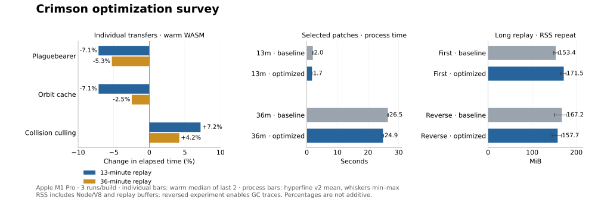

---
tags:
  - verification
  - performance
---

# Optimization survey

The earlier Python performance work contains two useful core transfers:
Plaguebearer culling and a phase-seed orbit-direction cache. Together they
reduce fresh-process zero-import WASM replay time by about 14% on the 13-minute
recording and 6% on the 36-minute recording. The direct collision-culling transfer
regresses. A spatial index remains a candidate requiring its own measured design.

The [optimization catalog](https://github.com/banteg/crimson/blob/master/crimson-core/optimizations/README.md) records
where each change belongs. Generated-source optimizations apply to both original
and ranked bug policies; the recovered `decomp/` files stay untouched.

## Inventory and transfer decisions

| Previous change | Why it helps Python | Core/verifier/game decision |
| --- | --- | --- |
| Plaguebearer strong-origin skip and axis culling | Avoids an entire scan and expensive PC24 math calls for distant candidates | Transfer as a separate optimization patch. Skip only the caller that ignores the index return; retain first-active-slot order, self and corpse eligibility, strict 45/150 boundaries. |
| Immutable orbit-direction cache | Repeated Python trig/function calls disappear | Transfer as a separate patch. Cache doubles for seeds 0..383, preserving phase spills and the wide trig result into its first rounded multiply. |
| Ordered 64-unit spatial hash | Replaces many Python loops/math calls with a much smaller sorted candidate list | Keep current Python implementation. Investigate a bounded native bitset grid separately; index building may cost more than a 384-slot C++ scan on sparse workloads. |
| Radius axis rejection | Avoids costly Python PC24 hypot and rounding calls | Keep Python. The tested direct C++ port was slower on both recordings, despite equal snapshots and 24,576 boundary/start-index comparisons. Extra branches/checks and wide reach arithmetic are plausible costs, not an adjudicated instruction-level explanation. |
| Size-margin LRU | Avoids Python calls, packing and repeated rounded arithmetic | Keep Python; a native float-key cache is unlikely to beat two arithmetic operations without evidence. |
| Integer masks and direct `Struct` packing/multiply-chain rounding | Removes Python enum/function overhead | Keep Python; C++ already has integer bit operations and inline float arithmetic. Never remove individual rounding boundaries or enable fast math. |
| Reused auto-target distance | Removes a redundant Python distance calculation | Keep Python for now. Inspect compiler output and one-/two-player target rules before claiming a native benefit. |
| Empty projectile/secondary guards | Avoids unnecessary Python spatial-index construction | Keep Python. The recovered `projectile_update` also updates sprites/particles, so a whole-function early return would change behavior. A future native index should build lazily at its first query. |
| Raylib/CFFI value construction and cached pan conversion | Avoids wrapper allocations and Python-side pan-law math | Keep in `grim/`; the native game uses different engine bindings and the verifier is headless. |
| Viewer keyframes/terrain caches, replay I/O and CI snapshot comparisons | Improves host lifecycle, recording or validation costs | Keep in the owning host/I/O/check modules; these are not recovered gameplay patches. |

Python optimizations should remain ordinary typed domain code, cross-linked by
the catalog. They do not need duplicate unoptimized implementations or runtime
patch loading. Core transfers should have one algorithm per patch, explicit
invariants, baseline comparisons and benchmark provenance.

## Spatial-index follow-up

The Python index is more than a bucket lookup: it sorts candidates by pool index,
tracks moved/dead/resized creatures, and rebuilds when allocation changes. Radius
damage resumes after the parent slot; split children allocated into later slots
must appear, while children in earlier slots must not be revisited. Creatures can
be outside the arena, and find-radius margins depend on creature size.

A native design could union six 64-bit slot masks per queried cell, then enumerate
set bits in ascending order. It must track successful allocation and relevant
mid-pass mutations and retain each query's exact predicate/start index. The
Plaguebearer scan has different eligibility and cannot blindly share the live
collision index. Measure sparse and busy flame/Ion workloads, including rebuild
cost, before choosing it.

In the earlier post-spawn-fix browser profile, `creature_find_in_radius` accounted
for about 2.62 seconds of sampled self time. Orbit trig attributed specifically
to `creature_update_all` accounted for about 1.23 seconds; much other trig belonged
to rendering. These samples motivate follow-up but are not predicted savings or
additive totals. No new rendered-browser timing is claimed here.

## Measured workloads

Measured 2026-10-10 on Apple M1 Pro, macOS 26.6.2, Node 26.10.0, Zig 0.17.0,
and hyperfine 2.0.0. Baseline commit
`9759a26c545972b4ba1b667e974b273c45536394` already contains the Survival spawn-batch
optimization, so these are incremental improvements over that fix.

| Recording | Input ticks | Game time | Identity |
| --- | ---: | --- | --- |
| Earlier Survival | 65,776 | 13:28.140 | `survival_20261007_091930_score1926843.crd`, SHA-256 `08e43e7b80f30805040925dd49d2aebcfee2d7b3624bc9dbf2de1c0875124c1e` |
| Reported Survival | 210,268 | 35:54.555 | [Watch](https://crimson.land/play/?watch=209b0cdb6d9345e8c2dc4eaeac654e929338eecf07aaad28aaf9137dd9bc38d6), raw input SHA-256 `209b0cdb6d9345e8c2dc4eaeac654e929338eecf07aaad28aaf9137dd9bc38d6` |

### Individual transfers: warm simulation only

Three repetitions per build in one process; the middle repetition reverses build
order. The values below are medians of the last two repetitions. Loading, init,
decoding and snapshots are outside timing. No other benchmark/build ran alongside.
The small sample establishes direction on these workloads, not universal gains.

| Prototype | Earlier replay | Change | Reported replay | Change |
| --- | ---: | ---: | ---: | ---: |
| Baseline | 1.827 s | — | 26.982 s | — |
| Plaguebearer | 1.697 s | -7.1% | 25.563 s | -5.3% |
| Orbit cache | 1.697 s | -7.1% | 26.317 s | -2.5% |
| Direct collision culling | 1.959 s | +7.2% | 28.119 s | +4.2% |
| All three | 1.698 s | -7.1% | 25.557 s | -5.3% |

The combined three-way result includes the collision regression. It is not the
selected two-patch candidate, and individual percentages must not be added.

### Hyperfine v2: fresh process and memory

[Hyperfine v2](https://github.com/sharkdp/hyperfine/releases/tag/v2.0.0) adds
peak RSS and per-run metric exports, along with CPU-cycle/instruction counters.
Direct execution is now the default; JSON schema 2 stores measurements and
summaries for each metric. The [metric documentation](https://github.com/sharkdp/hyperfine/blob/v2.0.0/README.md#choosing-metrics-and-units)
explains that macOS RSS is the largest per-process peak, not simultaneous process-tree
memory. CPU counters here belong to the Node process, including its threads.

The process measurement includes Node startup, WASM loading/JIT, replay decoding,
simulation, and terminal snapshot validation. Three fresh processes per command,
no warmup, warmed input files; command order is grouped with baseline first.
The earlier warm experiment reverses order to check the same direction.
Peak RSS includes V8, input/record buffers and touched WASM pages. It is not a
browser heap profile or the WASM reserved linear-memory size.

| Recording / build | Wall time (mean ± SD) | Peak RSS (mean; range) | Instructions |
| --- | ---: | ---: | ---: |
| Earlier: baseline | 1.972 ± 0.037 s | 121.9 MiB; 121.5–122.4 | 31.9 B |
| Earlier: optimized | 1.695 ± 0.008 s | 121.3 MiB; 120.7–121.6 | 28.2 B |
| Reported: baseline | 26.493 ± 0.137 s | 153.4 MiB; 148.9–159.1 | 328.6 B |
| Reported: optimized | 24.888 ± 0.303 s | 171.5 MiB; 163.9–176.6 | 298.8 B |

The first long-run pair shows higher optimized RSS, so a second three-run
experiment reversed command order and enabled Node GC traces. Mean RSS then
changed from 167.2 MiB baseline to 157.7 MiB optimized; the direction reversed.
That instrumented repeat ran in 26.638 s baseline and 24.537 s optimized,
confirming the timing direction but kept separate from the uninstrumented sample.

Both final captured GC logs return to about 31.9–32.0 MB of live Node heap after
collection, and both modules still have 2.5 MiB of WASM linear memory at replay
end. The orbit cache adds 9 KiB inside that reservation. This points to host/runtime
variability in RSS; it does not establish a reliable memory improvement or
regression, or prove browser memory behavior. Instructions independently confirm
less execution work. The raw data retains both experiments.

Raw per-run timings, counters, hashes and summaries are in the
[measurement data](../../crimson-core/results/optimization-survey.json).



## Validation and reproduction

Each prototype agreed at initialization and every input tick with the current
baseline on 101 corpus streams spanning both bug policies plus the two complete
recordings: 574,385 ticks, all 36,343 snapshot fields and step acceptance. The final
packaged patches also pass the same comparison against that baseline. Native/verifier/game
builds compile, and CI runs the existing Python/native/WASM and game/verifier gates.
These checks establish agreement on the tested inputs; they are not a proof for
all possible states or a new native-executable matching claim.

The focused `creature_optimizations.py` differential check covers 4,132
Plaguebearer state/return/axis cases and 24,192 orbit products across every seed,
including repeated cache use. Existing native-oracle tests exercise infection,
collision ordering/radius boundaries, and particle/AoE split/mutation behavior.

```sh
uv run python crimson-core/build.py --target wasm
uv run python crimson-core/checks/creature_optimizations.py
node crimson-core/checks/profile_replay.mjs run.rsi before.wasm after.wasm comparison.json --compare
```

Build `before.wasm` from the baseline commit in a separate checkout, convert the
same recording with `crimson-core/checks/replay.py`, and retain the baseline final
snapshot SHA-256 as `EXPECTED_HASH`. The benchmark runner rejects any tick or
terminal snapshot that differs from that expected hash.

```sh
hyperfine --runs 3 \
  --metrics time_wall_clock:ms,memory_peak_resident:MiB,time_cpu:s,instructions:B,cpu_cycles:B \
  --export-json timing.json \
  --command-name baseline \
  "node crimson-core/checks/benchmark_run.mjs before.wasm run.rsi $EXPECTED_HASH" \
  --command-name optimized \
  "node crimson-core/checks/benchmark_run.mjs after.wasm run.rsi $EXPECTED_HASH"
```

Hardware-counter availability depends on platform and permissions. Peak RSS and
CPU time measure the whole runner; use `profile_replay.mjs` separately for warm
simulation-only measurements. Keep validation, compilation and competing CPU
work outside the timed experiment.
