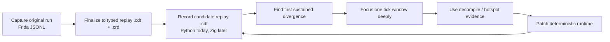
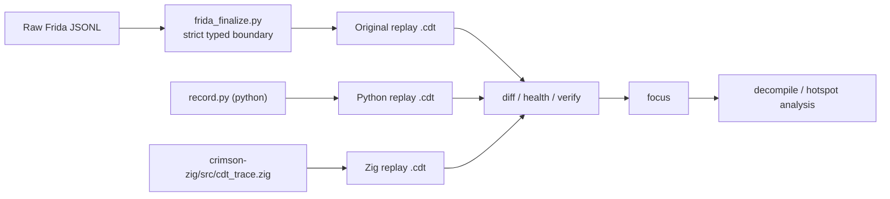
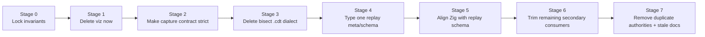

# Dbg Simplification And Unification Plan

## Goal

Make the debug stack serve the real parity workflow with the minimum number of
contracts:

- one owned capture wire contract: raw Frida JSONL
- one durable trace kind: typed replay `.cdt`
- one replay schema shared by Frida finalize, Python record, and Zig record
- diff/focus/health as the center of the design
- query/entity/tick as thin projections, not schema drivers

If we sequence the cuts correctly, we should not need a more complicated
artifact taxonomy. The target architecture should fall out of the cutover.

## Why This Plan

Historical differential sessions show the actual loop is:

The sessions do not show strong evidence for multiple durable `.cdt` dialects or
for broad trace-query abstractions driving the schema.

## Non-Goals

- Do not preserve long-lived compatibility wrappers inside `src/crimson/dbg`.
- Do not add a `trace_kind` taxonomy unless we later prove we truly need more
  than one durable `.cdt` kind.
- Do not let `query`, `entity`, `tick`, or `viz` force weak typing back into
  the replay path.
- Do not optimize around stored bisect repro `.cdt` bundles before proving they
  materially improve parity work.

## End State

## Sequencing Rules

1. Fix the owned capture contract first.
2. Cut secondary artifact paths before adding more metadata structure.
3. Make all producers emit one replay schema before polishing peripheral
   consumers.
4. Delete old paths in the same wave as caller migration.
5. Use real captures and real replay artifacts as acceptance gates.

## Stage Ladder

## Stage 0: Lock Invariants Before Cutting

### Goal

Create a safety rail around the real parity loop so later cuts are measured
against actual artifacts, not just type-checking.

### Main Edits

- Expand fixture-driven coverage around:
  - `tests/debug/test_dbg_frida_finalize.py`
  - `tests/debug/test_dbg_trace.py`
  - `tests/debug/test_dbg_record.py`
  - `tests/debug/test_dbg_cli.py`
- Add at least one fixture path for:
  - raw Frida JSONL -> finalized replay `.cdt`
  - `.crd` -> Python replay `.cdt`
  - trace diff/focus happy path
- Add a single doc note in `DBG_TRACE_ARCHITECTURE_MEMO.md` pointing to this
  plan as the execution document.

### Explicit Non-Changes

- No schema changes yet.
- No consumer cleanup yet.

### Verification

- `uv run pytest tests/debug`
- `uv run ty check src/crimson/dbg src/crimson/cli/dbg.py tests/debug`

### Exit Criteria

- We can change the internals of finalize/trace/diff without losing coverage on
  the real artifact flow.

### Suggested Commit

- `test(dbg): lock replay trace cutover invariants`

## Stage 1: Delete Viz Now

### Goal

Remove the lowest-value surface immediately while the architecture is still
fresh in our heads. `viz` is a static HTML convenience layer, not part of the
core parity loop.

### Why This Goes First

- no historical evidence that it drove parity fixes
- weaker diagnostic value than `diff` or `focus`
- easy to delete cleanly
- shrinks the public surface before we start deeper schema work

### Main Edits

- delete:
  - `src/crimson/dbg/viz.py`
  - the `dbg viz` command in `src/crimson/cli/dbg.py`
  - `tests/debug/test_dbg_cli.py` coverage specific to `viz`
- remove `viz` mentions from docs where it is presented as a standard parity
  workflow step:
  - `docs/frida/differential-playbook.md`
  - `DBG_TRACE_ARCHITECTURE_MEMO.md`
  - `plan.md` stage descriptions that would otherwise imply it survives longer

### Verification

- `uv run pytest tests/debug/test_dbg_cli.py`
- `uv run ty check src/crimson/dbg src/crimson/cli/dbg.py tests/debug`
- `rg -n "dbg viz|write_viz_html|viz.py" src tests docs`

### Exit Criteria

- there is no `viz` command left
- no docs still imply `viz` is part of the standard parity workflow

### Suggested Commit

- `refactor(dbg): remove trace viz`

## Stage 2: Make The Frida Capture Contract Strict

### Goal

Raw Frida JSONL is not an untrusted boundary; it is an owned producer/consumer
contract. The goal is to make that contract strict on both sides:

- `gameplay_diff_capture.js` emits one narrow, canonical wire shape
- `frida_finalize.py` decodes that shape directly and validates invariants
- neither side relies on permissive cleanup to recover from sloppy producer
  output

The only tolerated failure modes should be transport issues like abrupt shutdown
or truncated tail rows, not schema looseness.

### Main Edits

- `scripts/frida/gameplay_diff_capture.js`
  - document the exact emitted row shapes for `session_start`, `run_start`,
    `tick`, `run_end`, and `session_end`
  - make the row-builder functions authoritative for those shapes instead of
    passing through ad hoc objects
  - emit canonical scalars/lists only:
    - stable ints for ids/counts/ticks
    - explicit booleans
    - normalized string enums
    - canonical replay input tuples
  - stop silently papering over missing required tick fields with permissive
    `{}` / `[]` / `0.0` fallbacks where the row is supposed to be replay-grade
  - fail fast or shut down capture when required replay fields are missing or
    non-finite, instead of writing a weak row and hoping finalize sorts it out
  - keep truly auxiliary debug events separate in spirit from the finalized
    replay row contract
  - identify which objects are truly stable contracts and which are genuinely
    flexible
- `src/crimson/dbg/frida_finalize.py`
  - replace `_SessionStartRow.config: dict[str, Any]` with a typed config struct
  - replace `_SessionStartRow.session_fingerprint: dict[str, Any]` with a typed
    fingerprint struct
  - type any remaining stable capture row payloads instead of leaving them as
    generic maps
  - keep semantic finalize validation where it is
- add regression fixtures/tests for malformed boundary rows so boundary
  validation stays strict

### Expected Deletions

- narrow or remove `Any` usage in capture-row structs
- reduce `payloads.py` involvement in finalize to presentation-only metadata if
  still needed at all
- reduce finalize-time normalization that exists only because the JS producer is
  currently too permissive

### Verification

- `uv run pytest tests/debug/test_dbg_frida_finalize.py tests/debug/test_dbg_trace.py`
- `uv run ty check src/crimson/dbg/frida_finalize.py`
- `uv run sg scan --report-style short src/crimson/dbg/frida_finalize.py`

### Exit Criteria

- The finalized replay trace is fully trusted typed data.
- The Frida script emits one narrow replay-grade row contract for
  `session_start` / `run_start` / `tick` / `run_end` / `session_end`.
- The JSONL capture format is treated as a strict owned wire contract, not as a
  loose boundary that needs defensive repair.
- Any remaining generic maps in finalize are explicitly documented as truly
  dynamic boundary payloads.

### Suggested Commit

- `refactor(dbg): type frida finalize boundary rows`

## Stage 3: Delete The Bisect Repro Trace Dialect

### Goal

Replay `.cdt` should be the only durable trace kind. `dbg bisect` may still
produce an output artifact, but not a second trace dialect that drags extra
reader/writer complexity through the system.

### Main Edits

- `src/crimson/dbg/diff.py`
  - stop constructing `BisectTickRecord` and `BisectTickChannels`
  - make `bisect_traces()` return report data only
  - if `--out` stays, write a lightweight report bundle that references the two
    replay traces plus `first_bad_tick` and window bounds
- `src/crimson/cli/dbg.py`
  - change `dbg bisect --out` semantics away from `repro.cdt`
  - prefer JSON or a small report directory over a third trace file
- `tests/debug/test_dbg_cli.py`
  - rewrite repro assertions around the new report output

### Expected Deletions

- `BisectTickChannels`
- `BisectTickRecord`
- `BisectTickBlock`
- `BisectTraceReader`
- `write_bisect_trace_iter`
- `write_bisect_trace`
- any bisect-only schema branches in `trace.py`

### Verification

- `uv run pytest tests/debug/test_dbg_cli.py tests/debug/test_dbg_trace.py`
- `uv run ty check src/crimson/dbg src/crimson/cli/dbg.py`
- `rg -n "BisectTraceReader|write_bisect_trace|BisectTick" src tests`

### Exit Criteria

- There is only one durable `.cdt` reader/writer path left.
- We do not need `trace_kind` because we no longer have competing durable trace
  dialects.

### Suggested Commit

- `refactor(dbg): remove bisect repro trace dialect`

## Stage 4: Type One Replay Trace Meta And Schema

### Goal

Once only replay `.cdt` remains, `TraceMeta` can stop pretending to be a
generic artifact envelope and become a typed replay-trace contract.

### Main Edits

- `src/crimson/dbg/schema.py`
  - replace generic `TraceMeta` dict fields with typed replay metadata structs
  - define typed producer/source/config shapes for:
    - Frida-finalized original traces
    - Python-recorded candidate traces
    - Zig-recorded candidate traces
- `src/crimson/dbg/record.py`
  - emit the typed replay meta directly
- `src/crimson/dbg/frida_finalize.py`
  - emit the same typed replay meta directly
- `src/crimson/dbg/trace.py`
  - decode one replay meta contract
  - keep the shared container logic, but not a generic artifact abstraction

### Decision Rule

- Prefer one replay meta with a small producer-specific typed section.
- Do not reintroduce an artifact union unless a second durable `.cdt` kind
  reappears for a real reason.

### Verification

- `uv run pytest tests/debug`
- `uv run ty check src/crimson/dbg src/crimson/cli/dbg.py tests/debug`
- `uv run sg scan --report-style short src/crimson/dbg src/crimson/cli/dbg.py`

### Exit Criteria

- All replay `.cdt` producers emit one typed metadata contract.
- No consumer needs producer folklore plus generic dict access to read replay
  metadata.

### Suggested Commit

- `refactor(dbg): type replay trace metadata`

## Stage 5: Align Zig With The Replay Schema

### Goal

Python and Zig should emit the same replay trace contract, not merely two typed
contracts that happen to be close.

### Main Edits

- `crimson-zig/src/cdt_trace.zig`
  - align replay channel shapes with Python canonical replay channels
  - align ownership representation
  - remove single-player-only assumptions where the schema should permit more
- Python side:
  - remove Zig-specific schema accommodations once the contracts match
  - add cross-implementation fixture coverage

### Expected Fix Areas

- player container shapes
- owner representation
- metadata/source/config layout
- channel/version alignment

### Verification

- Python can read Zig-produced traces through the normal replay reader
- Zig can read or validate Python-produced replay traces if a reader exists
- `uv run pytest tests/debug`
- `uv run ty check src/crimson/dbg src/crimson/cli/dbg.py tests/debug`

### Exit Criteria

- Replay traces from original/Frida, Python, and Zig all pass through the same
  replay reader and the same diff/focus pipeline.

### Suggested Commit

- `refactor(zig): align replay trace schema with python`

## Stage 6: Make Remaining Secondary Consumers Thin

### Goal

`query`, `entity`, and `tick` should project from typed replay rows or typed
diff/focus reports. They should not shape the underlying trace model.

### Main Edits

- `src/crimson/dbg/query.py`
  - remove any generic row-materialization that is not strictly needed at the
    query edge
- `src/crimson/cli/dbg.py`
  - keep builtin conversion at JSON/HTML/text emission only

### Expected Deletions

- any leftover replay-path coercion helpers whose only purpose is to hop through
  builtins and come back to typed data

### Verification

- `uv run pytest tests/debug/test_dbg_cli.py`
- `uv run ty check src/crimson/dbg/query.py src/crimson/cli/dbg.py`
- `uv run sg scan --report-style short src/crimson/dbg src/crimson/cli/dbg.py`

### Exit Criteria

- Secondary commands are clearly layered on top of typed replay traces and
  reports.

### Suggested Commit

- `refactor(dbg): thin secondary trace consumers`

## Stage 7: Remove Duplicate Authorities And Stale Docs

### Goal

Finish the simplification by deriving facts once and making docs match reality.

### Main Edits

- `src/crimson/dbg/trace.py`
  - derive footer counts from actual rows
  - decide whether `meta.tick_range` stays stored or becomes purely derived
- `src/crimson/dbg/diff.py` and `src/crimson/dbg/health.py`
  - stop trusting different competing metadata authorities for the same facts
- docs:
  - update `docs/rewrite/cdt-trace-format.md`
  - update `docs/frida/differential-playbook.md` if bisect output semantics
    change
  - update `DBG_TRACE_ARCHITECTURE_MEMO.md` to mark completed stages

### Optional Enforcement

- add a structural rule or targeted test to stop `dict[str, object]` / `Any`
  from creeping back into replay-path structs

### Verification

- `just check`
- `uv run pytest tests/debug`
- `uv run ty check src/crimson/dbg src/crimson/cli/dbg.py tests/debug`

### Exit Criteria

- one source of truth per replay fact
- docs describe the shipped architecture
- no ghost APIs or stale repro-trace language remain

### Suggested Commit

- `docs(dbg): sync replay trace architecture`

## Implementation Notes

### Why Delete Bisect Repro Traces Early

Deleting the bisect `.cdt` dialect early keeps us from doing unnecessary work:

- no `trace_kind`
- no replay-vs-bisect meta union
- no second reader/writer pair to maintain
- no consumer branching over artifact kind

If the team later proves that a stored bisect bundle is still useful, it should
re-enter as a small report artifact, not as a second core trace contract.

### Why Metadata Typing Waits Until After That Cut

If we type metadata before removing the extra dialect, we risk designing a typed
union around a split that we may delete. Removing the extra artifact kind first
lets the simpler replay meta shape emerge naturally.

### What Success Looks Like

The final code should read like this:

- `gameplay_diff_capture.js` emits stable raw rows
- `frida_finalize.py` strictly validates those rows and writes typed replay
  traces
- `record.py` writes the same replay trace contract for Python
- Zig writes the same replay trace contract
- `diff`, `focus`, and `health` operate only on that contract
- everything else is a projection

That is the smallest architecture that still serves the actual parity loop.
