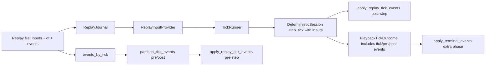
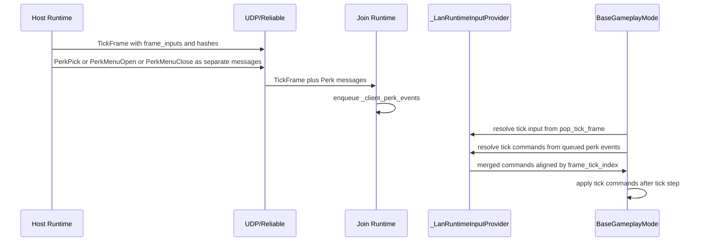
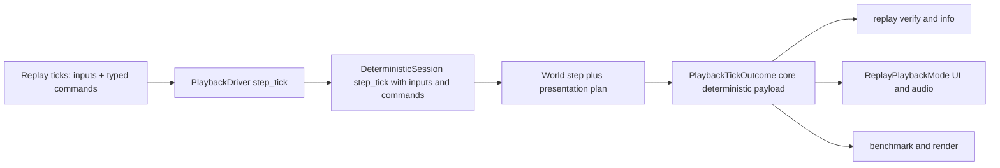
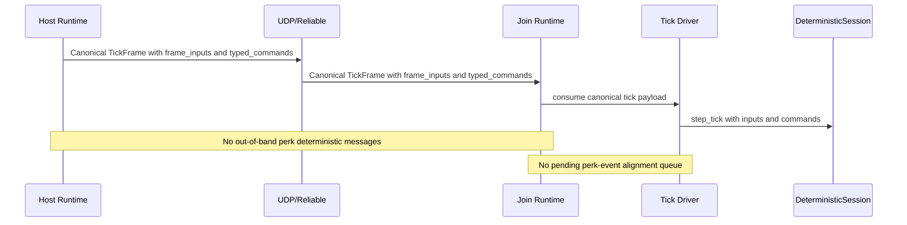

# Replay + Deterministic Runtime Architecture (Before vs After)

Date: 2026-03-05  
Status: Supplemental review doc for the Replay V2 refactor direction in `plan.md`.

This document compares:

1. **Before**: the currently-implemented architecture in `src/crimson/`.
2. **After**: the target architecture defined in [`plan.md`](plan.md).

It is intentionally explicit about **where the split-brain exists today**, what gets deleted, and what invariants replace hash/checksum-based checks.

---

## Scope and Sources

Primary source files for the **before** side:

- Replay schema/events: `src/crimson/replay/types.py:279-301`
- Replay recorder side-channel APIs: `src/crimson/replay/recorder.py:20-148`
- Provider contracts + dynamic command path: `src/crimson/sim/input_providers.py:14-267`
- Tick runner/session contracts: `src/crimson/sim/tick_runner.py:13-130`, `src/crimson/sim/sessions.py:285-381`
- Replay event partition/apply: `src/crimson/sim/driver/replay_events.py:13-95`
- Playback driver policy/event surfaces: `src/crimson/sim/driver/playback_driver.py:161-260`
- Playback runner path + terminal phase: `src/crimson/sim/driver/playback_driver.py:620-958`
- Replay playback mode custom orchestration: `src/crimson/modes/replay_playback_mode.py:478-777`
- LAN lockstep wire/messages: `src/crimson/net/lockstep_protocol.py:188-305`
- LAN runtime perk event queueing: `src/crimson/net/lockstep_runtime.py:153-154`, `src/crimson/net/lockstep_runtime.py:680-740`, `src/crimson/net/lockstep_runtime.py:1200-1236`
- LAN input provider event realignment: `src/crimson/modes/base_gameplay_mode.py:168-295`

Primary source for the **after** side:

- Target contract and deletion set: [`plan.md`](plan.md) (`## 1` through `## 10`)

---

## Executive Summary

### Before

The current runtime has three independent axes of complexity that create drift risk:

1. **Replay side-channel events** (`Replay.events`) separate from per-tick inputs.
2. **Multiple replay execution/orchestration paths** (`PlaybackDriver` vs `ReplayPlaybackMode` + `TickRunner` loops).
3. **LAN out-of-band deterministic commands** (perk messages separate from canonical tick frames) plus queue alignment logic.

### After

The target removes these axes by construction:

1. **Single per-tick replay unit** (`ReplayTick`) containing all deterministic inputs and commands.
2. **Single replay tick executor** (`PlaybackDriver.step_tick`) used by verify/info/play/render/benchmark.
3. **Host-canonical LAN tick payload** carries commands in-frame; no out-of-band perk command transport.

Additionally, the target plan removes hash/checksum mechanisms from deterministic/runtime parity and uses direct typed-struct comparisons.

---

## Before Architecture (Current)

## 1) Replay data model is split (`inputs`, `dt`, `events`)

Current replay object:

- `Replay.inputs` and `Replay.dt` rows: `src/crimson/replay/types.py:293-301`
- separate event list (`PerkPickEvent`/`PerkMenuOpenEvent`): `src/crimson/replay/types.py:279-297`

Recorder mirrors the split:

- appends tick inputs + dt: `src/crimson/replay/recorder.py:48-67`
- writes deterministic gameplay events separately: `record_perk_pick` and `record_perk_menu_open` at `src/crimson/replay/recorder.py:110-140`

### Consequence

A replay tick can be valid from an `inputs` perspective while still missing/delaying deterministic mutations encoded in `events`.

---

## 2) Replay execution is split across layered abstractions

There are multiple abstraction layers for replay playback:

- `ReplayJournal` protocol + adapter: `src/crimson/sim/input_providers.py:39-45`, `src/crimson/replay/journal.py:13-40`
- `ReplayInputProvider`: `src/crimson/sim/input_providers.py:131-201`
- `TickRunner`: `src/crimson/sim/tick_runner.py:42-130`

`PlaybackDriver.run_to_completion` currently builds and uses this stack (`build_tick_runner`):

- `src/crimson/sim/driver/playback_driver.py:821-839`
- loop body: `src/crimson/sim/driver/playback_driver.py:841-958`

`ReplayPlaybackMode` also holds tick-runner-specific orchestration and a terminal-event trigger path:

- driver/tick-runner setup: `src/crimson/modes/replay_playback_mode.py:478-530`
- runner loop: `src/crimson/modes/replay_playback_mode.py:647-777`
- terminal handling hook: `src/crimson/modes/replay_playback_mode.py:631-645`

### Consequence

Replay semantics are spread over mode + driver + runner + provider + event helper. This increases the chance that one callpath diverges from another without type errors.

---

## 3) Replay events are partitioned pre-step/post-step and terminally

`PlaybackDriver` contains explicit event partition semantics:

- partition config + fields: `PlaybackEventConfig` at `src/crimson/sim/driver/playback_driver.py:161-166`
- outcome carries tick/pre/post event lists and extra RNG boundaries: `src/crimson/sim/driver/playback_driver.py:213-236`
- per-tick partition/apply in `_prepare_tick_meta` / `_finalize_tick_outcome`: `src/crimson/sim/driver/playback_driver.py:635-731`
- terminal replay event phase: `apply_terminal_events` at `src/crimson/sim/driver/playback_driver.py:736-767`

Event behavior itself lives in `replay_events.py`:

- `apply_replay_tick_events`: `src/crimson/sim/driver/replay_events.py:13-77`
- `partition_tick_events`: `src/crimson/sim/driver/replay_events.py:80-95`

### Consequence

Deterministic mutations can happen in multiple phases around world step, with mode-specific partition knobs and a terminal phase. This is hard to reason about and test exhaustively.

---

## 4) Deterministic commands remain dynamic and outside session step

Command type and transport are dynamic:

- `InputCommand(name, payload)`: `src/crimson/sim/input_providers.py:14-17`
- provider command queues (`_pending_commands`, `_commands_by_tick`): `src/crimson/sim/input_providers.py:89-90`, `src/crimson/sim/input_providers.py:219-220`

`TickRunner` does not pass commands into `session.step_tick`; session only receives inputs:

- runner call: `src/crimson/sim/tick_runner.py:106-111`
- session signature: `src/crimson/sim/sessions.py:285-291`

Mode layer applies commands separately after tick:

- `_apply_tick_commands`: `src/crimson/modes/base_gameplay_mode.py:1676-1693`

### Consequence

Core deterministic step and deterministic command application are not the same contract boundary.

---

## 5) LAN lockstep carries deterministic perks out-of-band

LAN protocol currently includes dedicated perk messages alongside `TickFrame`:

- `TickFrame` + perk messages in union: `src/crimson/net/lockstep_protocol.py:210-305`

Runtime stores incoming perk messages in a separate queue:

- `_client_perk_events`: `src/crimson/net/lockstep_runtime.py:153-154`
- queue API + host broadcast helpers: `src/crimson/net/lockstep_runtime.py:680-740`
- client receive path enqueue: `src/crimson/net/lockstep_runtime.py:1200-1236`

LAN input provider then re-aligns queued events against canonical frame tick indices:

- `_pending_perk_events` and merge logic: `src/crimson/modes/base_gameplay_mode.py:173-272`

### Consequence

Deterministic command timeline is reconstructed from two channels at runtime (tick frame + perk queue), requiring reconciliation logic.

---

## Before Diagram A: Replay Tick Path (Current)

## Before Diagram B: LAN Command Path (Current)

---

## After Architecture (Target in `plan.md`)

## 1) Replay record is tick-local and self-contained

Target replay schema:

- `Replay` contains `ticks: list[ReplayTick]`
- `ReplayTick` carries `inputs + commands`
- no `Replay.events` side channel

Source: `plan.md` section `6.1`, `7.1`, and deletion list in `8`.

### Effect

Every deterministic mutation for tick `N` is co-located with tick `N` input data.

---

## 2) Replay playback removes replay provider/journal layer

Target states:

- `PlaybackDriver` iterates replay ticks directly.
- `ReplayInputProvider` and `ReplayJournal` are removed.

Source: `plan.md` sections `6.4`, `7.1`, `7.2`, `9`.

### Effect

Replay consumption path becomes a direct array iteration with fewer moving contracts and fewer out-of-band policies.

---

## 3) Deterministic commands become typed and session-native

Target states:

- closed `GameCommand` union (`PerkMenuOpenCommand | PerkPickCommand`)
- session contract accepts commands directly on `step_tick`
- mode-level post-step command mutation path is removed

Source: `plan.md` sections `6.1`, `7.2`, `7.3`, `7.4`.

### Effect

Command application and world step share one deterministic boundary.

---

## 4) Replay event partition and terminal phase are removed

Target states:

- no replay event partition (`pre_step`/`post_step`)
- no terminal replay event phase
- collapsed `PlaybackTickOutcome` with command stream metadata only

Source: `plan.md` sections `7.5`, `8`, `9`, `10`.

### Effect

Replay driver becomes a linear tick executor with one phase per tick.

---

## 5) LAN commands move into host-canonical tick frames

Target states:

- no out-of-band perk deterministic messages
- command stream carried in canonical host tick frame path
- no `_pending_perk_events` realignment queue

Source: `plan.md` section `7.6`, deletion list in `8`, checks in `10`.

### Effect

LAN deterministic stream has one channel for per-tick deterministic inputs/commands, eliminating runtime re-alignment logic.

---

## 6) Hash/checksum parity mechanisms are removed from this stack

Target states:

- remove `command_hash`, `state_hash`, `status_hash` plumbing
- remove replay/checkpoint digest links and trace/resync checksums in this plan scope
- parity uses direct typed-struct comparisons

Source: `plan.md` summary + `7.3` + deletion set in `8` + checks in `10`.

### Effect

Parity surfaces become explicit value comparisons rather than hash proxies.

---

## After Diagram A: Unified Replay Tick Path (Target)

## After Diagram B: LAN Command Path (Target)

---

## Before vs After Delta Matrix

| Concern | Before (Current Code) | After (Target Plan) |
|---|---|---|
| Replay deterministic payload | `inputs` + separate `events` | single `ReplayTick(inputs, commands)` |
| Replay timing source | per-tick `dt` rows + provider resolver | replay tick iteration with explicit tick record semantics |
| Replay execution path | Driver + journal/provider + replay-events helper + mode runner loop | one canonical `PlaybackDriver.step_tick` path |
| Command model | dynamic `InputCommand(name,payload)` | closed typed union |
| Command application point | mode-level post-step hooks | inside deterministic session tick boundary |
| Replay terminal events | explicit terminal phase | removed |
| LAN deterministic commands | out-of-band Perk* messages + queue merge | in canonical tick payload |
| Parity mechanism | hash/checksum-heavy | direct typed-struct comparisons |

---

## Discussion: Why the After Model Is Simpler

1. **Data locality**: a replay tick is now a complete deterministic packet rather than a partial row plus side channels.
2. **Contract locality**: deterministic command effects occur where deterministic simulation already occurs.
3. **Path locality**: verify/info/play/render/benchmark share one tick executor, reducing semantic forks.
4. **Transport locality**: LAN deterministic commands are attached to canonical host tick data, not reconstructed from a second message stream.
5. **Validation locality**: direct value comparisons make mismatch analysis clearer than hash mismatches.

---

## Migration Notes (Review Checklist)

Use this as a review checklist while implementing the plan:

- Ensure no replay caller can bypass `PlaybackDriver.step_tick`.
- Ensure no deterministic command can bypass `DeterministicSession.step_tick`.
- Ensure no LAN deterministic command path exists outside canonical tick payload handling.
- Ensure replay/playback observers consume explicit typed command data, not event partitions.
- Ensure removed fields are deleted from protocol/types/tests, not left as inert compatibility fields.

---

## Related Files to Track During Implementation

- Replay model and codec: `src/crimson/replay/types.py`, `src/crimson/replay/codec.py`, `src/crimson/replay/recorder.py`
- Session/runner contracts: `src/crimson/sim/input_providers.py`, `src/crimson/sim/tick_runner.py`, `src/crimson/sim/sessions.py`
- Replay runtime surfaces: `src/crimson/sim/driver/playback_driver.py`, `src/crimson/modes/replay_playback_mode.py`, `src/crimson/sim/driver/replay_info.py`
- LAN protocol/runtime: `src/crimson/net/lockstep_protocol.py`, `src/crimson/net/lockstep_runtime.py`, `src/crimson/modes/base_gameplay_mode.py`
