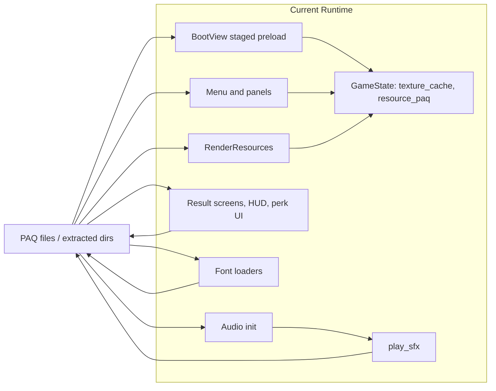
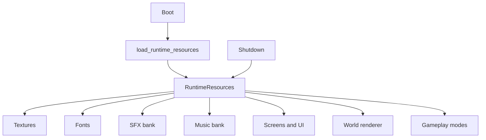
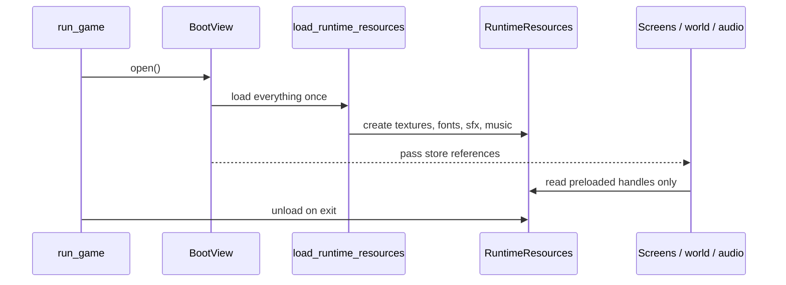

# Memo: Simplify Runtime Resource Loading

## Recommendation

Given the current archive sizes discussed for `crimson.paq` (about 1.2 MB) and `sfx.paq` (about 714 KB), the rewrite should stop doing on-demand runtime loading and stop carrying cache machinery through the game loop.

The simpler design is:

- load all runtime resources once during boot
- keep them resident for the lifetime of the process
- hand out already-loaded handles to gameplay/screens/audio
- unload everything once on shutdown

This is a better trade for the current project. It removes a lot of architectural complexity that only exists to save a small amount of startup work.

One caveat: compressed `.paq` size is not the same thing as decoded GPU/audio memory footprint. The decision should still be made on decoded runtime memory, not archive size alone. Even with that caveat, the current asset set looks small enough that simplicity should dominate.

## Why The Current Design Is Too Complicated

### 1. There is no single resource-loading path

Today the codebase uses multiple overlapping patterns:

- `src/crimson/screens/boot.py` stages texture loads through `TEXTURE_LOAD_STAGES`
- `src/crimson/screens/assets.py` lazily creates a shared `PaqTextureCache` through `_ensure_texture_cache`
- `src/crimson/world/render_resources.py` builds a `TextureLoader` on demand
- `src/crimson/ui/hud.py`, `src/crimson/ui/perk_menu.py`, `src/crimson/screens/results/game_over.py`, and `src/crimson/screens/results/quest_results.py` call `TextureLoader.from_assets_root(...)` directly
- `src/grim/fonts/small.py` and `src/grim/fonts/grim_mono.py` create fresh PAQ readers/cache objects again for fonts

That is already a sign that the abstraction is not simple enough. The system has both a shared cache and ad hoc loaders, so there is no obvious single owner.

### 2. Boot already preloads resources, but runtime still does lazy work

`BootView` is already trying to hide first-use work by preloading textures in stages. That means we are paying the complexity cost of lazy loading while also paying some of the startup cost of eager loading.

The result is the worst middle ground:

- startup contains bespoke preload lists and stage bookkeeping
- runtime still needs lazy load code paths
- new screens/features can still trigger resource work after boot

If we accept startup loading as a valid trade, we should finish the simplification and preload everything.

### 3. First-use stalls are still possible

Several code paths still do real work on first use:

- `src/grim/sfx.py` only indexes `sfx.paq` at startup; `_load_sample(...)` decodes a sound the first time it is played
- `src/grim/music.py` supports loading tracks dynamically through `load_music_track(...)`
- textures outside the boot preload list are still loaded on demand through `cache.get_or_load(...)` or `TextureLoader.from_assets_root(...)`
- fonts can re-open and re-parse the PAQ when a screen opens

That means frame-time behavior still depends on whether a resource has been touched before.

### 4. Ownership and unloading are unclear

The current system makes it hard to answer a basic question: who owns a loaded texture or sound, and who unloads it?

- `PaqTextureCache` stores textures, but there is no single top-level shutdown path for every cached texture
- `TextureAsset.unload()` exists, but it is not the center of the runtime lifecycle
- some screens create textures via standalone loaders and do not retain the loader as the owner
- some screens unload font textures manually, while most texture users rely on shared cache lifetime

Even when this does not produce a visible leak today, it is fragile. The lifecycle is distributed across screens instead of being explicit.

### 5. Runtime code is carrying resource plumbing instead of resource handles

`GameState` currently carries `texture_cache` and `resource_paq`. Those flow through boot, the loop view, modes, world runtime, and screen helpers.

That means gameplay/screen code is still partly responsible for resource resolution, not just resource use.

This is backwards. Runtime code should depend on already-initialized assets, not on the machinery needed to find and decode them.

### 6. The runtime still supports too many asset-source variants

`TextureLoader` and the font loaders support:

- direct PAQ lookup
- extracted filesystem lookup
- repo-local parent/sibling fallback search

That is useful for tooling and development, but it makes the runtime path more complex than necessary. The shipped game runtime should have one canonical source of truth.

## Suggested Design

Introduce one process-lifetime object, for example `RuntimeResources`, loaded once after the window/audio device are ready.

It should:

- read the runtime archives once
- decode and create all textures up front
- load all SFX samples up front
- load all music tracks up front
- create font objects from those preloaded textures
- expose typed handles used by screens/gameplay/audio
- unload everything once on shutdown

No caches. No `get_or_load`. No per-screen texture loaders. No first-use decode.

### Minimal shape

Keep the runtime API boring:

- `load_runtime_resources(assets_dir, config, console) -> RuntimeResources`
- `unload_runtime_resources(resources) -> None`

And a simple structure:

- `resources.textures.<name>`
- `resources.fonts.small`
- `resources.fonts.grim_mono`
- `resources.audio.sfx_by_key`
- `resources.audio.music_by_name`

If a dictionary is simpler than a large typed struct for some groups, use a dictionary. The important part is eager lifetime ownership, not perfect type taxonomy.

### Runtime rules

- Screens and gameplay code only read from `RuntimeResources`
- Boot no longer maintains staged texture lists
- `play_sfx(...)` only chooses a preloaded voice and starts playback
- `loadtexture` should be a no-op compatibility command with a console note that the rewrite does not port runtime texture loading
- `setresourcepaq` should be a no-op compatibility command with a console note that the rewrite does not port live resource-archive switching
- Extracted-assets fallback should stay in tooling/dev flows, not in the normal runtime path

## Expected Benefits

- fewer runtime code paths
- no first-use texture or audio stalls
- one clear owner for loaded assets
- easier reasoning about shutdown/unload
- easier testing because screens no longer need cache bootstrap helpers
- smaller `GameState` surface area
- less duplicated PAQ parsing and duplicated loader setup

## Migration Plan

1. Add `RuntimeResources` and a single eager loader/unloader.
2. Make boot create that store once and attach it to `GameState`.
3. Convert screens, HUD, world rendering, and fonts to consume preloaded handles.
4. Convert SFX from lazy sample decode to eager sample load.
5. Remove `PaqTextureCache`, `TextureLoader`, `_ensure_texture_cache`, `resource_paq`, and staged boot texture loading.
6. Keep extracted-asset support only in tooling or behind an explicit dev-only bootstrap path if it is still needed.

## Bottom Line

The current runtime is spending complexity on a problem it no longer really has.

For this project, the simplest correct design is to eagerly load the whole runtime asset set at startup, keep it alive for the session, and unload it once on exit.
