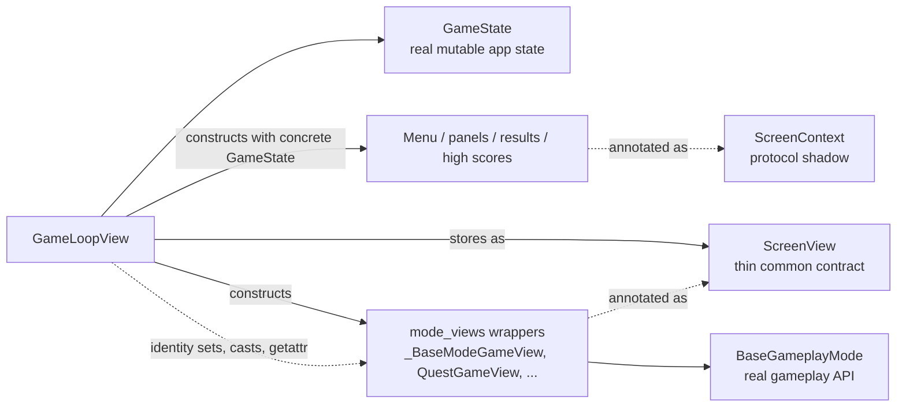
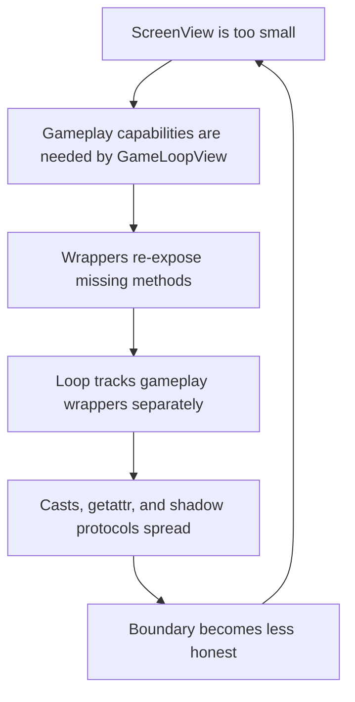
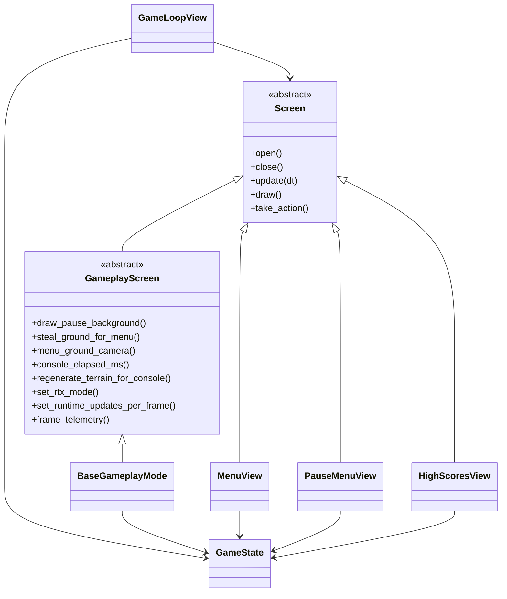
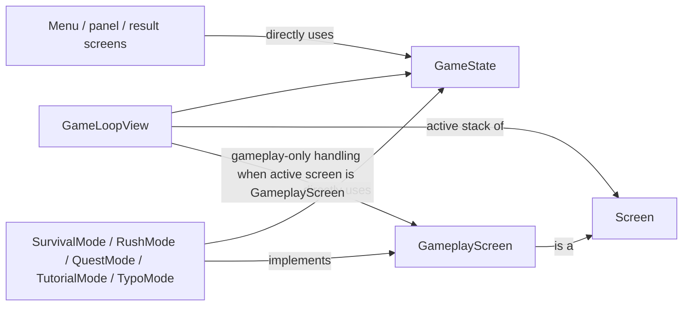

# Screen Boundary Memo

This memo is about the boundary between `GameState`, `ScreenContext`, and `ScreenView`.

The short version:

- `GameState` is the real mutable orchestration object.
- `ScreenContext` is a shadow of `GameState`, not a meaningful boundary.
- `ScreenView` is too small for the work `GameLoopView` actually needs to do.
- `mode_views.py` exists mostly to patch over that mismatch.

The result is extra wrappers, identity sets, `getattr`, and casts in the hottest part of the screen stack.

## Why this matters

This repo prefers structural simplicity. The current screen boundary does the opposite:

- it duplicates state shape without reducing coupling
- it hides gameplay-only capabilities behind a too-thin common interface
- it forces the loop to recover concrete gameplay behavior through side channels
- it makes the code look more abstract than it really is

That is the kind of abstraction that creates follow-on abstractions.

## Current state

Today the screen stack looks roughly like this:

The relevant code is spread across:

- [`src/crimson/game/types.py`](src/crimson/game/types.py)
- [`src/crimson/screens/types.py`](src/crimson/screens/types.py)
- [`src/crimson/game/loop_view.py`](src/crimson/game/loop_view.py)
- [`src/crimson/game/mode_views.py`](src/crimson/game/mode_views.py)

## The actual problem

### 1. `GameState` is already the real application boundary

`GameState` in [`src/crimson/game/types.py`](src/crimson/game/types.py) is the authoritative mutable object for:

- assets and config
- audio and console
- menu ground and pause background
- network session/runtime state
- pending quest/high-score transitions
- frame telemetry

That is the state `GameLoopView` actually manages.

Screens are also already constructed with the concrete `GameState` in [`src/crimson/game/loop_view.py`](src/crimson/game/loop_view.py), not with a reduced implementation object. So the concrete dependency already exists at construction time.

### 2. `ScreenContext` duplicates the shape without reducing coupling

`ScreenContext` in [`src/crimson/screens/types.py`](src/crimson/screens/types.py) says it should keep screen code lightweight, but in practice it mirrors a large chunk of `GameState`:

- runtime paths and config
- mutable audio/cache handles
- menu ground and pause background
- network session and runtime fields
- fade and quit state
- pending quest level

That means it is not a small interface around a stable capability. It is a second copy of the main app-state surface.

So we pay for:

- another type
- another place to maintain field shape
- another place to explain ownership

without gaining:

- actual decoupling
- restricted mutation
- feature isolation
- simpler tests

### 3. `ScreenView` is smaller than the loop contract

`ScreenView` in [`src/crimson/game/types.py`](src/crimson/game/types.py) only exposes:

- `open`
- `close`
- `update`
- `draw`
- `take_action`

That is enough for generic menu-like screens, but not enough for gameplay screens. `GameLoopView` also needs gameplay-only hooks for:

- pause background drawing
- terrain capture back into menu
- menu camera extraction
- console elapsed time sync
- terrain regeneration
- RTX mode sync
- frame telemetry
- runtime update pacing

Those are real loop responsibilities. Since `ScreenView` does not model them, the loop reaches around the interface.

### 4. `mode_views.py` is a repair layer, not a real subsystem

`mode_views.py` in [`src/crimson/game/mode_views.py`](src/crimson/game/mode_views.py) mostly does three things:

1. instantiate gameplay modes
2. forward lifecycle calls
3. re-expose gameplay-only helpers that `ScreenView` does not contain

Most methods on `_BaseModeGameView` are direct pass-throughs into `BaseGameplayMode`. The subclasses mostly differ in constructor wiring and a small amount of action routing.

This is the key smell:

- the wrappers are not adding a new domain concept
- they are translating between an underspecified interface and the real object

### 5. `GameLoopView` has to recover the hidden type anyway

Because gameplay capabilities were hidden behind `ScreenView`, `GameLoopView` now keeps extra recovery logic:

- `_gameplay_views` identity set in [`src/crimson/game/loop_view.py`](src/crimson/game/loop_view.py)
- `_as_gameplay_view(...)` casts in the same file
- `getattr(..., "set_runtime_updates_per_frame", None)` for capability probing
- special-case pause background and menu-ground handling

So the abstraction stack becomes:

- hide the gameplay type
- wrap the gameplay type
- recover the gameplay type

That is pure indirection tax.

## Failure loop

The current design creates a self-reinforcing abstraction loop:

This is why the code feels simultaneously abstract and tightly coupled.

## Goal architecture

The goal is not "more interfaces." The goal is one honest boundary.

### Design goals

1. `GameState` remains the single mutable orchestration root for screen-layer code.
2. The common screen contract must match what the loop really needs.
3. Gameplay modes should participate in the loop directly, not through wrapper adapters.
4. If a smaller context ever exists, it must be feature-specific and intentional, not a shadow copy of `GameState`.

## Proposed target

The preferred target architecture is:

- remove `ScreenContext`
- replace `ScreenView` with an honest screen hierarchy
- make `BaseGameplayMode` implement the gameplay-screen contract directly
- delete `mode_views.py`
- let non-gameplay screens take `GameState` directly

Conceptually:

And the runtime behavior becomes:

## What changes in practice

### `GameState`

Keep `GameState` as the screen-layer state root.

That means:

- screens can read and mutate the same authoritative state the loop already owns
- there is one place to understand ownership
- there is no second pseudo-interface to keep in sync

This does not mean every subsystem must depend on all of `GameState`. It means the screen layer should stop pretending it does not.

### `ScreenContext`

Delete it.

If later we discover a truly stable smaller boundary, it should be a narrow object for one feature, for example:

- a high-score query service
- a menu-assets loader
- a network-lobby presenter state

It should not be a catch-all structural shadow of the main application object.

### `ScreenView`

Replace the current thin protocol with an honest contract.

There are two reasonable forms:

1. a concrete abstract base class hierarchy
2. two explicit typed interfaces, `Screen` and `GameplayScreen`

The first option is preferable if we want runtime `isinstance` checks in the loop without more duck typing.

What matters is not the exact typing mechanism. What matters is that gameplay-only loop hooks are modeled explicitly instead of being recovered with casts and `getattr`.

### `BaseGameplayMode`

`BaseGameplayMode` should become the gameplay screen.

That means:

- `SurvivalMode`
- `RushMode`
- `QuestMode`
- `TutorialMode`
- `TypoShooterMode`

become the actual loop-managed gameplay screens.

The current wrapper classes in [`src/crimson/game/mode_views.py`](src/crimson/game/mode_views.py) go away.

Any action mapping that still belongs in the loop can be handled:

- in `GameLoopView`
- in a small mode factory
- or via typed screen actions

but not via a parallel wrapper hierarchy.

### `GameLoopView`

`GameLoopView` should depend on:

- `Screen` for generic lifecycle
- `GameplayScreen` when the active screen is gameplay

That removes:

- `_gameplay_views` identity tracking
- `_as_gameplay_view(...)`
- gameplay capability probing via `getattr`
- wrapper-specific pause-background casting

The loop becomes simpler because its contracts become more honest.

## What this architecture is not trying to do

This memo does **not** propose:

- breaking `GameState` into many micro-services right now
- redesigning all screen actions in the same step
- changing deterministic gameplay behavior
- pushing more protocol-driven abstraction into the UI

This is a boundary cleanup, not a gameplay redesign.

## Migration shape

The cutover can happen in a small number of deliberate steps:

1. Define the target `Screen` and `GameplayScreen` contracts.
2. Make `BaseGameplayMode` satisfy `GameplayScreen` directly.
3. Update `GameLoopView` to treat gameplay screens through that contract.
4. Delete `mode_views.py`.
5. Replace `ScreenContext` annotations with `GameState` in screen-layer code.
6. Remove the identity-set, cast, and `getattr` recovery paths from `GameLoopView`.

After that, follow-on cleanup gets easier:

- move shared menu rendering helpers out of `MenuView` static methods
- unify panel base classes
- simplify pause background handling

## Expected benefits

If we land this architecture, the screen stack should become:

- easier to read
- easier to extend
- easier to type-check honestly
- easier to refactor without wrapper churn

Most importantly, the code will describe the real ownership model:

- `GameState` is the app-state root
- screens operate on that root
- gameplay screens are first-class, not hidden behind adapters

That is the boundary we should optimize for.
