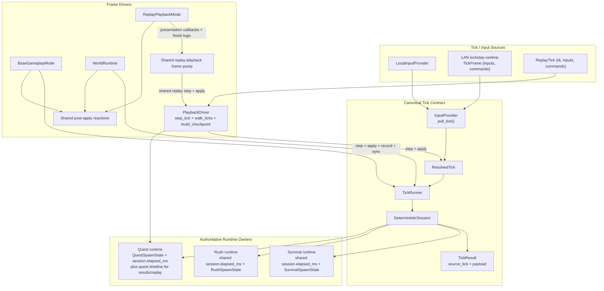
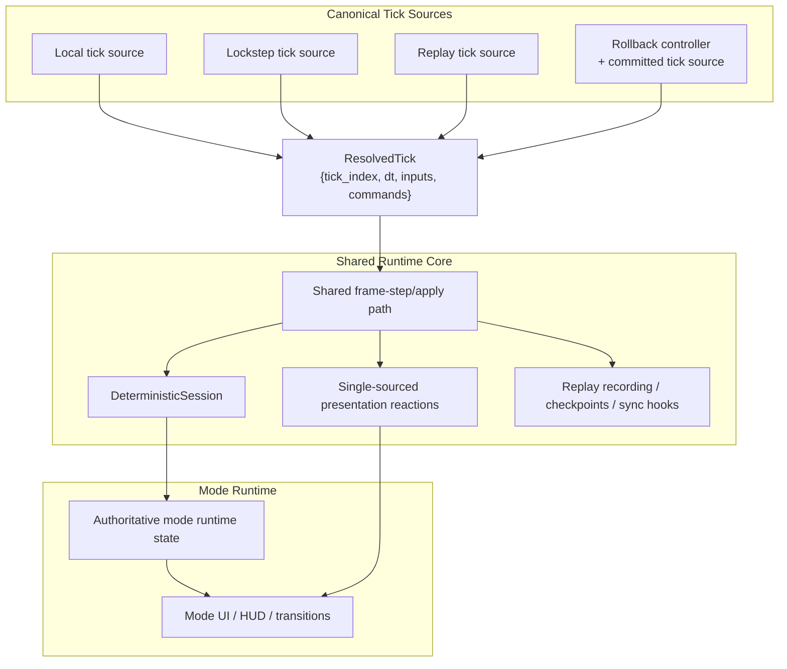

# Split-Brain Architecture Note

This note supplements `plan.md`.

Its purpose is narrower: describe the current architectural split-brain in the runtime, show what is already unified, and make the target shape concrete enough that future refactors can be judged against it.

## What Is Already Unified

Not everything is split-brained anymore.

- `DeterministicSession` is already the center of the deterministic step.
- The provider/runner contract now uses one canonical pre-step tick object: `ResolvedTick`.
- Replay ticks already carry `dt + inputs + commands`.
- Lockstep `TickFrame` already carries deterministic `commands`.
- `TickResult` now carries the source `ResolvedTick`, so replay/live/LAN share the same in-memory pre-step tick shape.
- Quest dynamic runtime state now lives in `QuestSpawnState` plus `DeterministicSession.elapsed_ms`; generic tick/result types no longer re-express quest-only fields.
- Survival and rush dynamic runtime now live in `DeterministicSession.elapsed_ms` plus `SurvivalSpawnState` / `RushSpawnState`; the live mode shadow structs are gone.
- Survival and rush now also share one explicit session-timer access path in gameplay code, instead of each mode carrying its own mirror helper.
- Quest rollback/resync snapshots now carry the authoritative quest runtime, including the remaining spawn table.
- Live `TickRunner` frame advancement is now shared between `BaseGameplayMode` and `WorldRuntime`, including `FrameContext` setup, tick-index bookkeeping, and stall/EOS debt refund.
- Replay playback frame advancement is now also shared, including replay clock advancement, `step_tick()` iteration, immediate sim metadata apply, and replay tick-limit debt refund.
- Post-apply presentation reactions are now shared too: perk-apply bonus SFX, quest hit SFX, quest completion music, and replay/live quest overlay timer updates all route through one small reaction layer.
- Driver-side replay utilities now share one canonical multi-tick walk path through `PlaybackDriver.walk_ticks()`, and replay checkpoint construction is no longer hidden behind private driver helpers.
- The sim plan/apply split is already shared in important paths.

That matters because the remaining work is no longer "invent a deterministic runtime". The remaining work is to remove the mismatched orchestration and reaction layers still wrapped around it.

## Current Split-Brain

Today the large split-brain targets are mostly gone. The remaining seams are smaller contract-shape issues rather than competing loop owners.

Timer semantics are no longer one of the fuzzy parts:

- survival and rush use the deterministic session elapsed timer
- quest runtime still owns `spawn_timeline_ms` for quest progression, replay elapsed stats, and quest results timing
- session-timer access in active gameplay now asserts on invalid lifecycle use instead of silently falling back

### 1) Replay wrappers still duplicate setup and reporting policy

The replay loop itself is now shared in `PlaybackDriver`, but wrapper helpers still duplicate configuration and summary policy around it:

- `src/crimson/sim/driver/replay_runner.py`
- `src/crimson/sim/driver/replay_info.py`

That is narrower than the old split brain. The drift is now mostly around how wrappers build configs, translate callbacks, and package results for different replay consumers.

### 2) Live and replay still expose different top-level stepped result shapes

Live/LAN stepping flows through `TickResult`, while replay stepping still exposes `PlaybackTickOutcome`:

- `src/crimson/sim/hooks.py`
- `src/crimson/sim/driver/playback_driver.py`

That is not a correctness problem, but it keeps some replay-only bookkeeping and testing surfaces separate from the live contract.

## Current Architecture



## Why This Hurts

The cost is not just conceptual neatness.

- The same stepping and apply responsibilities can drift between multiple call sites.
- Tests have to know about implementation wiring instead of one contract.
- Replay, live, LAN, and rollback stay harder to compare because they do not all enter the core through the same shape.
- Refactors tend to add compatibility with both the old and new model instead of deleting the old one.

## Goal Architecture

The goal is not "more layers". The goal is one canonical tick shape, one authoritative owner for mode runtime state, and one shared stepping/apply path.

### Canonical Tick

At the runtime boundary, one deterministic tick should be one object:

```python
@dataclass(frozen=True)
class ResolvedTick:
    tick_index: int
    dt_seconds: float
    inputs: list[PlayerInput]
    commands: list[GameCommand]
```

This does not need to become a giant new subsystem. It just needs to replace the split provider contract decisively.

### Shared Frame-Step / Apply Path

Local play, lockstep, replay playback, and rollback should all feed the same basic runtime loop shape:

1. get a canonical tick
2. step the deterministic session
3. apply sim metadata
4. apply presentation outputs/reactions
5. optionally record, checkpoint, or sync

## Goal Architecture Diagram



## Guardrails

The target shape should reduce complexity, not relocate it.

- Do not add a new tick type unless it replaces an old one.
- Do not introduce a `ModeRuntimeAdapter` that becomes a second god object.
- Do not extract a `SimulationLoop` so broad that mode-specific concerns become harder to see.
- Prefer shrinking contracts and deleting duplicate ownership before introducing named abstractions.

## Highest-Value Next Step

The best next refactor is no longer another loop-sharing extraction. The best next step is narrower replay contract polish.

The highest-leverage targets now are:

- canonical ticks already landed
- quest, survival, and rush now use authoritative runtime owners instead of mode-local mirrors
- live and replay frame advancement now share their low-level bookkeeping
- post-apply presentation reactions are now shared across gameplay, replay playback, world runtime, and the headless harness
- driver-side replay loops are now shared too, so the remaining drift is mostly wrapper policy and result-shape differences

The likely next cleanup is to narrow the replay-facing contract further: reduce wrapper/config duplication around `run_replay()` and `run_replay_info()`, and decide whether `PlaybackTickOutcome` should stay replay-specific or converge further with the live `TickResult` shape.
