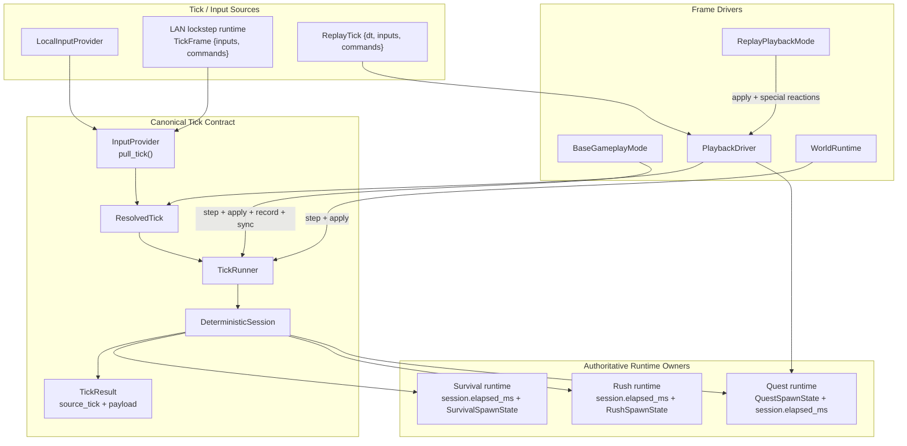
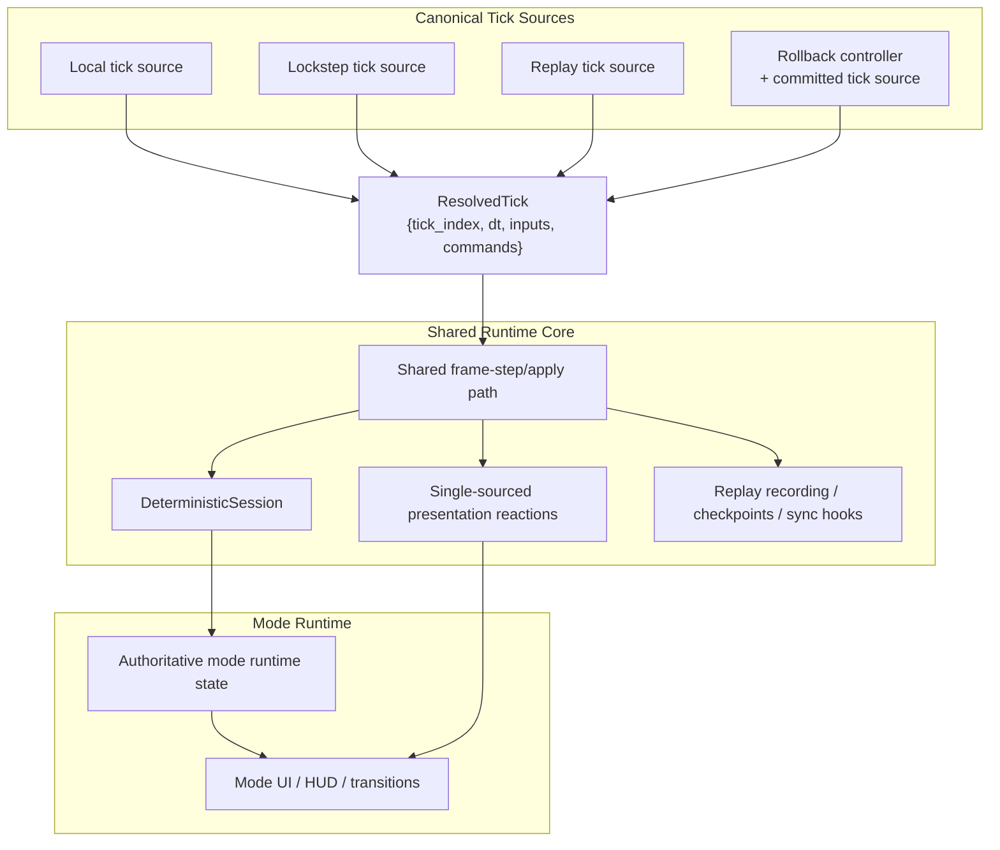

# Split-Brain Architecture Note

This note supplements `plan.md`.

Its purpose is narrower: describe the current architectural split-brain in the runtime, show what is already unified, and make the target shape concrete enough that future refactors can be judged against it.

## What Is Already Unified

Not everything is split-brained anymore.

- `DeterministicSession` is already the center of the deterministic step.
- The provider/runner contract now uses one canonical pre-step tick object: `ResolvedTick`.
- Replay ticks already carry `dt + inputs + commands`.
- Lockstep `TickFrame` already carries deterministic `commands`.
- `TickResult` now carries the source `ResolvedTick`, so replay/live/LAN share the same in-memory pre-step tick shape.
- Quest dynamic runtime state now lives in `QuestSpawnState` plus `DeterministicSession.elapsed_ms`; generic tick/result types no longer re-express quest-only fields.
- Survival and rush dynamic runtime now live in `DeterministicSession.elapsed_ms` plus `SurvivalSpawnState` / `RushSpawnState`; the live mode shadow structs are gone.
- Quest rollback/resync snapshots now carry the authoritative quest runtime, including the remaining spawn table.
- The sim plan/apply split is already shared in important paths.

That matters because the remaining work is no longer "invent a deterministic runtime". The remaining work is to remove the mismatched orchestration and reaction layers still wrapped around it.

## Current Split-Brain

Today the runtime still has a couple of architectural seams where the same work is expressed in more than one place.

### 1) The frame pump exists in several places

Variants of the same loop exist in:

- `src/crimson/modes/base_gameplay_mode.py`
- `src/crimson/world/runtime.py`
- `src/crimson/modes/replay_playback_mode.py`
- `src/crimson/sim/driver/playback_driver.py`

They all decide how many ticks to run, step the session, apply metadata, apply presentation outputs, and optionally record/checkpoint/sync.

### 2) Presentation reactions are not yet fully single-sourced

The deterministic step can already plan presentation work, and quest now computes its runtime flags in one place, but some reactions still live in ad hoc runtime code:

- perk-pick UI SFX
- quest hit SFX
- quest completion music
- mode-specific "after tick" presentation behavior

That creates live-vs-replay duplication pressure.

## Current Architecture



## Why This Hurts

The cost is not just conceptual neatness.

- The same stepping and apply responsibilities can drift between multiple call sites.
- Tests have to know about implementation wiring instead of one contract.
- Replay, live, LAN, and rollback stay harder to compare because they do not all enter the core through the same shape.
- Refactors tend to add compatibility with both the old and new model instead of deleting the old one.

## Goal Architecture

The goal is not "more layers". The goal is one canonical tick shape, one authoritative owner for mode runtime state, and one shared stepping/apply path.

### Canonical Tick

At the runtime boundary, one deterministic tick should be one object:

```python
@dataclass(frozen=True)
class ResolvedTick:
    tick_index: int
    dt_seconds: float
    inputs: list[PlayerInput]
    commands: list[GameCommand]
```

This does not need to become a giant new subsystem. It just needs to replace the split provider contract decisively.

### Shared Frame-Step / Apply Path

Local play, lockstep, replay playback, and rollback should all feed the same basic runtime loop shape:

1. get a canonical tick
2. step the deterministic session
3. apply sim metadata
4. apply presentation outputs/reactions
5. optionally record, checkpoint, or sync

## Goal Architecture Diagram



## Guardrails

The target shape should reduce complexity, not relocate it.

- Do not add a new tick type unless it replaces an old one.
- Do not introduce a `ModeRuntimeAdapter` that becomes a second god object.
- Do not extract a `SimulationLoop` so broad that mode-specific concerns become harder to see.
- Prefer shrinking contracts and deleting duplicate ownership before introducing named abstractions.

## Highest-Value Next Step

The best next refactor is to consolidate the duplicated frame-step/apply orchestration.

That is now the highest-leverage remaining split-brain because:

- canonical ticks already landed
- quest, survival, and rush now use authoritative runtime owners instead of mode-local mirrors
- the remaining runtime drift is mostly about orchestration duplication, not ownership duplication
- live gameplay, replay playback, and world/runtime stepping still each express their own variation of the same frame-step/apply sequence

After the shared frame-step/apply path is smaller and clearer, the next target is to finish centralizing presentation reactions so replay and live mode code stop carrying custom post-tick side effects.
